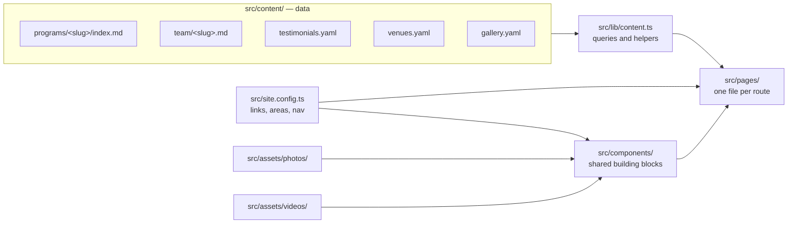

# Sabeel Institute website — guide for contributors and agents

Read this whole file before changing anything. It explains how the site is
built, the conventions every change follows, and how to keep changes easy to
review and merge. Deployment has its own guide: [docs/deployment.md](docs/deployment.md).
Staff who ask you for changes learn what a program can show from
[docs/course-guide.md](docs/course-guide.md), so their requests use its
words.

## What this is

A static website for Sabeel Institute, a women-led Islamic education
non-profit in Houston. Built with [Astro](https://astro.build) and Tailwind
CSS v4; deployed to Firebase Hosting by GitHub Actions. There is no server,
database, or CMS: every page is generated at build time from files in this
repository.

The design uses Cormorant Garamond for headings, Inter for body text, and DM
Sans for small labels; gold diamond dividers; ivory and sage sections; and
raspberry for headings, links, and buttons. The colours are the Sabeel brand
palette, defined as tokens in `src/styles/global.css` (see Design rules).
The palette, the logo files, and design guidance for every Sabeel surface live
in [Sabeel-Institute/brand](https://github.com/Sabeel-Institute/brand); this
site's colour tokens, logo, and favicons follow it.

Facts on the site (dates, fees, names, links, bios) come from the
organisation. Never invent them: if a fact is unknown, leave the field out and
ask.

## Commands

```bash
npm ci            # install exact dependencies
npm run dev       # live-reloading preview at http://localhost:4321
npm run build     # type-check, validate all content, build to dist/
npm run preview   # serve the built dist/
```

`npm run build` must end with `0 errors`. It validates every content file
against the schemas in `src/content.config.ts`, and errors name the file and
field, including a field the schema does not have.

## Everyday tasks

| Task | What to do |
|---|---|
| Announce, open, close, or end a program | Set its `status` (see Status). Listings update themselves |
| Keep a program off the site for now | Programs → Recipes → Keep a program off the site |
| Add a program | Programs → Recipes → Add a program |
| New session of a monthly gathering | Programs → Recipes → Recurring gathering |
| When a program meets: dates, days, times | Programs → Schedule |
| Prices, an early-bird price | Programs → Fields |
| Images from the program's designers | Programs → Program images |
| How people register: Zeffy, another site's form, or no registration | Programs → Registration |
| Add, rename, or hide a person | Team |
| Add a testimonial | Testimonials |
| Add a place where programs meet | Venues |
| Add a photo to a page | Photos |
| Add a video to a page | Videos |
| Photos from past programs on the home page | Gallery |
| A Summer Garden, Camp Futuwwah, or young children's course has ended | Programs → Areas |
| Change contact details, links, or menus | Site settings |
| Donations, newsletter | Site settings → Donations, Newsletter |
| Rename or move a page | Pages and components → Moving or removing a page |

The home page, Programs, the area pages, and Past Programs list programs from
each program's `status`. Never edit those pages to add, move, or remove a
program; the one exception is the series of past programs on Youth & Children
(see Areas).

## How the site is put together



| Path | Holds |
|---|---|
| `src/content/programs/` | One folder per program: `index.md` plus its flyer and program image |
| `src/content/team/` | One Markdown file per person |
| `src/content/testimonials.yaml` | Student quotes |
| `src/content/venues.yaml` | Places programs meet, with their addresses |
| `src/content/gallery.yaml` | Photos from past programs for the home page; the files are in `src/content/gallery/` |
| `src/content.config.ts` | Schemas: every field each content file may have, with comments |
| `src/site.config.ts` | Contact email, social and form links, program areas, navigation |
| `src/lib/content.ts` | Collection queries and shared helpers (use these; do not re-query ad hoc) |
| `src/lib/video.ts` | Reads a video's length while the site builds (for `Video`) |
| `src/pages/` | Routes. `[slug].astro` files render one page per content entry |
| `src/components/` | Shared layout pieces (catalogue below) |
| `src/layouts/BaseLayout.astro` | `<head>`, header, footer, interest-list dialog |
| `src/styles/global.css` | Design tokens and shared classes |
| `src/assets/` | Images processed at build time (`photos/`, `images/`, `decor/`), and videos (`videos/`) |
| `public/` | Files served as-is (favicons) |
| `firebase.json` | Hosting settings, and redirects for moved pages and the old WordPress site's addresses |
| `.github/workflows/` | Build and deploy (see docs/deployment.md) |
| `scripts/visual-diff/` | Screenshot comparison of each pull request with `main` (see docs/deployment.md) |

## Programs

Programs (courses, series, camps, gatherings) are the main subsystem. Every
program, current or past, is one folder in `src/content/programs/`. The folder
name is the program's ID and URL: `mommy-burnout/` → `/programs/mommy-burnout/`.
Names are lowercase words joined by hyphens; add the year for repeated
programs (`summer-garden-2026`). `womens-learning` and `youth-children` are
reserved for the area pages.

### Areas

Every program belongs to one area (`area:`). The labels, descriptions, and
page links live in `areas` in `src/site.config.ts`. An area whose `href` is
`null` has no page on the site, so it gets no card on Programs, no place in
the Programs menu, no links, and no interest-list option.

| `area` | Label | Page |
|---|---|---|
| `hikam-foundations` | Hikam Foundations | `/hikam-foundations/` |
| `womens-learning` | Women’s Learning | `/programs/womens-learning/` |
| `youth-children` | Youth & Children | `/programs/youth-children/` |

`AreaPage` builds Women’s Learning from its programs. The Youth & Children
page, `src/pages/programs/youth-children.astro`, shows its programs that are
not over the same way (`AreaPrograms`), below an introduction that links to
them and to its past programs. Under Explore past programs it keeps three
series on the page, so families see what Sabeel offers: Summer Garden, Camp
Futuwwah, and courses for young children. Each series in that file has its
programs by folder name, photo slots, a description for Summer Garden and
Camp Futuwwah, and a video for Camp Futuwwah. A description fits every
edition, so it leaves out what changes from year to year, such as how many
days the program runs. When a new edition ends, add its folder to its series;
the build stops if a folder is not a program on the site. That edits the page,
so it is a structural change (see Routine and structural changes).

### Status


| `status` | Use when | Shown as | Listed on | Its page offers |
|---|---|---|---|---|
| `open` | People can join: registration is open, or none is needed | Registration open, or No registration needed | Home, Programs, its area page | Register buttons, unless no registration is needed (see Registration) |
| `ongoing` | A series has begun and people can still join | Ongoing series | Same places, after open programs | The same as `open` |
| `closed` | Registration has closed; the program is still running | Registration closed | “Registration closed” on Programs and its area page | Join the Interest List |
| `upcoming` | Announced; registration is not open yet | Coming soon | “Coming soon” on Programs and its area page | Join the Interest List |
| `completed` | The program has ended | Program completed | Past Programs | Join the Interest List; kept as a record |

Current programs (open and ongoing) are listed open before ongoing, latest
start date first; the home page shows the first three. When registration
closes before a program ends, change only `status` to `closed`; when a program
ends, change `status` to `completed` (and end a repeat that has no end; see
Recipes). Keep every other field: the page stays up, its registration
buttons go, and shared links keep working.

### Format and location

`format` is `Online`, `On-site`, or `Online & on-site`. Programs and the area
pages group current programs under these three headings, and each card shows
it. Where it meets is two more fields:

- `venue`: a place from `src/content/venues.yaml` by its id
  (`masjid-istiqlal`), or a list of them. A part of the schedule can name its
  own (see Schedule).
- `location`: where it meets, as the page says it: `Sabeel Classroom at
  Masjid Istiqlal or online via Zoom`, `Online via Zoom`. Without it, the page
  shows the venues' names.

The page's Location shows `location`, then the address of every venue the
program names, each linked to a map.

### Schedule

`schedule` says when a program meets, as a list of parts. Each part has a
first day, and as much of the rest as it needs:

| Field | Meaning | Example |
|---|---|---|
| `start` | First day, `YYYY-MM-DD` | `2026-09-14` |
| `time` | Central time as people read it; the site adds “CT”. Leave it out for an all-day event, or a time set by prayer (say so in `label`) | `12:00–1:30 PM`, `10:00 AM–1:00 PM`, `6:00 PM` |
| `repeat` | How it repeats, as a calendar rule (below) | `FREQ=WEEKLY;BYDAY=MO;COUNT=7` |
| `skip` | Dates the rule gives that do not take place | `[2026-11-26]` |
| `end` | Last day of one continuous multi-day event, such as a camping trip. With `time`, the start time is on the first day and the end time on the last | `2026-07-12` |
| `venue` | This part's place, when it is not the program's `venue` | `masjid-al-aqsa` |
| `label` | A few words that set this part apart | `Book club`, `Girls 14+`, `Monthly` |

```yaml
schedule:
  - start: 2026-09-14
    time: 12:00–1:30 PM
    repeat: FREQ=WEEKLY;BYDAY=MO;COUNT=7
```

A part without `repeat` or `end` is one session on `start`. An evening event
that runs past midnight is written `11:45 PM–1:00 AM`. `repeat` is a rule in
the form calendar apps use (iCalendar RRULE):

| The program meets | `repeat` |
|---|---|
| 7 Mondays | `FREQ=WEEKLY;BYDAY=MO;COUNT=7` |
| Tuesdays and Thursdays until March 28 | `FREQ=WEEKLY;BYDAY=TU,TH;UNTIL=20240328` |
| Every other Sunday, 4 times | `FREQ=WEEKLY;INTERVAL=2;BYDAY=SU;COUNT=4` |
| Monday to Thursday, for two weeks | `FREQ=WEEKLY;BYDAY=MO,TU,WE,TH;COUNT=8` |
| 5 days in a row | `FREQ=DAILY;COUNT=5` |
| The last Wednesday of each month, with no end | `FREQ=MONTHLY;BYDAY=-1WE` |
| The third Friday of each month | `FREQ=MONTHLY;BYDAY=3FR` |

`start` is the first session, so it is a day the rule gives. `COUNT` is the
number of sessions and `UNTIL` the last day (`YYYYMMDD`); use one of them, or
neither for a gathering that continues. A rule uses only `FREQ` (`DAILY`,
`WEEKLY`, `MONTHLY`), `INTERVAL`, `COUNT`, `UNTIL`, `BYDAY`, and
`BYMONTHDAY`. The build stops on any other part, a `start` the rule does not
give, a `skip` that is not one of its dates, or a completed program whose
rule has no end. To move one session, skip it and add a part for the new
day.

Several parts describe a program in pieces: blocks of dates, different days
at different times, two places, or activities on the same nights (an
activity after midnight starts on the next day):

```yaml
schedule:
  - start: 2026-07-25
    time: 4:45–7:45 PM
    repeat: FREQ=DAILY;COUNT=4
    venue: maryam-islamic-center
  - start: 2026-07-29
    time: 4:45–7:45 PM
    repeat: FREQ=DAILY;COUNT=4
    venue: masjid-al-aqsa
```

When the dates are not known, as for a program announced for a year or an
old record, leave out `schedule` and give `date`: the first day, or a best
guess. Pages then show only its year. A program has `schedule` or `date`,
not both.

Cards and pages word the schedule themselves: “Sept 14 – Oct 26 · 7
sessions”, “Mondays · 12:00–1:30 PM CT”, “Last Wednesday of each month”.
`label` adds your own words to a part's line.

### Cards

Every current program's card shows the same lines, in this order: audience;
the dates (“Sept 14 – Oct 26 · 7 sessions”, “Saturday, Oct 24”); the days and
time, one line per part of the schedule (“Mondays · 12:00–1:30 PM CT”); and
format. When the dates and times are too long for a card, or say too little,
`card` gives one or two lines of your own in their place, on the card and in
the Coming soon and Registration closed lists on Programs:

```yaml
card:
  - July 25 – Aug 1 · two 4-day sessions
  - 4:45–7:45 PM CT
```

The build cannot check `card` against the schedule, so keep it for the odd
long case.

### Standard and bespoke pages

Every program gets a page in one of two ways:

- **Standard (default).** `src/pages/programs/[slug].astro` builds the page
  from the fields, in a fixed order:
  1. Status and area label, title, summary, `highlight`, Register and Ask a
     Question buttons, photo.
  2. The facts: Audience, Dates, Schedule, Location, Fee (with the Financial
     aid link under it while people can join), and Registration deadline.
  3. “About this program”. A program with `outcomes` or a Markdown body
     shows “What students will learn” (or the body as “What to know”), then
     the Instructor, What to expect, and Policies cards, then the body as
     “Program details”, with the original flyer pinned beside them. A
     program with neither shows its flyer with the cards beside it.
  4. A closing band (“Ready to join?”; “Registration opens soon.”, or
     “Coming soon.” without registration; or “Interested in a future
     offering?”, by status).

  Sections with no data are left out. Change the template only when the
  change should apply to every program.
- **Bespoke.** A hand-designed page for a flagship program, like
  `/hikam-foundations/`. The program folder keeps the facts and adds
  `page: /hikam-foundations/`; the page file reads them with
  `getEntry('programs', '<folder>')` instead of retyping them. Listings,
  cards, the archive, and link previews all keep working, and the standard
  template skips it. If `page` names a file that does not exist, the build
  fails and says which file to create.

To make a standard program bespoke: create `src/pages/<name>.astro` from the
components and conventions below, then add `page: /<name>/` to the program.
To go back, delete the page file and the `page` field.

The Hikam Foundations page, `src/pages/hikam-foundations.astro`, is its
area's page and the bespoke page of its next intake, `hikam-foundations-2027`,
which Programs lists under Coming soon. The page's announcement of the intake
takes its year from that program.

### Fields

Every program needs `status`, `title`, `area`, and `schedule` or `date`.
Until it is `completed` it also needs `summary`, and while it is `open` or
`ongoing`, `format`, which decides where it is listed. Everything else is
optional. The build stops on a field that is not in this table, naming it.

| Field | Meaning | Example |
|---|---|---|
| `status` | See Status | `open` |
| `title` | Name as on the flyer | `Mommy Burnout` |
| `subtitle` | Tagline under the title | `A Journey from Burnout to Barakah` |
| `summary` | One sentence: what students learn and why it matters; at the top of the page and in link previews | |
| `area` | See Areas | `womens-learning` |
| `schedule` | When it meets; see Schedule | |
| `date` | Only without a schedule: the first day or a best guess, `YYYY-MM-DD`; pages show its year | `2027-01-01` |
| `audience` | Who may attend | `Adult women`, `Boys 12–16 · Girls 13+` |
| `format` | See Format and location | `Online & on-site` |
| `venue`, `location` | Where it meets; see Format and location | `masjid-istiqlal`, `Sabeel Classroom at Masjid Istiqlal` |
| `fee` | Price as people should read it; one line per price | `$150`, `Free` |
| `financialAid` | `false` leaves out the Financial aid link under the fee, for a free program | `false` |
| `registration` | How people join (see Registration): `none`, or on the line under it, `zeffy:` a Zeffy form or `link:` another site's form | `zeffy: anchored-hearts-sisters-circle` |
| `deadline` | Registration deadline text | `Register by Wednesday, October 7` |
| `highlight` | A short line above the Register button: an early-bird price, limited seats, a new date. Shown until registration closes | `Register by October 20 and save $5.` |
| `card` | One or two lines a card, or a Programs list, shows in place of its dates and times; see Cards | `2 years · Starts 2027` |
| `outcomes` | Three to five things students will learn (list) | |
| `instructors` | Team file names and/or inline guests `{ name, role, highlights }` | `sameera-shah` |
| `expect` | Teaching format, activities, participation, and anything to bring or know first; Markdown without headings (see below) | |
| `policies` | Attendance, refunds, recording, safeguarding; Markdown without headings (see below) | |
| `image`, `imageAlt` | The program image, 16:9 (see Program images); alt text required with it | `./image.webp` |
| `flyer` | Original flyer, US Letter portrait (see Program images) | `./flyer.webp` |
| `page` | Bespoke page path | `/hikam-foundations/` |
| `draft` | `true` keeps the program in the repository but off the site: no page, no listing | |

`audience`, `location`, `fee`, and `deadline` are one line, or a list of
lines shown one under another. Write a price that changes on a date with its
date, so it stays true after the date passes:

```yaml
fee:
  - $30 early bird, through Oct 20
  - $35 from Oct 21
highlight: Register by October 20 and save $5.
```

In YAML, a line that contains “: ” must be in quotes.

The Markdown body after the front matter is “Program details”, or “What to
know” when the program has no `outcomes`. Use `##` and `###` headings (never
`#`), `-` bullets, `1.` numbered lists, `**bold**`, `*italics*`, and
site-relative links that end in `/` (for example
`/teachers-and-team/sameera-shah/`).

`expect` and `policies` take the same formatting except headings, which the
build refuses there: each is a card with its own title. Write them as a YAML
block, indented under the field, with a blank line between paragraphs and
before a list:

```yaml
expect: |
  Each session has three parts:

  - **Nourish** — a halaqah
  - **Connect** — a conversation with guests
```

Every other text field is plain: one line (`title`, `subtitle`, `summary`,
`highlight`), one line or a list of lines (`audience`, `location`, `fee`,
`deadline`), one or two lines (`card`), or a list of short points
(`outcomes`).

### Program images

A program has up to two images, each in one standard size, so the site uses
them as they are:

| Image | Size | Where the site shows it |
|---|---|---|
| Flyer (`flyer`) | US Letter portrait: 8.5 × 11 in, 2550 × 3300 px | Whole, lower on the program page, in Past Programs, and enlarged in the flyer viewer |
| Program image (`image`) | 16:9 landscape: 1920 × 1080 px | On the program's card, at the top of its page, and in link previews, which trim it slightly to 1.91:1 |

The program image is a photograph or artwork, not a copy of the flyer: at most
a large title, no small text (dates, times, and fees are on the page and
change), and nothing important within 5% of an edge. The build stops if a
program image is not 16:9. Until a program has its own, its image can be a
16:9 crop of its flyer's title area, as the current programs use. Designers'
guidance is the `sabeel-flyers` skill in
[Sabeel-Institute/brand](https://github.com/Sabeel-Institute/brand).

Both are stored as WebP (`flyer.webp`, `image.webp`). To convert a JPG or PNG,
run this from the repository root:

```bash
node -e "require('sharp')(process.argv[1]).webp({ quality: 90 }).toFile(process.argv[2])" flyer.png src/content/programs/<name>/flyer.webp
```

### Registration

`registration` says how people join a program. While the program is `open`
or `ongoing`, its page works by it:

```yaml
registration:
  zeffy: anchored-hearts-sisters-circle
```

- **A Zeffy form** (`zeffy`), for most programs, free or paid: people
  register, and pay if there is a fee, through a ticketing form in the
  organisation's Zeffy account, with a ticket for each price ($0 when the
  program is free); the form asks for their details. `zeffy` is the name
  after `/ticketing/` in the form's links: for
  `https://www.zeffy.com/embed/ticketing/anchored-hearts-sisters-circle?modal=true`
  it is `anchored-hearts-sisters-circle`. Register opens the form in a
  dialog. Ticket names and prices are set on zeffy.com; keep `fee` the same
  as them.
- **Another site's form** (`link`), for example a partner organisation's
  Google Form: its full address, starting with `https://`, copied exactly
  (`link: https://forms.gle/…`). Register opens it in a new tab. A Zeffy
  form is always `zeffy`, never `link`.
- **No registration** (`registration: none`), for a program anyone can come
  to. Cards and the page say “No registration needed” in place of
  “Registration open”, the page has no Register buttons, and Ask a Question
  is its main button.

Until the form exists, leave `registration` out: Register then opens a
dialog saying the registration form is a work in progress. Under the fee,
the page links to Financial Aid while people can join, unless the program
sets `financialAid: false`, as a free program does.

The form's name is all the site needs; do not add Zeffy's embed code (its
`zeffy-form-link` attribute and script) to a page.

### Recipes

**Add a program.**
1. Copy the most similar current program folder and rename it (see the
   naming rule under Programs).
2. In `index.md`, set `status` (`upcoming` until registration opens, then
   `open`) and every field that status needs (see Fields), copying names,
   dates, fees, and the Zeffy form or registration link (see Registration)
   exactly as the organisation gives them.
3. Replace `flyer.webp` with the new flyer and `image.webp` with the new
   program image (see Program images), and rewrite `imageAlt`. Without a
   program image, delete the file and both fields: the card then has no
   picture and the page shows a patterned panel in its place.
4. Write the Markdown body, or delete it if there is nothing beyond the
   fields.
5. Run `npm run build`, then check the program page, Programs, its area page,
   and (for an open program) the home page in `npm run dev`.

**Close registration early.** When registration closes while the program is
still running, change only `status` to `closed`.

**Retire a program.** Change `status` to `completed` and keep every other
field. A gathering that repeats with no end also gets `UNTIL`, its last day,
in its rule.

**Keep a program off the site.** Add `draft: true`; remove it to publish the
program. Everything else about it stays as it is.

**Recurring gathering.** A gathering on a fixed day, such as the last
Wednesday of each month, has one repeating part in `schedule` and needs no
edit each month. For one whose day is set each time (for example Anchored
Hearts), edit the same folder each cycle: the one part of `schedule`, the
next session with `label: Monthly`; `registration` (when the session has its
own form); instructors; and the “This month” text.
Replace `flyer.webp` with the new flyer under the same name, and
`image.webp` too if the artwork changed. The folder always describes the next
session; earlier sessions are not kept.

**Archive-only record** (a past program that only has a flyer): a folder with
`status: completed`, `title`, `area`, `schedule` from the flyer (or `date`
when its dates are not known), optionally `subtitle`, `summary`,
`audience`, `format`, `venue`, `location`, `instructors`, and `flyer`. No
body. Its year is the one the organisation gives, as in its folder name.
When the flyer's weekday does not fall on its date in that year, keep the
weekday and the month, and use the nearest day of that month with that
weekday. A flyer that prints neither a year nor a weekday gets `date` only,
so its page shows only the year; one that gives a start but no end gets that
first session only, with `label: First session`. Nights of Ramadan follow
the calculated calendar (Fiqh Council of North America), as Sabeel's flyers
do: the 21st night of Ramadan 2025 was the evening of March 20.

**Add a new program field.** Add it to the program schema in
`src/content.config.ts` as optional, with a one-line comment; render it in the
standard template (and in bespoke pages that need it); add a row to the Fields
table above; use it in at least one program. Existing programs must stay
valid without it.

## Other content

### Team (`src/content/team/<name>.md`)

Front matter: `name`, `honorific` (`Ustadhah`, `Ust.`, `Sr.`, `Br.`, `Dr.`),
`group` (`founder`, `board`, `teachers`, `volunteers`), `order` (ascending
within the group; use steps of 10), optional `role`, `sub` (a second line
under the role), `highlights`, and `listed` (`false` hides the person).
Each person has a short bio and a long one, both as the organisation writes
them. The short bio is `highlights`: up to three short lines of studies and
degrees, never roles or jobs (`Sabeel Graduate`, `‘Alimiyyah`,
`BS Biochemistry`), shown under the name and `role` on the Teachers & Team
page. The long bio is the Markdown body, shown on the person's own page,
`/teachers-and-team/<name>/`, which every listed person with a body gets.
Refer to people in programs by file name under `instructors`.

- **Add a person:** create `src/content/team/<name>.md`, where `<name>` is
  their name in lowercase words joined by hyphens (`sameera-shah`). Give it an
  `order` between those of the people it should sit between, and start the
  bio with the plain name (see Writing conventions).
- **Hide a person:** set `listed: false`. Their card and bio page go; programs
  that list them still show their name, without a link. If a redirect in
  `firebase.json` leads to their bio page, change its destination to
  `/teachers-and-team/`.
- **Rename a person:** correct `name`, rename the file, change every
  `instructors` entry that uses the old file name, fix the old spelling
  wherever else it appears in `src/`, and add a 301 redirect from
  `/teachers-and-team/<old>{,/}` to `/teachers-and-team/<new>/` (see Moving or
  removing a page).

### Venues (`src/content/venues.yaml`)

`id`, `name`, and optional `address`, as the organisation gives it. Programs
name a venue by its `id` in `venue`, or in a part of their `schedule`;
program pages link the address to a map. Add a place here before a program
uses it.

### Testimonials (`src/content/testimonials.yaml`)

`id` (unique), `program` (the program the quote is about, as the student or
parent names it), and `quote` (their words, exactly as given). No page shows
testimonials at the moment.

### Photos (`src/assets/photos/<slot>.jpg`)

Pages have named photo slots. Drop a file named after the slot (`.jpg`,
`.png`, or `.webp`) to fill it; until then the slot shows a geometric panel.
Photos are cropped to fill their frame, so use landscape photos with the
subject near the centre, at least 1600 × 1200 px (4:3); `about-story` is 5:4,
at least 1500 × 1200 px.

| Page | Slots |
|---|---|
| About | `about-hero`; `about-story` (5:4) |
| Programs | `programs-women`, `programs-teens`, `programs-children` (collage, cropped to 3:4) |
| Women’s Learning, Youth & Children | `area-womens-learning`, `area-youth-children` |
| Youth & Children | `youth-summer-garden-1`, `youth-summer-garden-2`; `youth-camp-futuwwah` (cropped to 9:16 beside the video); `youth-young-children-1`, `youth-young-children-2` |
| Teachers & Team | `team-hero` |
| Support | `rukaiya` |

A new slot on a page gets a row here. Use only real, approved Sabeel photos.
Children's faces are blurred or turned away unless their families have agreed
to show them.

Link previews (WhatsApp, Instagram, email) of pages without an image of their
own show `src/assets/images/link-preview.webp`, a landscape photo at least
1200 × 630 px.

Team cards, the founder's section on Teachers & Team, and bio pages are text
only: do not add a photo slot, an initials badge, or any other stand-in picture
for a person.

### Gallery (`src/content/gallery.yaml`)

The home page ends with a row of photos from past programs, just above the
newsletter sign-up. People swipe through it on a phone or use its arrows on a
larger screen; it never moves by itself. It shows the photos in
`gallery.yaml` in the order listed, and is left out while the list is empty.
Keep it to a few photos, four to eight, and replace them as programs happen.

| Field | Meaning | Example |
|---|---|---|
| `image` | The photo, a WebP file in `src/content/gallery/` | `./gallery/nature-walk.webp` |
| `alt` | What the photo shows, for people who cannot see it | `Women walking together along a wooded trail` |
| `program` | Optional: the program the photo is from, by folder name. Its name and year go under the photo, linked to its page | `summer-garden-2025` |

Each photo keeps its own shape at one height, so portrait and landscape photos
both work. Use only photos the organisation approves for the website. Its
photo consent says that faces are blurred and that children’s names are never
shared without separate permission, so use photos with faces blurred or turned
away, unless the people shown (for children, their families) have agreed to
show them, and never name a child in `alt`.

To add a photo, convert it to WebP from the repository root. This also turns
it upright, scales it to at most 1600 px on its longest side, and removes the
camera’s details, including where the photo was taken:

```bash
node -e "require('sharp')(process.argv[1]).rotate().resize({ width: 1600, height: 1600, fit: 'inside', withoutEnlargement: true }).webp({ quality: 85 }).toFile(process.argv[2])" photo.jpg src/content/gallery/<name>.webp
```

Then add it to the list, where it should appear:

```yaml
photos:
  - image: ./gallery/<name>.webp
    alt: What the photo shows
    program: <program folder>
```

To replace a photo, add the new file, point its entry at it, rewrite `alt` and
`program`, and delete the old file. To remove one, delete its entry and its
file. The build stops, naming the photo, if it is not WebP or if its `program`
is not a program on the site.

### Videos (`src/assets/videos/`)

A video is three files in `src/assets/videos/` with the same name, shown on a
page with `<Video name="<name>" title="…" />`:

| File | What it is |
|---|---|
| `<name>.mp4` | The video, 16:9 or portrait (9:16), encoded as below |
| `<name>.vtt` | Its captions (WebVTT), timed to the speech |
| `<name>.webp` | Its cover, 1920 × 1080 px (1080 × 1920 portrait): the video's first frame |

The page shows the cover with a play button and the video's length, which the
build reads from the file, and downloads nothing of the video until someone
presses play. The player then starts with captions on; its captions control
turns them off. The player takes the cover's shape. `title` says what the
video is, for people who cannot see the cover. The play button sits in the
middle of the cover at 15% of its width; when the cover leaves room for it
elsewhere, pass `play={{ x, y, size }}`: the centre of that room in percent of
the cover's width and height, and the button's size in percent of its width.

Encode the video from the repository root. This makes it 1280 × 720 at 30
frames a second with mono sound, and removes the camera's details, including
where it was filmed. For a portrait video, use `scale=720:1280`. When the sound
is music, keep it in stereo: replace `-ac 1 -b:a 64k` with `-b:a 96k`.

```bash
ffmpeg -i original.mp4 -vf "fps=30,scale=1280:720:flags=lanczos,format=yuv420p" -c:v libx264 -preset veryslow -crf 30 -aq-mode 3 -profile:v high -g 120 -maxrate 2000k -bufsize 4000k -colorspace bt709 -color_primaries bt709 -color_trc bt709 -color_range tv -c:a aac -ac 1 -b:a 64k -map_metadata -1 -movflags +faststart src/assets/videos/<name>.mp4
```

`-movflags +faststart` puts the file's index at its start, so the video plays
before it has finished downloading; the build stops if it is missing. Make the
cover from the original's first frame:

```bash
ffmpeg -i original.mp4 -frames:v 1 cover.png
node -e "require('sharp')(process.argv[1]).resize({ width: 1920, height: 1920, fit: 'inside', withoutEnlargement: true }).webp({ quality: 90 }).toFile(process.argv[2])" cover.png src/assets/videos/<name>.webp
```

Captions give every spoken word, in cues of at most two lines of up to 42
characters, with Arabic words in their usual English spelling (`Qur’an`,
`nahw`, `i‘jaz`). A video whose sound is only music has one cue that names it,
such as `♪ Nasheed in Arabic ♪`. Use only videos the organisation approves for the website,
with permission from the people in them, and from the parents of children.

### Site settings (`src/site.config.ts`)

Contact and finance emails (`email`, and `financeEmail` for financial aid
questions and larger gifts), location, social links, financial-aid form, the
Zeffy donation campaign, tax ID, `mailingListAction`, program areas, and the
header (`mainNav`) and footer (`footerNav`) menus. A header item's `menu`
lists the links in its drop-down menu; Programs lists the program areas that
have a page. Change a value here, never by typing it into a page.

#### Newsletter

`mailingListAction` is the `action` URL from the Mailchimp embedded form's
code (`https://<account>.<dc>.list-manage.com/subscribe/post?u=…&id=…&f_id=…`);
the rest of Mailchimp's embed code, its CSS and scripts, is not used. The
newsletter form (`MailingListForm`) keeps the site's own styling, submits to
that URL in the background, and shows Mailchimp's reply under the button. The
Mailchimp form must require only the email address, and reCAPTCHA must be off
for it: the site's form cannot show Mailchimp's reCAPTCHA. Choosing double
opt-in in the audience settings switches reCAPTCHA on, so switch it off again
after. While `mailingListAction` is `null`, and always for the interest-list
form, signing up opens a pre-filled email to the organisation.

#### Donations

`zeffyCampaign`, at the top of the file, is the name at the end of the Zeffy
donation campaign's links (`https://www.zeffy.com/en-US/donation-form/<name>`).
The Support page's Support Sabeel and Donate online buttons open that
campaign's form in a dialog, where donors choose the amount and how often to
give. The suggested amounts, frequencies, and the form's colour are set in the
campaign editor on zeffy.com (the organisation's Zeffy account) and need no
change here; change `zeffyCampaign` only to switch to another campaign.
`taxId` and `financeEmail` appear on the Support page. Every gift is a general
gift: the Support page describes what gifts support, and the donation form
asks only for the amount and how often to give.

## Pages and components

Routes: `/`, `/about/`, `/programs/`, `/programs/<slug>/`,
`/programs/womens-learning/`, `/programs/youth-children/`,
`/hikam-foundations/`, `/past-programs/`, `/teachers-and-team/`,
`/teachers-and-team/<slug>/`, `/support/`, `/contact/`, `/financial-aid/`, and
the 404 page.

| Component | Use for |
|---|---|
| `BaseLayout` | Every page. Props: `title`, `description`, `shareImage` |
| `Header`, `Footer` | The logo and menus on every page; the menus come from `mainNav` and `footerNav`. A header item with a `menu` opens a drop-down menu on wide screens, by hover or its arrow, and a list under it in the phone menu |
| `PageHero` | Page opening: `eyebrow`, `title`, lead text (default slot), `actions` slot, and optionally a photo slot or `media` slot beside the text, or an `aside` slot of further text beside a larger lead |
| `SectionHeading` | Section opening: `eyebrow`, `title`, gold divider; the default slot is aside text on the right |
| `CtaBand` | Closing band: `title`, optional `eyebrow`, text and an `actions` slot |
| `FactsBar` | A program's facts, three to a row (`facts=[{ label, value, places, note }]`): a value can be several lines, `places` are map links, `note` a line ending in a link |
| `InfoCard` | A short card on a program page: its instructors, or formatted text (What to expect, Policies) |
| `ProgramCard` | A program's card: the same lines for every current program (see Cards); completed ones show year and summary |
| `CurrentPrograms` | Current programs grouped by format |
| `AreaCards` | The three program-area cards on Programs |
| `FlyerArchive` | Completed programs' flyers, one tab per year; the page also includes `Lightbox` |
| `AreaPage` | A whole program-area page: Women’s Learning |
| `AreaPrograms` | An area's programs that are not over: open and ongoing ones by format, then Coming soon and Registration closed |
| `TeamCard` | A person |
| `Photo` | A photo slot (`slot=`) or a specific image (`image=`), with the pattern fallback (never for people; see Photos) |
| `Collage` | Three photo slots side by side, the same size, with captions |
| `Gallery` | The row of photos from past programs on the home page (see Gallery) |
| `Video` | A 16:9 or portrait video that downloads only when played: its cover, a play button, and its length, then the player with captions on (see Videos) |
| `MailingListForm`, `InterestDialog` | Newsletter and interest-list sign-up. Any link with `data-interest` opens the dialog; `data-interest="<area>"` opens it with only that area ticked |
| `ZeffyDialog` | A Zeffy form in a dialog: the donation form on Support, a program's registration form on its page, or a note that the form is a work in progress. A link with `data-zeffy="<id>"` opens the dialog with that `id` |
| `Lightbox` | Enlarging flyers: links with `data-lightbox="<group>"` |
| `SabeelDifference` | The three-column band on Home and About |
| `Divider`, `Icon` | Gold diamond divider; inline icons (add new ones to `Icon.astro` using Lucide paths) |

Queries and helpers in `src/lib/content.ts`: `getCurrentPrograms(area?)`,
`getUpcomingPrograms(area?)`, `getClosedPrograms(area?)`,
`getCompletedPrograms(area?)`, `programHref`, `statusLabel` (a program's
status as cards and pages show it), `STATUS_LABEL`, `programSchedule` (the
schedule as cards and pages word it), `programLocation`, `firstDay`,
`programYear`, `asLines`, `resolveInstructors`, `getGalleryPhotos`,
`getTeamGroup`, `displayName`, `teamHasPage`, `excerpt`. `src/lib/schedule.ts`
reads and words schedules.

**A new page** is a file in `src/pages/` wrapped in `BaseLayout`, opening with
`PageHero`, with sections that open with `SectionHeading`, and ending with a
`CtaBand`. Add it to `mainNav` or `footerNav` in `src/site.config.ts` if it
belongs in a menu.

**Moving or removing a page:** add a 301 redirect for the old path to
`redirects` in `firebase.json` so shared links keep working:

```json
{ "source": "/old-path{,/}", "destination": "/new-path/", "type": 301 }
```

`redirects` also sends each page address of the WordPress site that
oursabeel.com served before this one to its match here: its courses
(`/my-courses/…`) to their programs, people (`/aminamian/`) to their bio
pages, and its donation pages to Support. Firebase applies redirects before
serving pages, so a redirect's `source` must never be the address of a page
on this site, and a page that a redirect leads to keeps its address or gets
a redirect of its own.

## Design rules

- **Colour tokens only.** Use the Tailwind names defined in
  `src/styles/global.css`: backgrounds `bg-canvas`, `bg-surface`, `bg-inset`,
  `bg-sage-wash`, `bg-sage-mist`, `bg-raspberry`; text `text-ink`,
  `text-ink-soft`, `text-raspberry`, `text-gold-text`, `text-on-raspberry`;
  borders `border-border`, `border-gold`. No hex colours in pages or
  components.
- **Classes live in code.** Tailwind generates CSS only for class names it
  finds in `src/` outside `src/content/`. Write classes in components and
  pages, as whole names (not assembled from pieces), never in content files.
- **Contrast.** Body text is `text-ink` or `text-ink-soft`; on sage
  backgrounds use `text-ink`. Gold (`text-gold`) and taupe (`text-muted`) are
  decoration only; readable gold text is `text-gold-text`. Raspberry is for
  headings, links, buttons, and small bands, not large backgrounds. There is
  one light theme; do not add a dark mode.
- **Type.** Page titles `display-xl` / `display-lg`; section titles
  `display-md` (or `heading-sans` where the home page uses it); small labels
  `eyebrow`; long Markdown text in `prose-sabeel`.
- **Layout.** Wrap content in `container-page`. Sections use
  `py-14 md:py-16`. Cards use `rounded-card` with gold borders
  (`border border-gold/60`, often `border-t-4 border-t-gold`) on `bg-surface`.
  Lists of program cards use `card-grid`: up to three to a row, with a short
  last row centred.
- **Section backgrounds.** Sections sit on ivory, the page background, with no
  background class; where two ivory sections meet, the lower one has
  `border-t border-border`. Light sage (`bg-sage-mist`) marks an occasional
  highlight band: never a page's main content, and never next to another sage
  band. The stronger sage (`bg-sage-wash`) is only the closing `CtaBand`.
  `bg-surface` is for cards and panels, never a whole section.
- **Buttons and links.** `btn btn-primary` for the main action,
  `btn btn-outline` for a secondary one, `link-arrow` with an `arrow-right`
  icon for text links. External registration links open in a new tab with
  `rel="noopener"` and an `external` icon.
- **Images.** Use `Image` from `astro:assets` with `widths` and `sizes`, never
  a plain `` for local images. Meaningful images have alt text;
  decorative ones use `alt=""`.
- **Accessibility.** One `h1` per page; headings in order; icon-only controls
  have a `label`; tap targets at least 44 px.
- **Phone first.** Check every change at about 390 px wide as well as desktop.

## Writing conventions

- Sentence case for headings (“What students will learn”). Eyebrows are
  uppercased by CSS, so write them in sentence case too.
- “On-site” with a hyphen as a label or before a noun (“On-site programs”);
  two words when describing where people meet (“classes meet on site”).
- Times with the zone: `10:00 AM–1:00 PM CT`. En dash for ranges: spaced
  between dates (`Sept 14 – Oct 26`), unspaced between times. Spaced em dash
  ( — ) inside sentences.
- Curly apostrophes and quotes (’ “ ”) in visible text.
- A person's name and honorific come from their team file, and every page
  names them the same way, including program summaries and bios: Ustadhah
  for Sameera Shah, Ust. for the other teachers, Sr. and Br. as their files
  say. The one exception is the organisation's note under the teaching team
  heading on Teachers & Team, which calls her Ust. Sameera Shah. Bios begin
  with the plain name (“Mariam Sattar received…”). Write “‘Alimiyyah” with
  the opening mark.
- Program names, fees, and dates exactly as on the flyer or as the
  organisation gives them.

## Working in this repository

Keep every change easy to review and merge:

1. **Start from the latest `main`** and create a branch for one task.
2. **One concern per pull request.** Keep a content update separate from a
   layout change. Many changes touch the same components (`ProgramCard`,
   `CurrentPrograms`); small, focused diffs merge cleanly alongside each
   other.
3. **Change only what the task needs.** Do not reformat, reorder, or rename
   unrelated code, and do not rewrite whole files to change a few lines.
4. **Do not commit** screenshots, notes, scratch files, `dist/`,
   `node_modules/`, or `.astro/`. Put screenshots in the pull-request
   description instead. The one exception is the staff guide's pictures in
   `docs/course-guide/`.
5. **Leave deployment alone** (`.github/workflows/`, `firebase.json` hosting
   settings, `.firebaserc`, `scripts/visual-diff/`) unless the task is about
   deploying; see docs/deployment.md. Adding a redirect for a moved page to
   `firebase.json` is fine.
6. **Update docs with the change.** If you add a field, component, page, or
   convention, update this file in the same pull request. If you change what
   a program can show (a field, the program page, its card, or the
   listings), also update the staff guide,
   [docs/course-guide.md](docs/course-guide.md), and retake the pictures it
   shows.
7. **Verify** (below), then open a pull request that says what changed and
   why. A few minutes after its build passes, every pull request gets a
   comment with a preview link and a **Visual changes** line.
8. **Merging deploys the live site.** Any member of the organization can
   merge a routine pull request once its checks pass; only the repository
   admin merges a structural one (see Routine and structural changes). Merge
   only when the person you are working for asks you to.

If `main` has moved and your branch conflicts, update the branch from `main`
and resolve the conflicts, keeping other people’s changes.

## Routine and structural changes

A pull request is **routine** when it changes only content staff maintain,
the paths `.github/CODEOWNERS` leaves without an owner:

- `src/content/programs/` (programs, their flyers and images)
- `src/content/team/`
- `src/content/testimonials.yaml` and `src/content/venues.yaml`
- `src/content/gallery.yaml` and `src/content/gallery/`
- `src/assets/photos/`

Any member of the organization can merge a routine pull request once its
checks pass. Any other file makes it **structural**: pages (including the
Youth & Children series lists), components, layouts, styles, the schemas,
`src/site.config.ts`, `firebase.json` (redirects included), workflows,
scripts, packages, and the docs. `.github/CODEOWNERS` makes the repository
admin the owner of those files. The Change scope workflow
(`.github/workflows/scope.yml`) gives a structural pull request the
`structural` label, a comment naming the files that make it so, and a failing
`change scope` check, so only the admin can merge it. When a request needs a
structural change, such as a new field, a layout change, a menu, contact
details, a redirect, or a new edition in a Youth & Children series, tell the
person asking, and keep it in its own pull request, apart from routine
content, so the routine part can go live without waiting.

## Before you open a pull request

1. `npm run build` ends with `0 errors`.
2. Every changed page looks right in `npm run dev` at desktop and phone width,
   with no horizontal scrolling.
3. Links you added work (internal links end in `/`).
4. Every date, fee, name, and link you added comes from a real source.
5. This file is updated if you changed a convention.

## After you open a pull request

1. Open the link after **Visual changes:** in the preview comment. The
   report lists every page that looks different from `main`, new pages, and
   removed pages, with before and after screenshots of up to 20 of them on
   each screen (phone or desktop) where they changed. Check that the pages
   you meant to change look right, and that every other listed page follows
   from your change (editing a person's role, for example, also changes each
   program page that shows them). If the comment says “comparison
   unavailable” or that pages could not be captured, see Troubleshooting in
   docs/deployment.md.
2. If a page changed that should not have, find the cause (usually a shared
   component or style) and fix it in the same pull request.
3. Open the preview link and click through the pages you changed.
