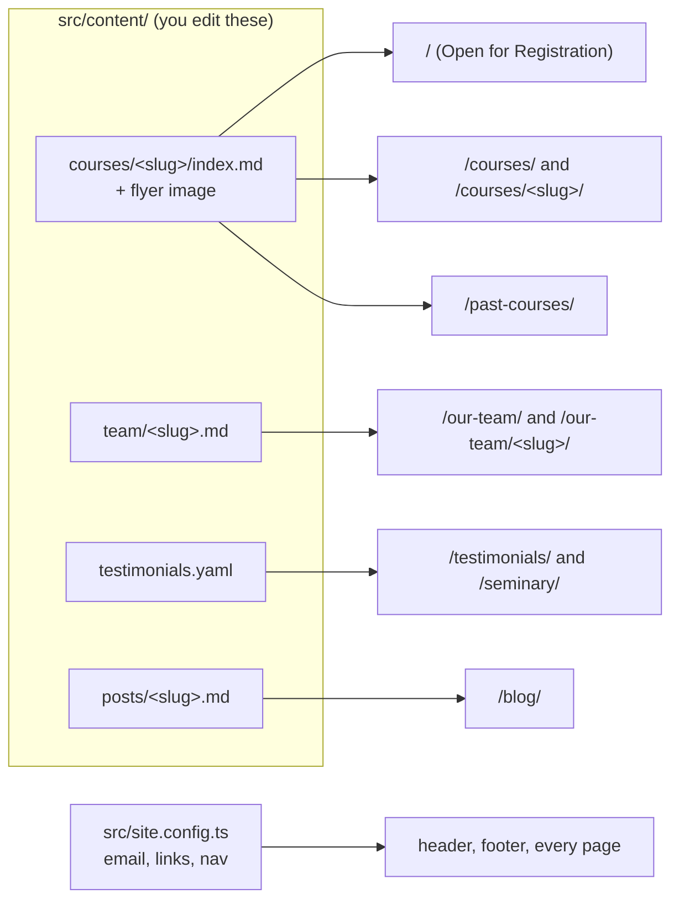

# Sabeel Institute website — maintainer guide

This file is the working guide for anyone (person or AI agent) changing this
site. Read it fully before editing.

## What this is

A static website for Sabeel Institute, built with [Astro](https://astro.build)
and Tailwind CSS v4, hosted on Firebase Hosting.

- **Design source:** the remake at `oursabeel.designrector.com` (home page and
  About page are final copy and layout; other pages follow the same design
  system).
- **Content source:** the established site `oursabeel.com` (courses, team
  bios, testimonials, donation and financial-aid details).

Almost everything that changes week to week is a content file. Pages read
those files and render them; you rarely need to touch page code.



## Commands

```bash
npm ci            # install exact dependencies (first time, or after pulling)
npm run dev       # local preview with live reload at http://localhost:4321
npm run build     # type-check, validate all content, build to dist/
npm run preview   # serve the built dist/ at http://localhost:4321
```

`npm run build` must finish with `0 errors` before you commit. It validates
every content file against the schemas in `src/content.config.ts`; when a file
is wrong, the error names the file and the field. Until the first blog post
exists, the build also prints `No files found matching "*.md" in directory
"src/content/posts"`; that line is expected.

## Deploying

Deploys run in GitHub Actions (`.github/workflows/firebase-hosting.yml`):

- Opening or updating a pull request deploys a preview and comments its URL on
  the PR.
- Merging to `main` deploys the live site.

Nothing needs to be run locally to deploy.

## Directory map

| Path | What it holds |
|---|---|
| `src/content/courses/` | One folder per course: `index.md` + flyer image |
| `src/content/team/` | One Markdown file per team member |
| `src/content/testimonials.yaml` | Student and parent quotes |
| `src/content/posts/` | Blog posts (the Blog link appears once one exists) |
| `src/content.config.ts` | Schemas: the fields each content file must have |
| `src/site.config.ts` | Email, social links, form links, navigation |
| `src/pages/` | One file per page; `[slug].astro` files render content entries |
| `src/components/` | Shared pieces: header, footer, cards, lightbox |
| `src/styles/global.css` | Design tokens (colours, fonts) and shared styles |
| `src/assets/` | Site images and decorative artwork |
| `public/` | Files served as-is (favicons) |

## Courses

Every course is a folder in `src/content/courses/`. The folder name is the
course's URL: `src/content/courses/mommy-burnout/` is served at
`/courses/mommy-burnout/`.

### Add a new course

1. Copy an existing open course folder that resembles the new one, e.g.
   `mommy-burnout/` for a multi-week class or `anchored-hearts/` for a
   gathering. Name the new folder in lowercase words joined by hyphens,
   e.g. `tafsir-surah-kahf-2027`.
2. Replace `flyer.webp` with the new flyer (`.webp`, `.jpg`, or `.png`; about
   1600 px on the long edge is plenty). Keep the file name referenced by the
   `flyer:` field.
3. Edit `index.md`. The block between the `---` lines is the course's data;
   everything after it is the course description in Markdown.
4. Run `npm run build` and fix anything it reports. Check the page in
   `npm run dev`.

Template (every field is required for an open course unless marked optional):

```markdown
---
status: open
title: Tafsir of Surah Al-Kahf
subtitle: Lessons for a Changing World          # optional
summary: One or two sentences for course cards and link previews (240 characters max).
category: Ladies
date: 2027-01-12                                  # first session, YYYY-MM-DD
dates: Tuesdays, January 12 – March 2
time: 10:00 AM – 12:00 PM
venue: Masjid Istiqlal
audience: Ladies only
fee: $50
registerUrl: https://forms.gle/xxxxxxxx
flyer: ./flyer.webp
---

Opening paragraph about the course.

## What you’ll study

- First topic
- Second topic

## Your instructor

### Ustadhah Sameera Shah

Short bio. [Read her full bio](/our-team/sameera-shah/).
```

Field reference:

| Field | Meaning |
|---|---|
| `status` | `open` (listed under Open for Registration) or `past` (archive) |
| `title` | Course name as it appears on the flyer |
| `subtitle` | Optional tagline shown under the title |
| `summary` | Card text and link-preview text; one or two sentences |
| `category` | Exactly one of: `Ladies`, `Adults`, `Youth Girls`, `Youth Boys`, `Youth`, `Kids`, `Families`, `Everyone` |
| `date` | First session as `YYYY-MM-DD`; listings are ordered newest first |
| `dates` | The schedule as people should read it |
| `time` | Session time, e.g. `7:00 – 8:00 PM` |
| `venue` | Where it meets, e.g. `Masjid Istiqlal` or `Online via Zoom` |
| `audience` | Who may attend, e.g. `Boys 12–16, Girls 13+` |
| `fee` | Price text, e.g. `$5 per session, or $35 for the series` or `Free` |
| `registerUrl` | The registration form link, copied exactly |
| `flyer` | Path to the flyer image in the same folder, starting with `./` |

The home page shows the three open courses with the latest `date`; the
Courses page shows all open courses.

Writing the description:

- Use `##` for section headings and `###` for sub-headings (sessions,
  instructors). Do not use `#`; the page already has the title.
- Use `-` for bullet lists and `**bold**` for emphasis.
- Link to other pages on this site with paths like `/seminary/` or
  `/our-team/mariam-sattar/`.
- Copy wording from the flyer or the organisers. Never invent dates, fees,
  instructors, or registration links; if something is unknown, ask.

### When a course ends

Change `status: open` to `status: past`. Nothing else. The course moves to the
Past Courses archive, and its page stays up (marked as ended) so links people
shared keep working.

### Monthly or recurring gatherings

For a recurring course whose topic changes (e.g. Anchored Hearts), edit the
existing folder each cycle: update `date`, `dates`, the flyer, the
registration link, and the "This month" section of the description.

### Add a flyer to the archive only

For a past program that only needs its flyer in the archive, create a folder
with `status: past` and no description after the closing `---`. Only
`title`, `category`, `date`, and `flyer` are required; `subtitle`, `summary`,
`dates`, and `venue` are optional and appear in the archive viewer. Entries
with no description get no page of their own.

```markdown
---
status: past
title: Summer Garden
subtitle: Glow Up — Inside and Out
summary: A summer sisterhood program for girls.
category: Youth Girls
date: 2025-06-29
flyer: ./flyer.webp
---
```

## Team members

Each person is one file in `src/content/team/`, named after them, e.g.
`mariam-sattar.md` (served at `/our-team/mariam-sattar/`).

```markdown
---
name: Mariam Sattar
honorific: Ustadhah          # Ustadhah, Sr., Br., or Dr.
group: teachers              # board, teachers, or admin
order: 10                    # position within the group, ascending
role: Treasurer              # optional
photo: ./photos/mariam-sattar.jpg   # optional; omit to show initials
---

Bio in Markdown. A member with no bio text is listed without a bio page.
```

To reorder people, change `order` (use steps of 10 so you can insert between).
If you add photos, put them in `src/content/team/photos/`.

## Testimonials

Edit `src/content/testimonials.yaml`. Each entry needs a unique `id`, a
`program`, and a `quote`. Quotes whose `program` is exactly
`Certification Program` also appear on the Seminary page.

## Blog posts

Add `src/content/posts/<slug>.md`:

```markdown
---
title: Preparing Our Hearts for Ramadan
date: 2027-02-01
summary: One or two sentences for the blog list and link previews.
author: Ustadhah Sameera Shah     # optional
cover: ./covers/ramadan.jpg       # optional
---

Post body in Markdown.
```

The Blog link appears in the header and footer automatically once the first
post exists.

## Seminary page

The Hikam Seminary details live in the `seminary` object at the top of
`src/pages/seminary.astro`. Each cycle, update `term` and `status`. When
applications open, set `applyUrl` to the application form; the page then
shows an "Apply Now" button instead of "Ask About the Seminary".

## Site-wide settings

`src/site.config.ts` holds the contact email, social links, donation and
financial-aid form links, the Zelle address, the tax ID, and the navigation
menus. `newsletterFormAction` takes a Mailchimp embedded-form URL; while it is
`null`, the newsletter form opens a pre-filled email instead.

## Design rules

- Colours come only from the tokens in `src/styles/global.css` (`bg-canvas`,
  `text-ink`, `text-raspberry`, `bg-sage-wash`, `text-gold-text`, ...). Do not
  write hex colours in pages or components.
- Body text is `text-ink` or `text-ink-soft`. Gold and taupe are decoration;
  gold text uses `text-gold-text`, which is darkened to stay readable. On
  sage backgrounds (`bg-sage-wash`), use `text-ink` for paragraphs.
- Raspberry is for headings, links, and buttons, not large backgrounds.
- The site has one light theme. Do not add a dark mode.
- Headings: page titles use `display-xl`; section titles use `display-md` or
  `heading-sans` (the home page style); small labels above headings use
  `eyebrow`.
- Reuse `PageHero`, `Divider`, `CourseCard`, `TeamCard`, and `Icon` rather
  than re-creating them. New icons go in `src/components/Icon.astro`.
- Check changes at phone width (about 390 px) as well as desktop.

## Before you commit

1. `npm run build` finishes with `0 errors`.
2. You looked at every page you changed in `npm run dev`, on desktop and
   phone widths.
3. Every date, fee, name, and link you added comes from a real source.
