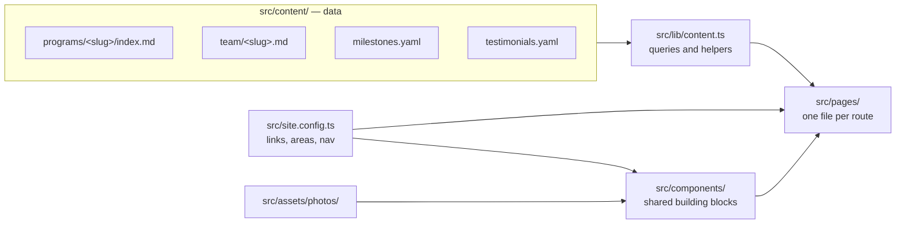
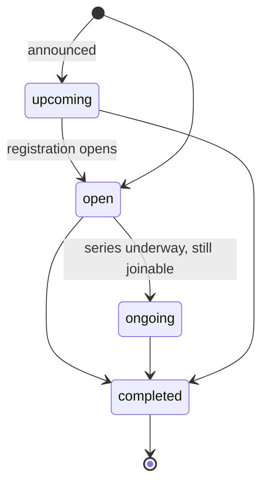

# Sabeel Institute website — guide for contributors and agents

Read this whole file before changing anything. It explains how the site is
built, the conventions every change follows, and how to keep changes easy to
review and merge. Deployment has its own guide: [docs/deployment.md](docs/deployment.md).

## What this is

A static website for Sabeel Institute, a women-led Islamic education
non-profit in Houston. Built with [Astro](https://astro.build) and Tailwind
CSS v4; deployed to Firebase Hosting by GitHub Actions. There is no server,
database, or CMS: every page is generated at build time from files in this
repository.

Sources of truth:

- **Structure and copy:** the organisation's wireframes (Home, Programs,
  program page, Past Programs, Hikam Foundations, Teachers & Team, About,
  Support Our Work, Through the Years, Contact).
- **Look:** the remake at `oursabeel.designrector.com` and the Sabeel brand
  palette: Cormorant Garamond headings, gold diamond dividers, ivory and sage
  sections, raspberry for actions.
- **Facts** (dates, fees, names, links): the organisation. Never invent them.
  If a fact is unknown, leave the field out and ask.

## Commands

```bash
npm ci            # install exact dependencies
npm run dev       # live-reloading preview at http://localhost:4321
npm run build     # type-check, validate all content, build to dist/
npm run preview   # serve the built dist/
```

`npm run build` must end with `0 errors`. It validates every content file
against the schemas in `src/content.config.ts`, and errors name the file and
field.

## How the site is put together



| Path | Holds |
|---|---|
| `src/content/programs/` | One folder per program: `index.md` plus its flyer and photo |
| `src/content/team/` | One Markdown file per person |
| `src/content/milestones.yaml` | Through the Years timeline |
| `src/content/testimonials.yaml` | Student quotes |
| `src/content.config.ts` | Schemas: every field each content file may have, with comments |
| `src/site.config.ts` | Contact email, social and form links, program areas, navigation |
| `src/lib/content.ts` | Collection queries and shared helpers (use these; do not re-query ad hoc) |
| `src/pages/` | Routes. `[slug].astro` files render one page per content entry |
| `src/components/` | Shared layout pieces (catalogue below) |
| `src/layouts/BaseLayout.astro` | `<head>`, header, footer, interest-list dialog |
| `src/styles/global.css` | Design tokens and shared classes |
| `src/assets/` | Images processed at build time (`photos/`, `images/`, `decor/`) |
| `public/` | Files served as-is (favicons) |
| `firebase.json` | Hosting settings and redirects for moved pages |
| `.github/workflows/` | Build and deploy (see docs/deployment.md) |

## Programs

Programs (courses, series, camps, gatherings) are the main subsystem. Every
program, current or past, is one folder in `src/content/programs/`. The folder
name is the program's ID and URL: `mommy-burnout/` → `/programs/mommy-burnout/`.
Names are lowercase words joined by hyphens; add the year for repeated
programs (`summer-garden-2026`). `womens-learning` and `youth-children` are
reserved for the area pages.

### Areas

Every program belongs to one area (`area:`). The labels, descriptions, and
page links live in `areas` in `src/site.config.ts`.

| `area` | Label | Page |
|---|---|---|
| `hikam-foundations` | Hikam Foundations | `/hikam-foundations/` (bespoke) |
| `womens-learning` | Women’s Learning | `/programs/womens-learning/` |
| `youth-children` | Youth & Children | `/programs/youth-children/` |

### Status



| `status` | Shown as | Appears in |
|---|---|---|
| `open` | Registration open | Home (first three), Programs, its area page |
| `ongoing` | Ongoing series | Same places, after open programs |
| `upcoming` | Coming soon | “Coming soon” on Programs and its area page |
| `completed` | Program completed | Past Programs, its area page’s archive; its own page stays up as a record |

When a program ends, change only `status` to `completed`. Its page stays,
registration buttons disappear, and shared links keep working.

### Format

`format` is `Online`, `On-site`, or `Online & on-site`. Programs and the area
pages group current programs under these three headings. `venue` names the
place (`Masjid Istiqlal`, `Zoom`, `Masjid Istiqlal and Zoom`).

### Standard and bespoke pages

Every program gets a page in one of two ways:

- **Standard (default).** `src/pages/programs/[slug].astro` builds the page
  from the fields, in a fixed order: status and area label, title, summary,
  Register and Ask a Question buttons, photo; the Audience · Starts ·
  Schedule · Format bar; “What students will learn” (`outcomes`) beside an
  “At a glance” panel; Instructor / What to expect / Policies cards; the
  Markdown body as “Program details”; the original flyer; a closing band
  (“Ready to join?”, “Registration opens soon.”, or “Interested in a future
  offering?” by status). Sections with no data are left out. Change the
  template only when the change should apply to every program.
- **Bespoke.** A hand-designed page for a flagship program, like
  `/hikam-foundations/`. The program folder keeps the facts and adds
  `page: /hikam-foundations/`; the page file reads them with
  `getEntry('programs', '<folder>')` instead of retyping them. Listings,
  cards, the archive, and link previews all keep working, and the standard
  template skips it. If `page` names a file that does not exist, the build
  fails and says which file to create.

To make a standard program bespoke: create `src/pages/<name>.astro` (use the
components and conventions below and `src/pages/hikam-foundations.astro` as
the reference), then add `page: /<name>/` to the program. To go back, delete
the page file and the `page` field.

### Fields

Required for `open` and `ongoing`: `title`, `summary`, `area`, `date`,
`audience`, `schedule`, `format`, `venue`, `duration`, `fee`, `registerUrl`.
`upcoming` needs `title`, `summary`, `area`, `date`, `audience`.
`completed` needs `title`, `area`, `date`. Everything else is optional.

| Field | Meaning | Example |
|---|---|---|
| `status` | See Status | `open` |
| `title` | Name as on the flyer | `Mommy Burnout` |
| `subtitle` | Tagline under the title | `A Journey from Burnout to Barakah` |
| `summary` | One sentence: what students learn and why it matters (≤ 240 characters); used on cards and link previews | |
| `area` | See Areas | `womens-learning` |
| `date` | First session, `YYYY-MM-DD`; orders listings | `2026-09-14` |
| `dateApprox` | `true` when only the year is known (shown as the year) | |
| `starts` | Overrides how the start is shown | `Fall 2026`, `Last Wednesday of each month` |
| `audience` | Who may attend | `Adult women`, `Boys 12–16 · Girls 13+` |
| `schedule` | Day · time · zone | `Mondays · 12:00–1:30 PM CT` |
| `format` | See Format | `Online & on-site` |
| `venue` | Where | `Masjid Istiqlal and Zoom` |
| `duration` | Length | `Seven sessions, Sept 14 – Oct 26` |
| `fee` | Price text | `$150`, `Free` |
| `registerUrl` | Registration form, copied exactly | `https://forms.gle/…` |
| `deadline` | Registration deadline text | |
| `prerequisites` | Materials or prerequisites | |
| `outcomes` | Three to five things students will learn (list) | |
| `instructors` | Team file names and/or inline guests `{ name, role, highlights }` | `sameera-shah` |
| `expect` | Teaching format, activities, participation | |
| `policies` | Attendance, refunds, recording, safeguarding | |
| `image`, `imageAlt` | Real photo for the top of the page (not the flyer); alt text required with it | `./photo.jpg` |
| `flyer` | Original flyer, shown lower on the page | `./flyer.webp` |
| `page` | Bespoke page path | `/hikam-foundations/` |

The Markdown body after the front matter is “Program details”. Use `##` and
`###` headings (never `#`), `-` bullets, `**bold**`, and site-relative links
that end in `/` (for example `/teachers-and-team/sameera-shah/`).

### Recipes

**Add a program.** Copy the most similar current program folder, rename it,
replace `flyer.webp` (and add `photo.jpg` with `image`/`imageAlt` if there is a
real photo), edit `index.md`, run `npm run build`, and check the program page,
the Programs page, and the home page in `npm run dev`.

**Retire a program.** Set `status: completed`.

**Recurring gathering** (for example Anchored Hearts): edit the same folder
each cycle — `date`, `starts`, flyer, `registerUrl`, instructors, and the
“This month” text.

**Archive-only record** (a past program that only has a flyer): a folder with
`status: completed`, `title`, `area`, `date` (plus `dateApprox: true` if only
the year is known), optionally `subtitle`, `summary`, `audience`, `schedule`,
`format`, `venue`, `instructors`, and `flyer`. No body.

**Add a new program field.** Add it to the shared `fields` object in
`src/content.config.ts` as optional, with a one-line comment; render it in the
standard template (and in bespoke pages that need it); add a row to the Fields
table above; use it in at least one program. Existing programs must stay
valid without it.

## Other content

### Team (`src/content/team/<name>.md`)

Front matter: `name`, `honorific` (`Ustadhah`, `Sr.`, `Br.`, `Dr.`), `group`
(`founder`, `board`, `teachers`, `volunteers`), `order` (ascending within the
group; use steps of 10), optional `role`, `highlights` (one or two short
lines), `listed` (`false` hides the person), `photo`. The body is the bio; a
listed person with a bio gets `/teachers-and-team/<name>/`. Refer to people in
programs by file name under `instructors`.

### Milestones (`src/content/milestones.yaml`)

`id`, `order`, `title`, `text`, optional `year` (only once verified), and
optional `program` (a program folder whose photo or flyer illustrates it).

### Testimonials (`src/content/testimonials.yaml`)

`id`, `program`, `quote`. Quotes whose `program` is `Certification Program`
appear on the Hikam Foundations page.

### Photos (`src/assets/photos/<slot>.jpg`)

Pages have named photo slots. Drop a file named after the slot (`.jpg`,
`.png`, or `.webp`) to fill it; until then the slot shows a geometric panel.
Find slot names by searching `src/pages` and `src/components` for `slot="` and
`photo="`. Use only real, approved Sabeel photos. `home-hero` and
`hikam-hero` currently hold design mock-ups to be replaced.

### Site settings (`src/site.config.ts`)

Contact email, location, social links, financial-aid form, giving links per
designation, Zelle address, tax ID, `mailingListAction` (Mailchimp form URL;
while `null`, sign-ups open a pre-filled email), `hikamOverviewPdf`, program
areas, and the header (`mainNav`) and footer (`footerNav`) menus. Change a
value here, never by typing it into a page.

## Pages and components

Routes: `/`, `/about/`, `/programs/`, `/programs/<slug>/`,
`/programs/womens-learning/`, `/programs/youth-children/`,
`/past-programs/`, `/hikam-foundations/`, `/teachers-and-team/`,
`/teachers-and-team/<slug>/`, `/through-the-years/`, `/support/`,
`/contact/`, `/financial-aid/`, and the 404 page.

| Component | Use for |
|---|---|
| `BaseLayout` | Every page. Props: `title`, `description`, `shareImage` |
| `PageHero` | Page opening: `eyebrow`, `title`, lead text (default slot), `actions` slot, and a photo slot or `media` slot |
| `SectionHeading` | Section opening: `eyebrow`, `title`, gold divider; the default slot is aside text on the right |
| `CtaBand` | Closing band: `title`, optional `eyebrow`, `tone` (`sage` or `mist`), text and an `actions` slot |
| `FactsBar` | Labelled facts row (`facts=[{ label, value }]`) |
| `ProgramCard` | A program teaser (current or completed) |
| `CurrentPrograms` | Current programs grouped by format |
| `AreaCards` | The three program-area cards (`mode="programs"` or `"archive"`) |
| `AreaPage` | A whole program-area page |
| `TeamCard` | A person |
| `Photo` | A photo slot (`slot=`) or a specific image (`image=`), with the pattern fallback |
| `Collage` | Three photo slots with captions |
| `MailingListForm`, `InterestDialog` | Newsletter and interest-list sign-up. Any link with `data-interest` opens the dialog |
| `Lightbox` | Enlarging flyers: links with `data-lightbox="<group>"` |
| `SabeelDifference` | The three-column band on Home and About |
| `Divider`, `Icon` | Gold diamond divider; inline icons (add new ones to `Icon.astro` using Lucide paths) |

Queries and helpers in `src/lib/content.ts`: `getCurrentPrograms(area?)`,
`getUpcomingPrograms(area?)`, `getCompletedPrograms(area?)`, `programHref`,
`STATUS_LABEL`, `startLabel`, `programYear`, `resolveInstructors`,
`getTeamGroup`, `displayName`, `teamHasPage`, `initials`, `excerpt`.

**A new page** is a file in `src/pages/` wrapped in `BaseLayout`, opening with
`PageHero`, with sections that open with `SectionHeading`, and ending with a
`CtaBand`. Add it to `mainNav` or `footerNav` in `src/site.config.ts` if it
belongs in a menu.

**Moving or removing a page:** add a 301 redirect for the old path to
`firebase.json` so shared links keep working.

## Design rules

- **Colour tokens only.** Use the Tailwind names defined in
  `src/styles/global.css`: backgrounds `bg-canvas`, `bg-surface`, `bg-inset`,
  `bg-sage-wash`, `bg-sage-mist`, `bg-raspberry`; text `text-ink`,
  `text-ink-soft`, `text-raspberry`, `text-gold-text`, `text-on-raspberry`;
  borders `border-border`, `border-gold`. No hex colours in pages or
  components.
- **Contrast.** Body text is `text-ink` or `text-ink-soft`; on sage
  backgrounds use `text-ink`. Gold (`text-gold`) and taupe (`text-muted`) are
  decoration only; readable gold text is `text-gold-text`. Raspberry is for
  headings, links, buttons, and small bands, not large backgrounds. There is
  one light theme; do not add a dark mode.
- **Type.** Page titles `display-xl` / `display-lg`; section titles
  `display-md` (or `heading-sans` where the home page uses it); small labels
  `eyebrow`; long Markdown text in `prose-sabeel`.
- **Layout.** Wrap content in `container-page`. Sections use
  `py-14 md:py-16`. Cards use `rounded-card` with gold borders
  (`border border-gold/60`, often `border-t-4 border-t-gold`) on `bg-surface`.
- **Buttons and links.** `btn btn-primary` for the main action,
  `btn btn-outline` for a secondary one, `link-arrow` with an `arrow-right`
  icon for text links. External registration links open in a new tab with
  `rel="noopener"` and an `external` icon.
- **Images.** Use `Image` from `astro:assets` with `widths` and `sizes`, never
  a plain `` for local images. Meaningful images have alt text;
  decorative ones use `alt=""`.
- **Accessibility.** One `h1` per page; headings in order; icon-only controls
  have a `label`; tap targets at least 44 px.
- **Phone first.** Check every change at about 390 px wide as well as desktop.

## Writing conventions

- Sentence case for headings (“Open for registration”). Eyebrows are
  uppercased by CSS, so write them in sentence case too.
- “On-site” with a hyphen as a label or before a noun (“On-site programs”);
  two words when describing where people meet (“classes meet on site”).
- Times with the zone: `10:00 AM–1:00 PM CT`. En dash for ranges: spaced
  between dates (`Sept 14 – Oct 26`), unspaced between times. Spaced em dash
  ( — ) inside sentences.
- Curly apostrophes and quotes (’ “ ”) in visible text.
- Honorifics as the organisation uses them: Ustadhah, Sr., Br.; write
  “‘Alimiyyah” with the opening mark.
- Program names, fees, and dates exactly as on the flyer or as the
  organisation gives them.

## Working in this repository

Keep every change easy to review and merge:

1. **Start from the latest `main`** and create a branch for one task.
2. **One concern per pull request.** Keep a content update separate from a
   layout change. Several open pull requests often touch the same component
   (`ProgramCard`, `CurrentPrograms`); small, focused diffs merge cleanly.
3. **Change only what the task needs.** Do not reformat, reorder, or rename
   unrelated code, and do not rewrite whole files to change a few lines.
4. **Do not commit** screenshots, notes, scratch files, `dist/`,
   `node_modules/`, or `.astro/`. Put screenshots in the pull-request
   description instead.
5. **Leave deployment alone** (`.github/workflows/`, `firebase.json` hosting
   settings, `.firebaserc`) unless the task is about deploying; see
   docs/deployment.md. Adding a redirect for a moved page to `firebase.json`
   is fine.
6. **Update docs with the change.** If you add a field, component, page, or
   convention, update this file in the same pull request.
7. **Verify** (below), then open a pull request that says what changed and
   why. Every pull request gets a preview link in a comment a few minutes
   after its build passes.
8. **Only the repository admin merges into `main`.** Merging deploys the live
   site.

If `main` has moved and your branch conflicts, update the branch from `main`
and resolve the conflicts, keeping other people’s changes.

## Before you open a pull request

1. `npm run build` ends with `0 errors`.
2. Every changed page looks right in `npm run dev` at desktop and phone width,
   with no horizontal scrolling.
3. Links you added work (internal links end in `/`).
4. Every date, fee, name, and link you added comes from a real source.
5. This file is updated if you changed a convention.
