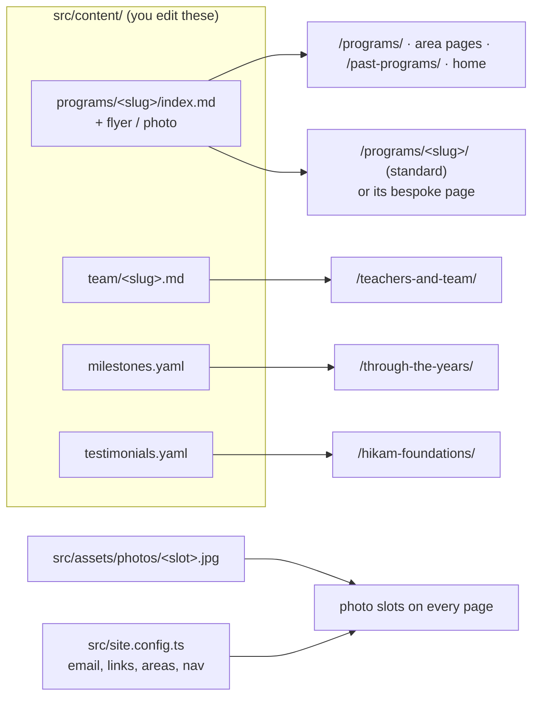

# Sabeel Institute website — maintainer guide

This file is the working guide for anyone (person or AI agent) changing this
site. Read it fully before editing.

## What this is

A static website for Sabeel Institute, built with [Astro](https://astro.build)
and Tailwind CSS v4, hosted on Firebase Hosting.

- **Structure and copy:** the organisation's wireframes (Programs, program
  page, Past Programs, Hikam Foundations, Teachers & Team, About, Support Our
  Work, Through the Years, Home, Contact).
- **Visual language:** the remake at `oursabeel.designrector.com` — Cormorant
  Garamond headings, gold diamond dividers, ivory and sage sections.
- **Programs are organised into three areas:** Hikam Foundations, Women’s
  Learning, and Youth & Children.

Almost everything that changes week to week is a content file. Pages read
those files and render them.



## Commands

```bash
npm ci            # install exact dependencies (first time, or after pulling)
npm run dev       # local preview with live reload at http://localhost:4321
npm run build     # type-check, validate all content, build to dist/
npm run preview   # serve the built dist/ at http://localhost:4321
```

`npm run build` must finish with `0 errors` before you commit. It validates
every content file against the schemas in `src/content.config.ts`; when a file
is wrong, the error names the file and the field.

## Deploying

Deploys run in GitHub Actions:

- `.github/workflows/site.yml` builds every pull request and every push to
  `main`. Pushes to `main` (merged pull requests) deploy the live site.
- `.github/workflows/preview.yml` runs after a pull request builds
  successfully: it publishes that build to a preview channel and comments the
  preview URL on the pull request.

Only workflows running from `main` can deploy, so changes to these workflow
files take effect after they are merged.

## Directory map

| Path | What it holds |
|---|---|
| `src/content/programs/` | One folder per program: `index.md` + optional flyer and photo |
| `src/content/team/` | One Markdown file per team member |
| `src/content/milestones.yaml` | Through the Years timeline |
| `src/content/testimonials.yaml` | Student quotes (shown on Hikam Foundations) |
| `src/assets/photos/` | Photos for named slots on pages (see Photos) |
| `src/content.config.ts` | Schemas: the fields each content file must have |
| `src/site.config.ts` | Email, links, program areas, navigation |
| `src/pages/` | One file per page; `[slug].astro` files render content entries |
| `src/components/` | Shared pieces: header, footer, cards, hero, photo slots |
| `src/styles/global.css` | Design tokens (colours, fonts) and shared styles |

## Programs

Every program — current or past — is a folder in `src/content/programs/`. The
folder name is its URL: `src/content/programs/mommy-burnout/` is
`/programs/mommy-burnout/`.

### Status

| `status` | Meaning | Shown |
|---|---|---|
| `open` | Taking registrations | Open for registration (home, Programs, its area) |
| `ongoing` | A running series people can still join | Same, labelled “Ongoing series” |
| `upcoming` | Announced, registration not open yet | “Coming soon” on Programs and its area |
| `completed` | Finished | Past Programs archive; its page stays as a record |

On Programs and the area pages, open and ongoing programs are grouped by
`format`: Online, On-site, and Online & on-site.

When a program ends, change its `status` to `completed`. Nothing else. The
page stays up without registration buttons, so shared links keep working.

### Add a new program (standard page)

1. Copy an existing current program folder that resembles the new one, e.g.
   `mommy-burnout/` for a multi-week course or `anchored-hearts/` for a
   monthly gathering. Name the folder in lowercase words joined by hyphens,
   e.g. `tafsir-surah-kahf-2027`.
2. Put the flyer in the folder as `flyer.webp` (or `.jpg`/`.png`). It is shown
   lower on the page, not at the top. If you have a real photo from the class,
   add it as `photo.jpg` and set `image: ./photo.jpg`.
3. Edit `index.md`: the block between the `---` lines is the program’s data;
   everything after it is the optional “Program details” text in Markdown.
4. Run `npm run build` and fix anything it reports. Check the page in
   `npm run dev`.

Template (fields marked optional may be left out):

```markdown
---
status: open
title: Tafsir of Surah Al-Kahf
subtitle: Lessons for a Changing World        # optional
summary: One clear sentence explaining what students will learn and why it matters.
area: womens-learning                         # hikam-foundations, womens-learning, youth-children
date: 2027-01-12                              # first session, YYYY-MM-DD; orders listings
starts: January 12                            # optional; overrides how the start date is shown
audience: Adult women
schedule: Tuesdays · 10:00 AM–12:00 PM CT
format: On-site                               # Online, On-site, or Online & on-site
venue: Masjid Istiqlal
duration: Eight weekly sessions
fee: $50
registerUrl: https://forms.gle/xxxxxxxx
deadline: January 5                           # optional
prerequisites: None                           # optional
outcomes:                                     # optional; three to five
  - First thing students will learn
  - Second thing
  - Third thing
instructors:                                  # optional
  - sameera-shah                              # a team member's file name
  - name: Dr. Guest Speaker                   # or a guest written inline
    role: Guest speaker
expect: Teaching format, activities, homework, parent role.   # optional
policies: Attendance, refunds, recordings.                    # optional
flyer: ./flyer.webp                           # optional
image: ./photo.jpg                            # optional; real photo for the top
imageAlt: Students in the Tafsir class        # required with image
---

Optional longer description: sessions, extra details. Use `##` for section
headings and `###` for sub-headings; `-` for bullets; `**bold**` for emphasis.
```

The page is built from these fields in a fixed order: title and summary,
Audience · Starts · Schedule · Format, “What students will learn” with an “At
a glance” panel, Instructor / What to expect / Policies cards, program
details, the original flyer, and a closing “Ready to join?” band. Sections
with no data are left out.

For a `completed` program only `title`, `area`, and `date` are required; add
`dateApprox: true` when only the year is known.

Never invent dates, fees, instructors, or registration links. If something is
unknown, leave the optional field out and ask.

### Recurring gatherings

For a recurring program whose topic changes (e.g. Anchored Hearts), edit the
existing folder each cycle: `date`, `starts`, the flyer, the registration
link, the instructors, and the “This month” section.

### Bespoke program pages

A program can have a hand-designed page instead of the standard one, like
Hikam Foundations. It still appears in every listing and the archive, because
its facts stay in its program folder.

1. Create the page in `src/pages/`, e.g. `src/pages/summer-garden.astro`.
   Design it freely with the shared components and the design rules below.
   Read the program’s facts from its entry instead of retyping them:
   `const program = await getEntry('programs', 'summer-garden-2027')`.
2. In the program’s `index.md`, add `page: /summer-garden/`.

Listings then link to the bespoke page, and the standard template skips that
program. If `page` points to a file that does not exist, the build fails and
says which file to create. Bespoke pages are design work; ask before creating
one.

## Photos

Pages have named photo slots (for example `home-hero`, `about-story`,
`team-hero`, `founder`, `rukaiya`, `support-hero`, `programs-women`). To fill
one, add an image named after the slot to `src/assets/photos/`, e.g.
`src/assets/photos/about-story.jpg`. Until a photo exists the slot shows a
geometric panel. Use only real, approved Sabeel photographs. To find a slot’s
name, search `src/pages` for `slot="` or `photo="`.

`home-hero` and `hikam-hero` currently hold the design mock-up images from
the remake; replace them with real photographs when available.

## Team

Each person is one file in `src/content/team/`, named after them (served at
`/teachers-and-team/<file-name>/`).

```markdown
---
name: Mariam Sattar
honorific: Ustadhah          # Ustadhah, Sr., Br., or Dr.
group: teachers              # founder, board, teachers, or volunteers
order: 10                    # position within the group, ascending
role: Program Director and Teacher
highlights:                  # one or two short lines
  - ‘Alimiyyah (2015) · B.Sc. Biochemistry, University of Houston
  - Islamic sciences · Girls’ and women’s mentorship
listed: false                # optional; hides the person from the site
photo: ./photos/mariam-sattar.jpg   # optional
---

Bio in Markdown. A member without a bio is listed without a bio page.
```

The Teachers & Team page shows the founder, `board`, and `teachers`. People
with `listed: false` are kept in the files but not shown.

## Through the Years

Edit `src/content/milestones.yaml`. Each milestone has an `id`, an `order`, a
`title`, and `text`. Add `year` only after checking it against registration
records, flyers, and program leads. `program` links a program folder; its
photo or flyer illustrates the milestone.

## Testimonials

Edit `src/content/testimonials.yaml`. Quotes whose `program` is exactly
`Certification Program` appear on the Hikam Foundations page.

## Site-wide settings

`src/site.config.ts` holds the contact email, social links, financial-aid form,
giving links per designation, the Zelle address, the tax ID, the program-area
names and descriptions, and the navigation menus.

- `mailingListAction`: a Mailchimp embedded-form URL. While `null`, the
  newsletter and interest-list forms open a pre-filled email.
- `hikamOverviewPdf`: the Hikam program overview; the download button appears
  once it is set.

## Design rules

- Colours come only from the tokens in `src/styles/global.css` (`bg-canvas`,
  `text-ink`, `text-raspberry`, `bg-sage-wash`, `text-gold-text`, ...). Do not
  write hex colours in pages or components.
- Body text is `text-ink` or `text-ink-soft`; on sage backgrounds use
  `text-ink`. Gold text uses `text-gold-text`. Raspberry is for headings,
  links, buttons, and small bands — not large page backgrounds.
- One light theme. Do not add a dark mode.
- Page titles use `PageHero`; sections open with `SectionHeading` (eyebrow,
  serif heading, gold divider); closing actions use `CtaBand`.
- Check changes at phone width (about 390 px) as well as desktop.

## Before you commit

1. `npm run build` finishes with `0 errors`.
2. You looked at every page you changed in `npm run dev`, on desktop and
   phone widths.
3. Every date, fee, name, and link you added comes from a real source.
