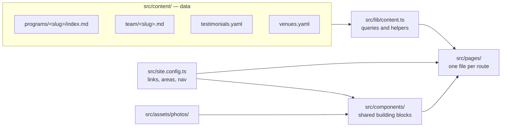
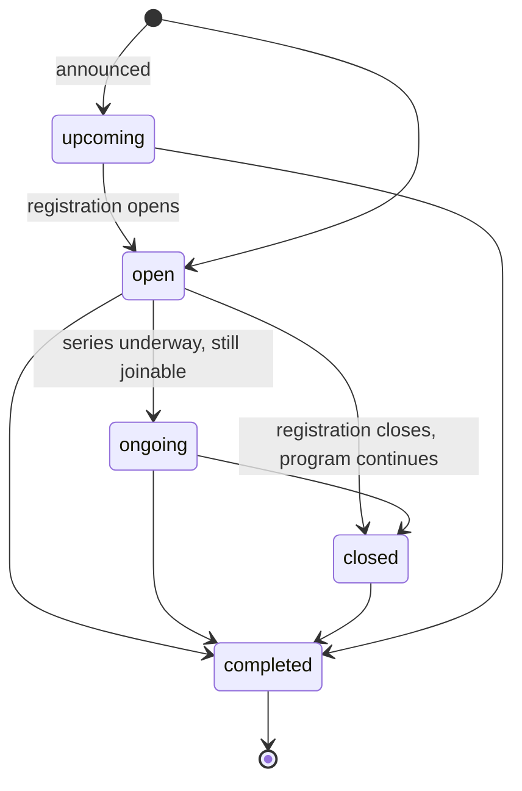

# Sabeel Institute website — guide for contributors and agents

Read this whole file before changing anything. It explains how the site is
built, the conventions every change follows, and how to keep changes easy to
review and merge. Deployment has its own guide: [docs/deployment.md](docs/deployment.md).

## What this is

A static website for Sabeel Institute, a women-led Islamic education
non-profit in Houston. Built with [Astro](https://astro.build) and Tailwind
CSS v4; deployed to Firebase Hosting by GitHub Actions. There is no server,
database, or CMS: every page is generated at build time from files in this
repository.

The design uses Cormorant Garamond for headings, Inter for body text, and DM
Sans for small labels; gold diamond dividers; ivory and sage sections; and
raspberry for headings, links, and buttons. The colours are the Sabeel brand
palette, defined as tokens in `src/styles/global.css` (see Design rules).
The palette, the logo files, and design guidance for every Sabeel surface live
in [Sabeel-Institute/brand](https://github.com/Sabeel-Institute/brand); this
site's colour tokens, logo, and favicons follow it.

Facts on the site (dates, fees, names, links, bios) come from the
organisation. Never invent them: if a fact is unknown, leave the field out and
ask.

## Commands

```bash
npm ci            # install exact dependencies
npm run dev       # live-reloading preview at http://localhost:4321
npm run build     # type-check, validate all content, build to dist/
npm run preview   # serve the built dist/
```

`npm run build` must end with `0 errors`. It validates every content file
against the schemas in `src/content.config.ts`, and errors name the file and
field.

## Everyday tasks

| Task | What to do |
|---|---|
| Announce, open, close, or end a program | Set its `status` (see Status). Listings update themselves |
| Keep a program off the site for now | Programs → Recipes → Keep a program off the site |
| Add a program | Programs → Recipes → Add a program |
| New session of a monthly gathering | Programs → Recipes → Recurring gathering |
| Images from the program's designers | Programs → Program images |
| Add, rename, or hide a person | Team |
| Add a testimonial | Testimonials |
| Add a place where programs meet | Venues |
| Add a photo to a page | Photos |
| Change contact details, links, or menus | Site settings |
| Donations, newsletter | Site settings → Donations, Newsletter |
| Rename or move a page | Pages and components → Moving or removing a page |

The home page, Programs, the area pages, and Past Programs list programs from
each program's `status`. Never edit those pages to add, move, or remove a
program.

## How the site is put together



| Path | Holds |
|---|---|
| `src/content/programs/` | One folder per program: `index.md` plus its flyer and program image |
| `src/content/team/` | One Markdown file per person |
| `src/content/testimonials.yaml` | Student quotes |
| `src/content/venues.yaml` | Places programs meet, with their addresses |
| `src/content.config.ts` | Schemas: every field each content file may have, with comments |
| `src/site.config.ts` | Contact email, social and form links, program areas, navigation |
| `src/lib/content.ts` | Collection queries and shared helpers (use these; do not re-query ad hoc) |
| `src/pages/` | Routes. `[slug].astro` files render one page per content entry |
| `src/components/` | Shared layout pieces (catalogue below) |
| `src/layouts/BaseLayout.astro` | `<head>`, header, footer, interest-list dialog |
| `src/styles/global.css` | Design tokens and shared classes |
| `src/assets/` | Images processed at build time (`photos/`, `images/`, `decor/`) |
| `public/` | Files served as-is (favicons) |
| `firebase.json` | Hosting settings and redirects for moved pages |
| `.github/workflows/` | Build and deploy (see docs/deployment.md) |
| `scripts/visual-diff/` | Screenshot comparison of each pull request with `main` (see docs/deployment.md) |

## Programs

Programs (courses, series, camps, gatherings) are the main subsystem. Every
program, current or past, is one folder in `src/content/programs/`. The folder
name is the program's ID and URL: `mommy-burnout/` → `/programs/mommy-burnout/`.
Names are lowercase words joined by hyphens; add the year for repeated
programs (`summer-garden-2026`). `womens-learning` and `youth-children` are
reserved for the area pages.

### Areas

Every program belongs to one area (`area:`). The labels, descriptions, and
page links live in `areas` in `src/site.config.ts`. An area whose `href` is
`null` has no page on the site, so it gets no card on Programs, no links, and
no interest-list option.

| `area` | Label | Page |
|---|---|---|
| `hikam-foundations` | Hikam Foundations | None: its bespoke page is a draft |
| `womens-learning` | Women’s Learning | `/programs/womens-learning/` |
| `youth-children` | Youth & Children | `/programs/youth-children/` |

### Status



| `status` | Use when | Shown as | Listed on | Its page offers |
|---|---|---|---|---|
| `open` | Registration is open | Registration open | Home, Programs, its area page | Register buttons (`registerUrl`) |
| `ongoing` | A series has begun and people can still join | Ongoing series | Same places, after open programs | Register buttons |
| `closed` | Registration has closed; the program is still running | Registration closed | “Registration closed” on Programs and its area page | Join the Interest List |
| `upcoming` | Announced; registration is not open yet | Coming soon | “Coming soon” on Programs and its area page | Join the Interest List |
| `completed` | The program has ended | Program completed | Past Programs | Join the Interest List; kept as a record |

Current programs (open and ongoing) are listed open before ongoing, latest
start date first; the home page shows the first three. When registration
closes before a program ends, change only `status` to `closed`; when a program
ends, change only `status` to `completed`. Keep every other field: the page
stays up, its registration buttons go, and shared links keep working.

### Format

`format` is `Online`, `On-site`, or `Online & on-site`. Programs and the area
pages group current programs under these three headings, and each card shows
it. Where it meets is three fields, and the page words them:

- `venue`: a place from `src/content/venues.yaml` by its id
  (`masjid-istiqlal`), or a list of them. Needed unless the program is online
  only.
- `room`: the room there (`Sabeel Classroom`), shown as “Sabeel Classroom at
  Masjid Istiqlal”.
- `platform`: the online platform (`Zoom`), shown as “online via Zoom”.

The page's Location reads, for example, “Masjid Istiqlal or online via Zoom”,
with each venue's address linked to a map.

### Cards

Every current program's card shows the same lines, in this order: audience,
schedule, how often (`frequency` and `duration`, “Weekly · 7 sessions”), and
format. Dates, the venue, and the fee are on the program's page only. Write
these fields exactly as the Fields table shows, so cards read alike; the
build stops when a schedule or a length contains dates.

### Standard and bespoke pages

Every program gets a page in one of two ways:

- **Standard (default).** `src/pages/programs/[slug].astro` builds the page
  from the fields, in a fixed order: status and area label, title, summary,
  Register and Ask a Question buttons, photo; the Audience · Starts ·
  Schedule · Location bar; “What students will learn” (`outcomes`) beside an
  “At a glance” panel; Instructor / What to expect / Policies cards; the
  Markdown body as “Program details”; the original flyer; a closing band
  (“Ready to join?”, “Registration opens soon.”, or “Interested in a future
  offering?” by status). Sections with no data are left out. Change the
  template only when the change should apply to every program.
- **Bespoke.** A hand-designed page for a flagship program, like
  `/hikam-foundations/`. The program folder keeps the facts and adds
  `page: /hikam-foundations/`; the page file reads them with
  `getEntry('programs', '<folder>')` instead of retyping them. Listings,
  cards, the archive, and link previews all keep working, and the standard
  template skips it. If `page` names a file that does not exist, the build
  fails and says which file to create.

To make a standard program bespoke: create `src/pages/<name>.astro` from the
components and conventions below, then add `page: /<name>/` to the program.
To go back, delete the page file and the `page` field.

The only bespoke page, Hikam Foundations, is a draft that is not on the site:
`src/pages/_hikam-foundations.astro` is not built (Astro builds no page from a
file whose name starts with `_`), and its program, `hikam-foundations-2026`,
has `draft: true`. Its content and design are not final: do not copy it as a
pattern or take conventions from it. To publish it, rename the file without
the `_`, remove `draft: true`, set the area's `href` in `src/site.config.ts`
to `/hikam-foundations/`, and add the page to `footerNav` and to the Programs
item's `match` in `mainNav`.

### Fields

Required for `open` and `ongoing`: `title`, `summary`, `area`, `date`,
`audience`, `schedule`, `format`, `frequency`, `fee`, `registerUrl`, and
`venue` unless the program is online only. `closed` needs the same except
`registerUrl`.
`upcoming` needs `title`, `summary`, `area`, `date`, `audience`.
`completed` needs `title`, `area`, `date`. Everything else is optional.

| Field | Meaning | Example |
|---|---|---|
| `status` | See Status | `open` |
| `title` | Name as on the flyer | `Mommy Burnout` |
| `subtitle` | Tagline under the title | `A Journey from Burnout to Barakah` |
| `summary` | One sentence: what students learn and why it matters (≤ 240 characters); used on cards and link previews | |
| `area` | See Areas | `womens-learning` |
| `date` | First session, `YYYY-MM-DD`; orders listings | `2026-09-14` |
| `dateApprox` | `true` when only the year is known (shown as the year) | |
| `starts` | Overrides how the start is shown | `Fall 2026`, `Last Wednesday of each month` |
| `audience` | Who may attend | `Adult women`, `Boys 12–16 · Girls 13+` |
| `endDate` | Last session, `YYYY-MM-DD`; the page shows the dates from `date` to `endDate` | `2026-10-26` |
| `schedule` | Days, then the time, without dates or frequency | `Mondays · 12:00–1:30 PM CT`, `Last Wednesday · 10:00–10:30 AM CT` |
| `frequency` | `weekly`, `twice-monthly`, `monthly`, `daily`, or `once` | `weekly` |
| `duration` | Length without dates; leave out for open-ended gatherings | `7 sessions`, `10 weeks`, `5 days` |
| `format` | See Format | `Online & on-site` |
| `venue`, `room`, `platform` | Where it meets; see Format | `masjid-istiqlal`, `Sabeel Classroom`, `Zoom` |
| `fee` | Price text | `$150`, `Free` |
| `registerUrl` | Registration form, copied exactly | `https://forms.gle/…` |
| `deadline` | Registration deadline text | |
| `prerequisites` | Materials or prerequisites | |
| `outcomes` | Three to five things students will learn (list) | |
| `instructors` | Team file names and/or inline guests `{ name, role, highlights }` | `sameera-shah` |
| `expect` | Teaching format, activities, participation | |
| `policies` | Attendance, refunds, recording, safeguarding | |
| `image`, `imageAlt` | The program image, 16:9 (see Program images); alt text required with it | `./image.webp` |
| `flyer` | Original flyer, US Letter portrait (see Program images) | `./flyer.webp` |
| `page` | Bespoke page path | `/hikam-foundations/` |
| `draft` | `true` keeps the program in the repository but off the site: no page, no listing | |

The Markdown body after the front matter is “Program details”. Use `##` and
`###` headings (never `#`), `-` bullets, `**bold**`, and site-relative links
that end in `/` (for example `/teachers-and-team/sameera-shah/`).

### Program images

A program has up to two images, each in one standard size, so the site uses
them as they are:

| Image | Size | Where the site shows it |
|---|---|---|
| Flyer (`flyer`) | US Letter portrait: 8.5 × 11 in, 2550 × 3300 px | Whole, lower on the program page, in Past Programs, and enlarged in the flyer viewer |
| Program image (`image`) | 16:9 landscape: 1920 × 1080 px | On the program's card, at the top of its page, and in link previews, which trim it slightly to 1.91:1 |

The program image is a photograph or artwork, not a copy of the flyer: at most
a large title, no small text (dates, times, and fees are on the page and
change), and nothing important within 5% of an edge. The build stops if a
program image is not 16:9. Until a program has its own, its image can be a
16:9 crop of its flyer's title area, as the current programs use. Designers'
guidance is the `sabeel-flyers` skill in
[Sabeel-Institute/brand](https://github.com/Sabeel-Institute/brand).

Both are stored as WebP (`flyer.webp`, `image.webp`). To convert a JPG or PNG,
run this from the repository root:

```bash
node -e "require('sharp')(process.argv[1]).webp({ quality: 90 }).toFile(process.argv[2])" flyer.png src/content/programs/<name>/flyer.webp
```

### Recipes

**Add a program.**
1. Copy the most similar current program folder and rename it (see the
   naming rule under Programs).
2. In `index.md`, set `status` (`upcoming` until registration opens, then
   `open`) and every field that status needs (see Fields), copying names,
   dates, fees, and the registration link exactly as the organisation gives
   them.
3. Replace `flyer.webp` with the new flyer and `image.webp` with the new
   program image (see Program images), and rewrite `imageAlt`. Without a
   program image, delete the file and both fields: the card then has no
   picture and the page shows a patterned panel in its place.
4. Write the Markdown body, or delete it if there is nothing beyond the
   fields.
5. Run `npm run build`, then check the program page, Programs, its area page,
   and (for an open program) the home page in `npm run dev`.

**Close registration early.** When registration closes while the program is
still running, change only `status` to `closed`.

**Retire a program.** Change only `status` to `completed`.

**Keep a program off the site.** Add `draft: true`; remove it to publish the
program. Everything else about it stays as it is.

**Recurring gathering** (for example Anchored Hearts): edit the same folder
each cycle: `date`, `starts`, `registerUrl`, instructors, and the “This
month” text. Replace `flyer.webp` with the new flyer under the same name, and
`image.webp` too if the artwork changed. The folder always describes the next
session; earlier sessions are not kept.

**Archive-only record** (a past program that only has a flyer): a folder with
`status: completed`, `title`, `area`, `date` (plus `dateApprox: true` if only
the year is known), optionally `subtitle`, `summary`, `audience`, `schedule`,
`format`, `venue`, `instructors`, and `flyer`. No body.

**Add a new program field.** Add it to the shared `fields` object in
`src/content.config.ts` as optional, with a one-line comment; render it in the
standard template (and in bespoke pages that need it); add a row to the Fields
table above; use it in at least one program. Existing programs must stay
valid without it.

## Other content

### Team (`src/content/team/<name>.md`)

Front matter: `name`, `honorific` (`Ustadhah`, `Ust.`, `Sr.`, `Br.`, `Dr.`),
`group` (`founder`, `board`, `teachers`, `volunteers`), `order` (ascending
within the group; use steps of 10), optional `role`, `sub` (a second line
under the role), `highlights`, and `listed` (`false` hides the person).
Each person has a short bio and a long one, both as the organisation writes
them. The short bio is `highlights`: up to three short lines of studies and
degrees, never roles or jobs (`Sabeel Graduate`, `‘Alimiyyah`,
`BS Biochemistry`), shown under the name and `role` on the Teachers & Team
page. The long bio is the Markdown body, shown on the person's own page,
`/teachers-and-team/<name>/`, which every listed person with a body gets.
Refer to people in programs by file name under `instructors`.

- **Add a person:** create `src/content/team/<name>.md`, where `<name>` is
  their name in lowercase words joined by hyphens (`sameera-shah`). Give it an
  `order` between those of the people it should sit between, and start the
  bio with the plain name (see Writing conventions).
- **Hide a person:** set `listed: false`. Their card and bio page go; programs
  that list them still show their name, without a link.
- **Rename a person:** correct `name`, rename the file, change every
  `instructors` entry that uses the old file name, fix the old spelling
  wherever else it appears in `src/`, and add a 301 redirect from
  `/teachers-and-team/<old>{,/}` to `/teachers-and-team/<new>/` (see Moving or
  removing a page).

### Venues (`src/content/venues.yaml`)

`id`, `name`, and optional `address`, as the organisation gives it. Programs
name a venue by its `id` in `venue`; program pages show its name and link the
address to a map. Add a place here before a program uses it.

### Testimonials (`src/content/testimonials.yaml`)

`id` (unique), `program` (the program the quote is about, as the student or
parent names it), and `quote` (their words, exactly as given). Only the
Hikam Foundations page shows testimonials, and it is a draft, so no quote
appears on the site.

### Photos (`src/assets/photos/<slot>.jpg`)

Pages have named photo slots. Drop a file named after the slot (`.jpg`,
`.png`, or `.webp`) to fill it; until then the slot shows a geometric panel.
Photos are cropped to fill their frame, so use landscape photos with the
subject near the centre, at least 1600 × 1200 px (4:3); `about-story` is 5:4,
at least 1500 × 1200 px.

| Page | Slots |
|---|---|
| Home | `home-hero` |
| About | `about-hero`; `about-story` (5:4) |
| Programs | `programs-women`, `programs-teens`, `programs-children` (collage) |
| Women’s Learning, Youth & Children | `area-womens-learning`, `area-youth-children` |
| Hikam Foundations (draft, not on the site) | `hikam-hero` |
| Past Programs | `past-programs-hero` |
| Teachers & Team | `team-hero`, `founder` |
| Support | `support-hero`, `rukaiya` |

A new slot on a page gets a row here. Use only real, approved Sabeel photos.
`home-hero`, `hikam-hero`, `about-hero`, and `about-story` hold
illustrations, not photos of Sabeel classes; replace them with approved photos
when available.

Team cards and bio pages are text only: do not add a photo slot, an initials
badge, or any other stand-in picture for a person. Three slots hold pictures the
organisation will supply, and show the geometric panel until then: `team-hero`
and `founder` on the Teachers & Team page, and `rukaiya` beside Rukaiya's story
on Support.

### Site settings (`src/site.config.ts`)

Contact email, location, social links, financial-aid form, the Zeffy donation
campaign, Zelle address, tax ID, `mailingListAction`, `hikamOverviewPdf`,
program areas, and the header (`mainNav`) and footer (`footerNav`) menus.
Change a value here, never by typing it into a page.

#### Newsletter

`mailingListAction` is the `action` URL from the Mailchimp embedded form's
code (`https://<account>.<dc>.list-manage.com/subscribe/post?u=…&id=…&f_id=…`);
the rest of Mailchimp's embed code, its CSS and scripts, is not used. The
newsletter form (`MailingListForm`) keeps the site's own styling, submits to
that URL in the background, and shows Mailchimp's reply under the button. The
Mailchimp form must require only the email address, and reCAPTCHA must be off
for it: the site's form cannot show Mailchimp's reCAPTCHA. Choosing double
opt-in in the audience settings switches reCAPTCHA on, so switch it off again
after. While `mailingListAction` is `null`, and always for the interest-list
form, signing up opens a pre-filled email to the organisation.

#### Donations

`zeffyCampaign`, at the top of the file, is the name at the end of the Zeffy
donation campaign's links (`https://www.zeffy.com/en-US/donation-form/<name>`).
The Support page's Donate buttons open that campaign's form in a dialog, where
donors choose the amount and how often to give. The suggested amounts,
frequencies, and the form's colour are set in the campaign editor on zeffy.com
(the organisation's Zeffy account) and need no change here; change
`zeffyCampaign` only to switch to another campaign. `zelle` and `taxId` appear
on the Support page. Donors do not choose a fund: every gift supports both
priorities the Support page describes, so do not add a choice of fund.

## Pages and components

Routes: `/`, `/about/`, `/programs/`, `/programs/<slug>/`,
`/programs/womens-learning/`, `/programs/youth-children/`,
`/past-programs/`, `/teachers-and-team/`, `/teachers-and-team/<slug>/`,
`/support/`, `/contact/`, `/financial-aid/`, and the 404 page.

| Component | Use for |
|---|---|
| `BaseLayout` | Every page. Props: `title`, `description`, `shareImage` |
| `Header`, `Footer` | The logo and menus on every page; the menus come from `mainNav` and `footerNav` |
| `PageHero` | Page opening: `eyebrow`, `title`, lead text (default slot), `actions` slot, and optionally a photo slot or `media` slot beside the text |
| `SectionHeading` | Section opening: `eyebrow`, `title`, gold divider; the default slot is aside text on the right |
| `CtaBand` | Closing band: `title`, optional `eyebrow`, text and an `actions` slot |
| `FactsBar` | Labelled facts row (`facts=[{ label, value }]`) |
| `ProgramCard` | A program's card: the same lines for every current program (see Cards); completed ones show year and summary |
| `CurrentPrograms` | Current programs grouped by format |
| `AreaCards` | The three program-area cards on Programs |
| `FlyerArchive` | Completed programs' flyers, one tab per year; the page also includes `Lightbox` |
| `AreaPage` | A whole program-area page |
| `TeamCard` | A person |
| `Photo` | A photo slot (`slot=`) or a specific image (`image=`), with the pattern fallback (never for people; see Photos) |
| `Collage` | Three photo slots with captions |
| `MailingListForm`, `InterestDialog` | Newsletter and interest-list sign-up. Any link with `data-interest` opens the dialog |
| `DonationDialog` | The Zeffy donation form, on the Support page. Any link with `data-donate` opens it |
| `Lightbox` | Enlarging flyers: links with `data-lightbox="<group>"` |
| `SabeelDifference` | The three-column band on Home and About |
| `Divider`, `Icon` | Gold diamond divider; inline icons (add new ones to `Icon.astro` using Lucide paths) |

Queries and helpers in `src/lib/content.ts`: `getCurrentPrograms(area?)`,
`getUpcomingPrograms(area?)`, `getClosedPrograms(area?)`,
`getCompletedPrograms(area?)`, `programHref`, `STATUS_LABEL`, `startLabel`,
`programYear`, `resolveInstructors`, `getTeamGroup`, `displayName`,
`teamHasPage`, `excerpt`.

**A new page** is a file in `src/pages/` wrapped in `BaseLayout`, opening with
`PageHero`, with sections that open with `SectionHeading`, and ending with a
`CtaBand`. Add it to `mainNav` or `footerNav` in `src/site.config.ts` if it
belongs in a menu.

**Moving or removing a page:** add a 301 redirect for the old path to
`redirects` in `firebase.json` so shared links keep working:

```json
{ "source": "/old-path{,/}", "destination": "/new-path/", "type": 301 }
```

## Design rules

- **Colour tokens only.** Use the Tailwind names defined in
  `src/styles/global.css`: backgrounds `bg-canvas`, `bg-surface`, `bg-inset`,
  `bg-sage-wash`, `bg-sage-mist`, `bg-raspberry`; text `text-ink`,
  `text-ink-soft`, `text-raspberry`, `text-gold-text`, `text-on-raspberry`;
  borders `border-border`, `border-gold`. No hex colours in pages or
  components.
- **Classes live in code.** Tailwind generates CSS only for class names it
  finds in `src/` outside `src/content/`. Write classes in components and
  pages, as whole names (not assembled from pieces), never in content files.
- **Contrast.** Body text is `text-ink` or `text-ink-soft`; on sage
  backgrounds use `text-ink`. Gold (`text-gold`) and taupe (`text-muted`) are
  decoration only; readable gold text is `text-gold-text`. Raspberry is for
  headings, links, buttons, and small bands, not large backgrounds. There is
  one light theme; do not add a dark mode.
- **Type.** Page titles `display-xl` / `display-lg`; section titles
  `display-md` (or `heading-sans` where the home page uses it); small labels
  `eyebrow`; long Markdown text in `prose-sabeel`.
- **Layout.** Wrap content in `container-page`. Sections use
  `py-14 md:py-16`. Cards use `rounded-card` with gold borders
  (`border border-gold/60`, often `border-t-4 border-t-gold`) on `bg-surface`.
  Lists of program cards use `card-grid`: up to three to a row, with a short
  last row centred.
- **Section backgrounds.** Sections sit on ivory, the page background, with no
  background class; where two ivory sections meet, the lower one has
  `border-t border-border`. Light sage (`bg-sage-mist`) marks an occasional
  highlight band: never a page's main content, and never next to another sage
  band. The stronger sage (`bg-sage-wash`) is only the closing `CtaBand`.
  `bg-surface` is for cards and panels, never a whole section.
- **Buttons and links.** `btn btn-primary` for the main action,
  `btn btn-outline` for a secondary one, `link-arrow` with an `arrow-right`
  icon for text links. External registration links open in a new tab with
  `rel="noopener"` and an `external` icon.
- **Images.** Use `Image` from `astro:assets` with `widths` and `sizes`, never
  a plain `` for local images. Meaningful images have alt text;
  decorative ones use `alt=""`.
- **Accessibility.** One `h1` per page; headings in order; icon-only controls
  have a `label`; tap targets at least 44 px.
- **Phone first.** Check every change at about 390 px wide as well as desktop.

## Writing conventions

- Sentence case for headings (“Open for registration”). Eyebrows are
  uppercased by CSS, so write them in sentence case too.
- “On-site” with a hyphen as a label or before a noun (“On-site programs”);
  two words when describing where people meet (“classes meet on site”).
- Times with the zone: `10:00 AM–1:00 PM CT`. En dash for ranges: spaced
  between dates (`Sept 14 – Oct 26`), unspaced between times. Spaced em dash
  ( — ) inside sentences.
- Curly apostrophes and quotes (’ “ ”) in visible text.
- A person's name and honorific come from their team file, and every page
  names them the same way, including program summaries and bios: Ustadhah
  for Sameera Shah, Ust. for the other teachers, Sr. and Br. as their files
  say. Bios begin with the plain name (“Mariam Sattar received…”). Write
  “‘Alimiyyah” with the opening mark.
- Program names, fees, and dates exactly as on the flyer or as the
  organisation gives them.

## Working in this repository

Keep every change easy to review and merge:

1. **Start from the latest `main`** and create a branch for one task.
2. **One concern per pull request.** Keep a content update separate from a
   layout change. Many changes touch the same components (`ProgramCard`,
   `CurrentPrograms`); small, focused diffs merge cleanly alongside each
   other.
3. **Change only what the task needs.** Do not reformat, reorder, or rename
   unrelated code, and do not rewrite whole files to change a few lines.
4. **Do not commit** screenshots, notes, scratch files, `dist/`,
   `node_modules/`, or `.astro/`. Put screenshots in the pull-request
   description instead.
5. **Leave deployment alone** (`.github/workflows/`, `firebase.json` hosting
   settings, `.firebaserc`, `scripts/visual-diff/`) unless the task is about
   deploying; see docs/deployment.md. Adding a redirect for a moved page to
   `firebase.json` is fine.
6. **Update docs with the change.** If you add a field, component, page, or
   convention, update this file in the same pull request.
7. **Verify** (below), then open a pull request that says what changed and
   why. A few minutes after its build passes, every pull request gets a
   comment with a preview link and a **Visual changes** line.
8. **Only the repository admin merges into `main`.** Merging deploys the live
   site.

If `main` has moved and your branch conflicts, update the branch from `main`
and resolve the conflicts, keeping other people’s changes.

## Before you open a pull request

1. `npm run build` ends with `0 errors`.
2. Every changed page looks right in `npm run dev` at desktop and phone width,
   with no horizontal scrolling.
3. Links you added work (internal links end in `/`).
4. Every date, fee, name, and link you added comes from a real source.
5. This file is updated if you changed a convention.

## After you open a pull request

1. Open the link after **Visual changes:** in the preview comment. The
   report lists every page that looks different from `main`, new pages, and
   removed pages, with before and after screenshots of up to 20 of them on
   each screen (phone or desktop) where they changed. Check that the pages
   you meant to change look right, and that every other listed page follows
   from your change (editing a person's role, for example, also changes each
   program page that shows them). If the comment says “comparison
   unavailable” or that pages could not be captured, see Troubleshooting in
   docs/deployment.md.
2. If a page changed that should not have, find the cause (usually a shared
   component or style) and fix it in the same pull request.
3. Open the preview link and click through the pages you changed.
