# Sabeel Course Page Guide

For Sabeel staff: everything a course can show on the website, and what you
can ask your agent to change. Read it once, then use it to describe what you
want.

**Contents:** [How it works](#how-it-works) ·
[Stages](#a-courses-stage-decides-where-it-appears) ·
[The course card](#the-course-card) · [The course page](#the-course-page) ·
[Dates and times](#dates-and-times) ·
[Prices](#prices-and-financial-aid) · [Registration](#registration) ·
[Where it meets](#where-it-meets) · [Pictures](#pictures) ·
[Kinds of text](#what-kind-of-text-each-part-takes) ·
[Everyday requests](#everyday-requests) ·
[What stays the same](#what-stays-the-same-on-every-course) ·
[Checking a change](#checking-a-change) ·
[Your agent’s words](#your-agents-words)

## How it works

Every course on the website comes from one place: the course’s own
information, kept in its folder with its flyer and picture. Nobody edits the
pages themselves. When the information changes, every place the course
appears changes with it.

You don’t edit the information yourself either. You tell your agent what you
want, in plain words. The agent knows the website’s rules, makes the change,
and sends it for review with a preview you can click through.

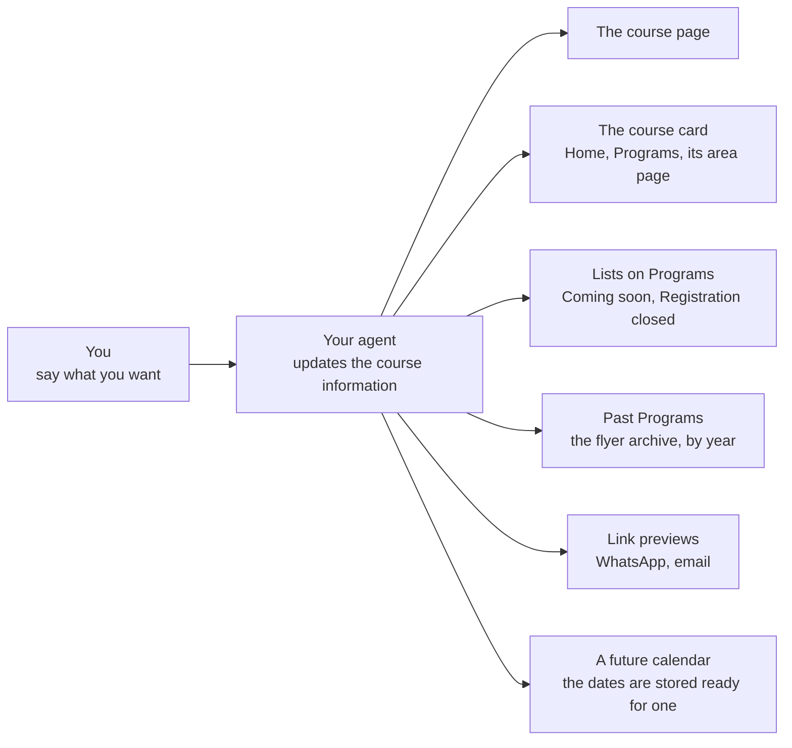

> **Good to know:** the website calls courses **programs** (the Programs
> menu, Past Programs). This guide says courses. Your agent understands both.

In the pictures below, numbered markers point to each part. Parts marked
*Optional* appear only when you give them: leave one out and it is not shown
at all, with no empty space left behind. Parts marked *Automatic* are written
by the site.

## A course’s stage decides where it appears

Each course is at one stage. The stage puts the course in the right lists
and chooses its buttons. It never changes by itself on a date: when
registration closes or the course ends, ask your agent to change it.

| Stage (as the site shows it) | Where it shows | Buttons |
|---|---|---|
| **Coming soon** | The Coming soon list on Programs and on its area page | Join the Interest List |
| **Registration open** | The home page (up to three courses), Programs, and its area page | Register and Ask a Question |
| **No registration needed** | An open course anyone can just come to; the same places | Ask a Question |
| **Ongoing series** | Already started, still taking people; after the open courses | Register and Ask a Question |
| **Registration closed** | Still running, no longer taking people; the Registration closed list | Join the Interest List |
| **Program completed** | Finished; moves to Past Programs. The page stays as a record, and shared links keep working | Join the Interest List |

**Tell your agent:**

- “Open registration for [course name].”
- “Close registration for [course name]; the course is still running.”
- “[Course name] has finished. Move it to past programs.”

## The course card

On the home page, Programs, and the area pages. Every current course gets the
same card, so visitors can compare them at a glance. The lines always come in
the same order.

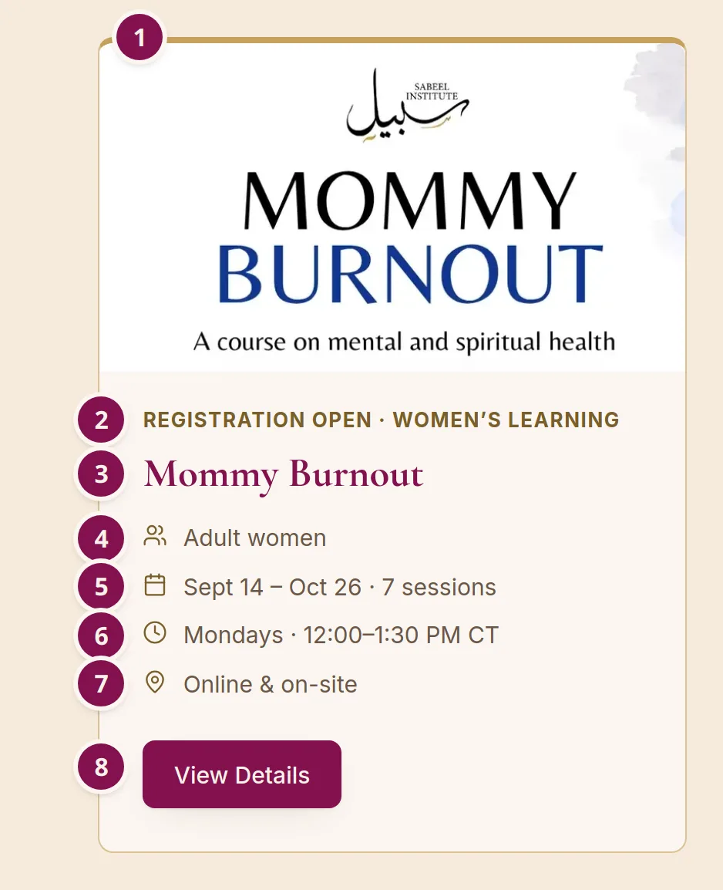

1. **Picture.** The course’s wide picture. Without one, the card has no
   picture. *Optional*
2. **Stage and area.** *Automatic*
3. **Title.** As on the flyer.
4. **Who it’s for.** Your words: “Adult women”, “Boys 12–16 · Girls 13+”.
   *Optional*
5. **Dates and how many sessions.** Written from the dates you give.
   *Automatic*
6. **Days and time.** One line for each part of the schedule. *Automatic*
7. **Online, On-site, or Online & on-site.** Also decides which group the
   card sits in on Programs.
8. **View Details.** Opens the course page.

> **When the dates are complicated:** lines 5 and 6 can be replaced with one
> or two short lines of your own, for a schedule too long for a small card.
> Use this rarely: those lines are not checked against the real dates.
> Your agent’s word: `card`.

### How the cards are arranged

Programs and the area pages group current courses by where they meet:
Online, On-site, and Online & on-site. Within a group, open courses come
first, then ongoing ones, newest start first.

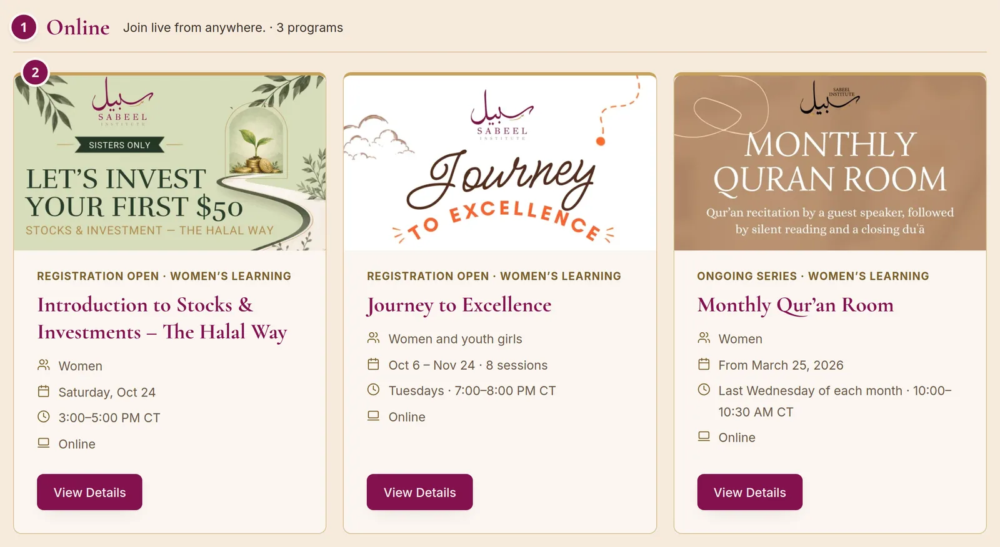

1. **The group**, with how many courses it holds. *Automatic*
2. **A course card.** Programs shows every current course; the home page
   shows the first three.

Courses that are coming soon or have closed registration appear as one line
each, with their dates:

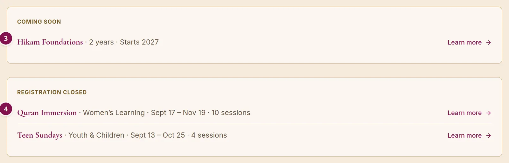

3. **Coming soon.** Title, area, and dates, or your own card lines (here
   “2 years · Starts 2027”).
4. **Registration closed.** Title, area, dates, and how many sessions.

## The course page

Every course’s own page is built from its information, top to bottom, in a
fixed order. This section shows every part that can appear.

### The top of the page

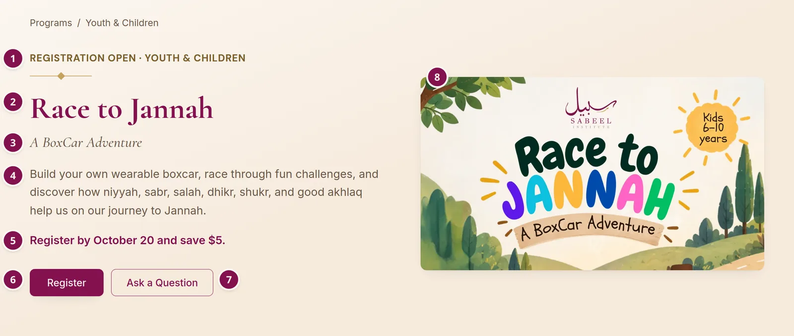

1. **Stage and area.** *Automatic*
2. **Title.**
3. **Subtitle**, a short tagline. *Optional*
4. **Summary.** One sentence: what people will learn and why it matters. It
   is also the text people see when the link is shared on WhatsApp or by
   email.
5. **Highlight line**, in bold above the buttons: an early-bird price,
   limited seats, a new date. It disappears once registration closes.
   *Optional*
6. **Register.** What it opens depends on how people register (see
   [Registration](#registration)).
7. **Ask a Question.** Opens the contact form with the course’s name already
   filled in.
8. **Picture.** The same wide picture as the card. Without one, a patterned
   panel takes its place. *Optional*

The label and the buttons change with the stage and with how people
register. These two are shown with sample settings:

| Coming soon | No registration needed |
|---|---|
| 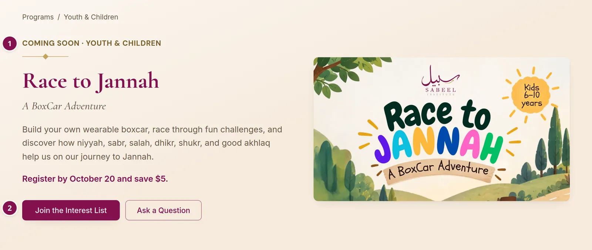 | 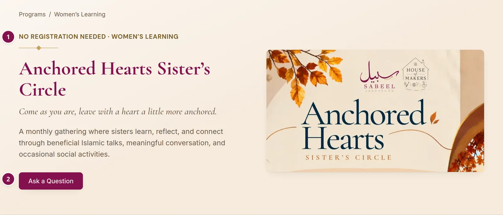 |
| (1) the label, and (2) Join the Interest List in place of Register | (1) the label, and (2) Ask a Question as the only button |

### The facts

Every fact someone needs to decide sits in one block under the top of the
page.

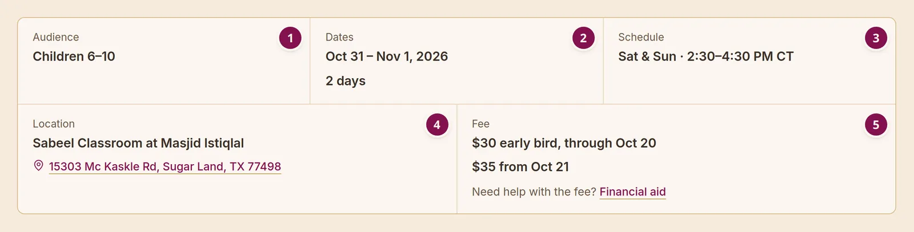

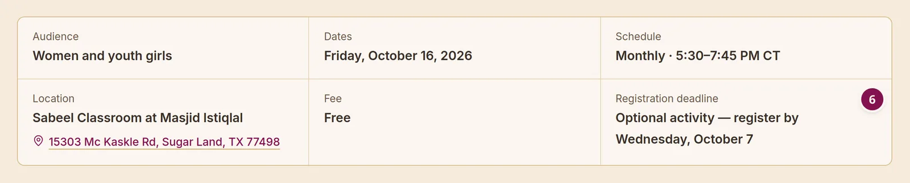

1. **Audience.** Who it’s for, in your words. *Optional*
2. **Dates**, with how many sessions or days. *Automatic*
3. **Schedule**: days and time, one line for each part. *Automatic*
4. **Location**, in your words, with the address linked to a map for places
   the site knows (see [Where it meets](#where-it-meets)). *Optional*
5. **Fee**, one line or several, with “Need help with the fee? Financial
   aid” under it while people can join (see
   [Prices](#prices-and-financial-aid)). *Optional*
6. **Registration deadline.** It disappears once registration closes.
   *Optional*

### About this program

The middle of the page takes one of three layouts, chosen automatically from
what the course has.

**1. With points for “What students will learn”.** The writing leads, and
the flyer stays beside it as the reader scrolls:

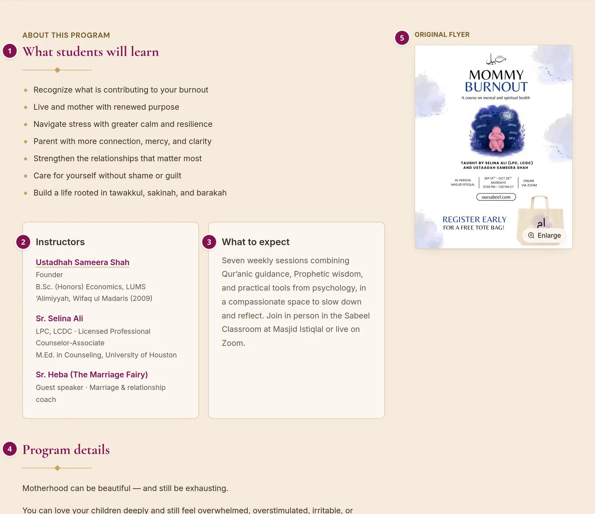

1. **What students will learn.** Three to five short points. *Optional*
2. **Instructor card.** See [the cards](#the-cards) below. *Optional*
3. **What to expect card.** See [the cards](#the-cards) below. *Optional*
4. **Program details.** Your longer write-up, as long as you like, with
   headings, bullet points, bold, and links. Good for a session-by-session
   list, “This course may be for you if…”, or speaker bios. *Optional*
5. **Original flyer.** Click to enlarge. *Optional*

**2. With a longer write-up but no points.** The write-up leads under the
heading “What to know”, then the cards, with the flyer beside them:

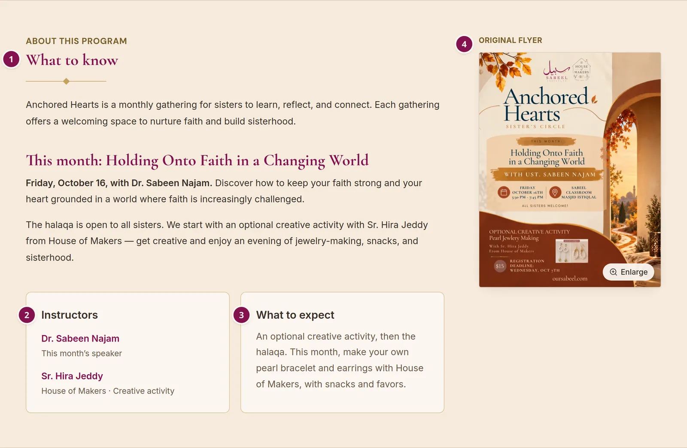

1. **What to know.** The longer write-up, with all its formatting.
2. **Instructor card.** *Optional*
3. **What to expect card.** *Optional*
4. **Original flyer.** *Optional*

**3. With neither.** The flyer leads, and the cards sit beside it:

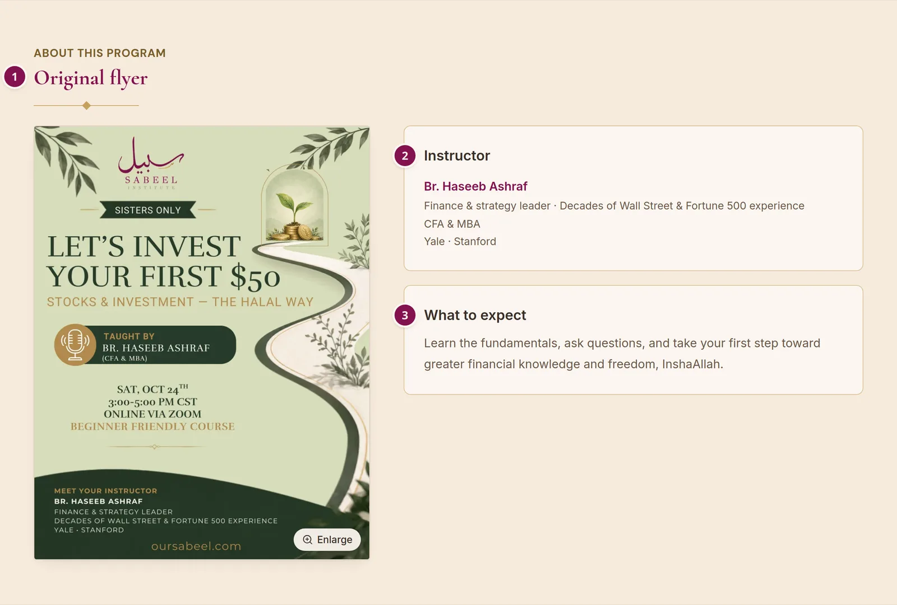

1. **Original flyer**, large.
2. **Instructor card.** *Optional*
3. **What to expect card.** *Optional*

### The cards

Up to three short cards, in every layout. Each one appears only when you
give it; leave it out and the card is gone. In the first two layouts, two
cards sit side by side and a third takes the whole row, as here; in the
third, they stack beside the flyer.

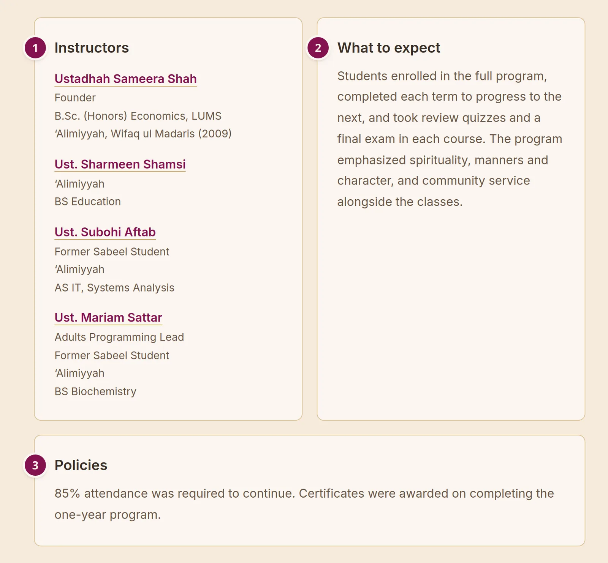

1. **Instructor**, or **Instructors** for more than one. Team members link to
   their bio page when they have one; guest speakers get their name, role,
   and up to three short lines. *Optional*
2. **What to expect.** How the course runs, the activities, and anything to
   bring or know first. *Optional*
3. **Policies.** Attendance, refunds, recording, safeguarding. *Optional*

> **Formatting:** What to expect and Policies can have paragraphs, bullet
> points, numbered lists, bold, italics, and links. They can’t have
> headings: each card already has its own title.

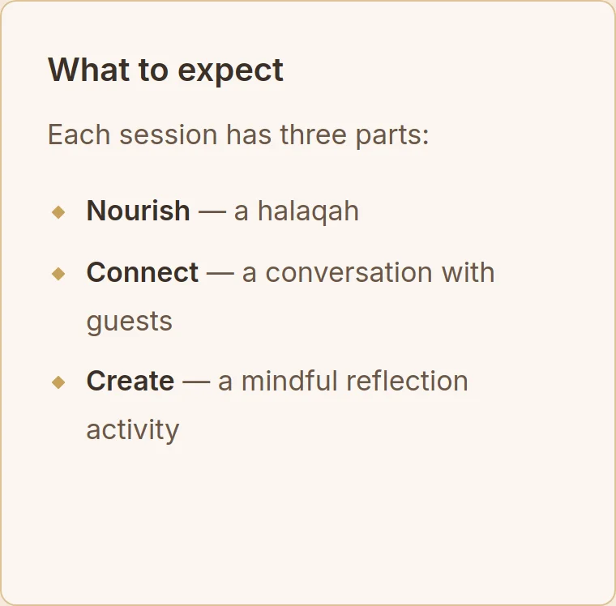

Raising with Purpose’s What to expect: a sentence, then a bulleted list with
each part’s name in bold. Ask for it in plain words: “Make the three parts a
bulleted list, with their names in bold.”

### The closing band

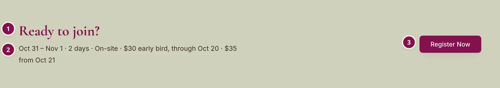

1. **The heading changes with the stage:** “Ready to join?”, “Registration
   opens soon.”, “Coming soon.”, or “Interested in a future offering?”.
   *Automatic*
2. **The key facts again**: dates, format, and fee. *Automatic*
3. **Register Now**, or Ask a Question, or Join the Interest List, by stage.

Every version of the band:

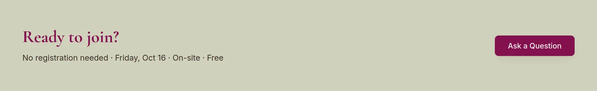

**Open, no registration needed:** “No registration needed” leads the facts,
and the button is Ask a Question. (Sample settings.)

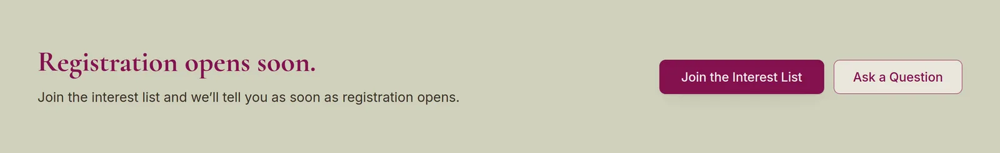

**Coming soon:** “Registration opens soon.” A coming-soon course that will
need no registration says “Coming soon.” instead. (Sample settings.)

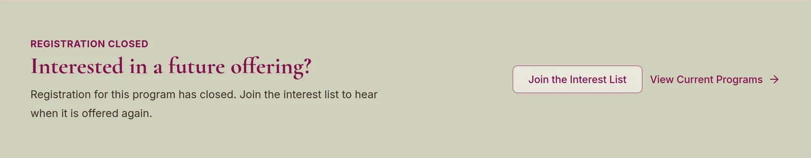

**Registration closed or completed:** “Interested in a future offering?”,
with Join the Interest List and a link to current programs. (Teen Sundays,
whose registration has closed.)

### On a phone

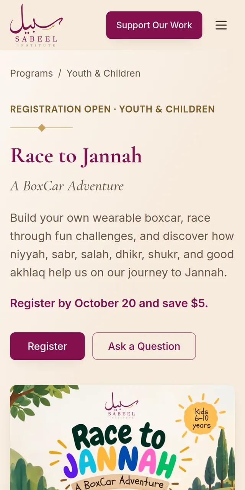

Everything stacks into one column in the same order. Nothing extra is needed
for phones, and the review report includes phone screenshots of every
changed page.

## Dates and times

Tell your agent the dates the way you would tell a person. The site then
writes them the same way on the card, the page, and the lists, works out how
many sessions there are, and keeps them ready for a calendar later. Times
are always Central time; the site adds “CT”.

Each example shows what you might say and what the card then shows. Examples
marked “Example” are made up; the others are real courses.

| Course | You say | The card shows |
|---|---|---|
| Investing workshop · one session | Saturday, October 24, 3 to 5 pm. | Saturday, Oct 24 3:00–5:00 PM CT |
| Mommy Burnout · a weekly course | Seven Mondays from September 14, 12 to 1:30. | Sept 14 – Oct 26 · 7 sessions Mondays · 12:00–1:30 PM CT |
| Example · two days a week | Tuesdays and Thursdays from January 12, eight sessions, 7 to 8 pm. | Jan 12 – Feb 4 · 8 sessions Tuesdays & Thursdays · 7:00–8:00 PM CT |
| Teen Sundays · every other week | Every other Sunday from September 13, four times, 2:15 to 4:15. | Sept 13 – Oct 25 · 4 sessions Every other Sunday · 2:15–4:15 PM CT |
| Race to Jannah · a weekend | Saturday October 31 and Sunday November 1, 2:30 to 4:30. | Oct 31 – Nov 1 · 2 days Sat & Sun · 2:30–4:30 PM CT |
| Monthly Qur’an Room · monthly, no end | The last Wednesday of every month, starting March 25, 10 to 10:30 am. | From March 25, 2026 Last Wednesday of each month · 10:00–10:30 AM CT |
| Anchored Hearts · a new date each month | This month’s gathering is Friday, October 16, 5:30 to 7:45. It meets monthly. | Friday, Oct 16 Monthly · 5:30–7:45 PM CT |
| Example · a week off | Thursdays from November 5 to December 10, 10 am to 1 pm, but not on Thanksgiving, November 26. | Nov 5 – Dec 10 · 5 sessions Thursdays · 10:00 AM–1:00 PM CT |
| Example · two blocks of days | Monday to Thursday, June 14 to 17, then again June 28 to July 1, 10 am to 1 pm. | June 14 – July 1 · 8 sessions June 14–17: Mon–Thu · 10:00 AM–1:00 PM CT June 28 – July 1: Mon–Thu · 10:00 AM–1:00 PM CT |
| Camp Futuwwah 2026 · two places | July 25 to 28 at Maryam Islamic Center, then July 29 to August 1 at Masjid Al-Aqsa, 4:45 to 7:45 each day. | July 25 – Aug 1 July 25–28: Sat–Tue · 4:45–7:45 PM CT July 29 – Aug 1: Wed–Sat · 4:45–7:45 PM CT (The course page names each place, with a map link for each.) |
| Example · an overnight trip | A camping trip from Friday March 12 to Sunday March 14, overnight. | March 12–14 · 3 days Overnight · Fri–Sun (With times, such as leaving Friday at 4 pm and back Sunday at 2 pm, the line reads “Fri 4:00 PM – Sun 2:00 PM CT”.) |
| Example · your own card lines | On the card, just say “Two 4-day camps” and the time. | Two 4-day camps · July 25 – Aug 1 4:45–7:45 PM CT (The course page still shows the full schedule.) |
| Example · nights of Ramadan | Ten nights from March 1: reflections at 11:45 pm, then games at 2 am. | March 1–11 Nightly reflections: Daily · 11:45 PM CT Games: Daily · 2:00 AM CT (An activity after midnight falls on the next calendar day, so the dates end a day after the last night.) |

**Also possible:**

- **No set time**, such as an all-day event: the time is simply left off.
- **A time set by prayer** (“after Isha”, “at Tahajjud”): give it as words,
  without a clock time.
- **A session moves** to another day: the old date is skipped and the new
  one added.
- **Dates not decided yet**: give the year, and the card says “Starts 2027”.
- **Your own wording** for one part, such as “Girls 14+” or “Book club”,
  shown before its days and time.

**Written by the site,** the same on every course so visitors always know
where to look: the style of dates and times (“Sept 14 – Oct 26”,
“12:00–1:30 PM CT”); the count of sessions or days; and “Mondays”, “Every
other Sunday”, “Last Wednesday of each month”.

Your agent’s words: `schedule` for the dates and times, `date` when only the
year is known.

## Prices and financial aid

The fee is written the way you want people to read it. It can be one line or
several, each shown on its own line.

| Course | You say | The page shows |
|---|---|---|
| One price | The fee is $150. | $150 |
| Quran Immersion · two prices | $50 in person, $75 online. | $50 in person $75 online |
| Race to Jannah · early bird | $30 early bird through October 20, then $35. Highlight it at the top. | $30 early bird, through Oct 20 $35 from Oct 21 Highlight line: **Register by October 20 and save $5.** |
| Example · monthly fee | $10 a month. | $10 a month |

> **Early-bird prices:** write the date into the price, as above, so the line
> stays true after the date passes. Ask your agent to remove the early-bird
> line and the highlight once the date has passed; the site does not remove
> them by itself.

> **Financial aid:** “Need help with the fee? Financial aid” appears under
> the fee while people can join. For a free course, ask your agent to turn it
> off. Your agent’s words: `fee`, `highlight`, `financialAid: false`.

> **Zeffy prices:** ticket prices are set on zeffy.com, not by your agent.
> When a price changes, change it in both places so the page and the form
> agree.

## Registration

Each course has one way to register. It decides what the Register buttons
do.

| Choice | What Register does |
|---|---|
| **A Zeffy form** | For most courses, free or paid. Register opens the form in a window on the page, so people never leave the site. A free course uses a $0 ticket. Give your agent the form’s link. |
| **Another site’s form** | For example a partner organisation’s Google Form. Register opens it in a new tab. Give your agent the full link. |
| **No registration needed** | For a course anyone can just come to. The label says “No registration needed”, there is no Register button, and Ask a Question becomes the main button. |
| **Form not ready yet** | Say so, and Register opens a short message instead of a form. Send the link when it exists. |

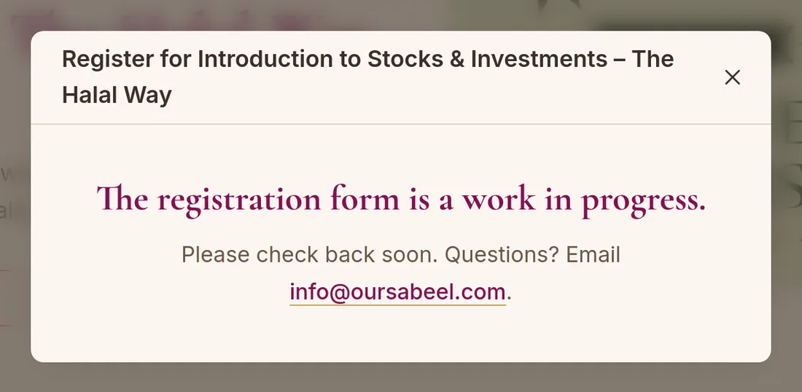

What Register opens while the form is not ready. (Sample settings.)

**Tell your agent:**

- “Registration for [course name] is this Zeffy form: [link].”
- “[Course name] needs no registration; anyone can come.”

## Where it meets

Two things decide how the location shows:

- **The place**, chosen from the site’s list of places (Masjid Istiqlal,
  Maryam Islamic Center, and others). A place with an address gets a map
  link with a pin. A new place needs its name, and its address if you want a
  map link, given once.
- **How it’s worded**, in your words: “Sabeel Classroom at Masjid Istiqlal or
  online via Zoom”, “Online via Zoom”. Leave it out and the page shows the
  place’s name. Two places in one course? Give each part of the schedule its
  place (see [Dates and times](#dates-and-times)).

Separately, every current course is **Online**, **On-site**, or **Online &
on-site**. That decides its group on Programs and the icon on its card.

## Pictures

A course has up to two images, each in one fixed shape, so the site never
has to crop or stretch them badly.

| Image | Shape and size | Where it shows |
|---|---|---|
| **Course picture** | Wide, 1920 × 1080 | On the card, at the top of the page, and in link previews. A photograph or artwork, with at most a large title: no small text, since dates, times, and fees change. Keep anything important away from the edges. |
| **Flyer** | Letter size, 2550 × 3300 | Shown whole and enlargeable on the page and in Past Programs. |

Until a course has its own picture, a crop of the flyer’s title can stand
in. Designers’ guidance for both is in the Sabeel brand kit.

## What kind of text each part takes

Some parts hold a single line, and some can hold lists and paragraphs.
Describe the formatting in plain words (“make this a bulleted list”, “bold
the names”), and your agent writes it.

| Part | What it can hold | For example |
|---|---|---|
| Title, subtitle, summary, highlight line | One line of plain text | Register by October 20 and save $5. |
| Who it’s for, location, fee, registration deadline | One line, or several lines shown one under another. No bold or links | $50 in person $75 online |
| Your own card lines | One or two short lines | Two 4-day camps · July 25 – Aug 1 |
| What students will learn | A list of short points, plain text | Navigate stress with greater calm and resilience |
| Instructor (guest speakers) | A name, a role, and up to three short lines. Team members’ details come from their own profiles | Sr. Heba · Guest speaker |
| What to expect, Policies | Paragraphs, bullet points, numbered lists, bold, italics, and links. No headings | See [the cards](#the-cards) |
| Program details (the longer write-up) | All of the above, plus headings at two levels. As long as you like | A session-by-session list |
| Dates, days, and times | Written by the site from the dates you give. One part of a schedule can have a short label | Girls 14+ |

## Everyday requests

Each line is something you can say to your agent, more or less word for
word.

| Task | Tell your agent |
|---|---|
| Add a new course | “Add a new course from this flyer.” Give the agent what you have: the flyer and picture, title, who it’s for, dates and times, place, fee, registration link, a one-sentence summary, what students will learn, instructors, and what to expect. Anything missing is simply left off the page. |
| Next month’s gathering | “Update Anchored Hearts for next month: [date], [time], speaker [name]. Here is the new flyer.” |
| Open, close, or end | “Open registration for [course name].” · “Close registration for [course name].” · “[Course name] has ended; move it to past programs.” A gathering that repeats with no end also needs its last date when it ends. |
| Early-bird price | “Add an early bird: $30 through October 20, then $35, and highlight it.” Later: “The early bird has ended; remove it.” |
| Cancel or move a session | “There is no class on [date].” · “The [date] session moves to [new date], same time.” |
| Change the place | “[Course name] now meets in [room] at [place].” A new place needs its address once, for the map link. |
| Hide a course for now | “Keep [course name] off the site until we announce it.” Everything stays saved; nothing shows. |
| A Youth & Children series | When a Summer Garden or Camp Futuwwah ends: “Add this year’s Camp Futuwwah to its series on the Youth & Children page.” |
| Add a past course | “Add this old flyer to Past Programs.” The agent takes the dates from the flyer. If the flyer shows no year and no weekday, the page shows only the year. |

## What stays the same on every course

Some things are part of the template, so every course looks and works the
same. Changing one of them changes every course at once: that is a design
change for the website’s administrator, not a request for one course.

**You decide, course by course:**

- All the words: title, subtitle, summary, audience, location, fee,
  deadline, highlight, what students will learn, what to expect, policies,
  and the longer write-up.
- The dates and times, and any parts or skipped dates.
- The stage, and how people register.
- The picture, the flyer, and the instructors.
- Which optional parts appear: leave one out and it’s hidden.
- Your own card lines, when the dates are too long for a card.

**The template decides:**

- The order of the parts on the page and on the card.
- Colours, fonts, sizes, and icons.
- Headings such as “What students will learn” and “Ready to join?”.
- Button words: Register, Ask a Question, View Details, Join the Interest
  List.
- How dates, times, and counts are written.
- The order of courses in lists: open first, then newest start.
- That a stage changes only when someone changes it.

> **Special pages:** a flagship course can have its own hand-designed page
> instead of the standard one, as Hikam Foundations does. Its card and
> listings still work the usual way. Ask the administrator before planning
> one.

## Checking a change

Your agent sends each change for review (on GitHub this is a “pull
request”). A few minutes later a comment appears on it with two links:

- **Preview:** the whole website with your change in it. Open the course
  page, its card on Programs, and the home page, and look at it on your phone
  too.
- **Visual changes:** before-and-after pictures of every page that looks
  different. Check that only the pages you expected changed.

When it looks right, the website’s administrator publishes it. Until then,
nothing on the live site changes.

## Your agent’s words

Plain words are enough. If you want to be exact, or to check the agent’s
work, these are the names it uses.

| On the page | Agent’s word |
|---|---|
| Stage (Coming soon, Registration open…) | `status` |
| Title, subtitle, summary | `title` `subtitle` `summary` |
| Area (Women’s Learning, Youth & Children, Hikam Foundations) | `area` |
| Who it’s for | `audience` |
| Dates and times | `schedule`, or `date` when only the year is known |
| Online, On-site, Online & on-site | `format` |
| Place, and how it’s worded | `venue` `location` |
| Fee, financial aid link | `fee` `financialAid` |
| How people register | `registration` |
| Registration deadline | `deadline` |
| Highlight line | `highlight` |
| Your own card lines | `card` |
| What students will learn | `outcomes` |
| Instructors, What to expect, Policies | `instructors` `expect` `policies` |
| Longer write-up (Program details) | the course’s body text |
| Course picture, flyer | `image` `flyer` |
| Hidden for now | `draft` |

The pictures in this guide are screenshots of the website’s own pages. The
full rules your agent follows are in [AGENTS.md](../AGENTS.md).
