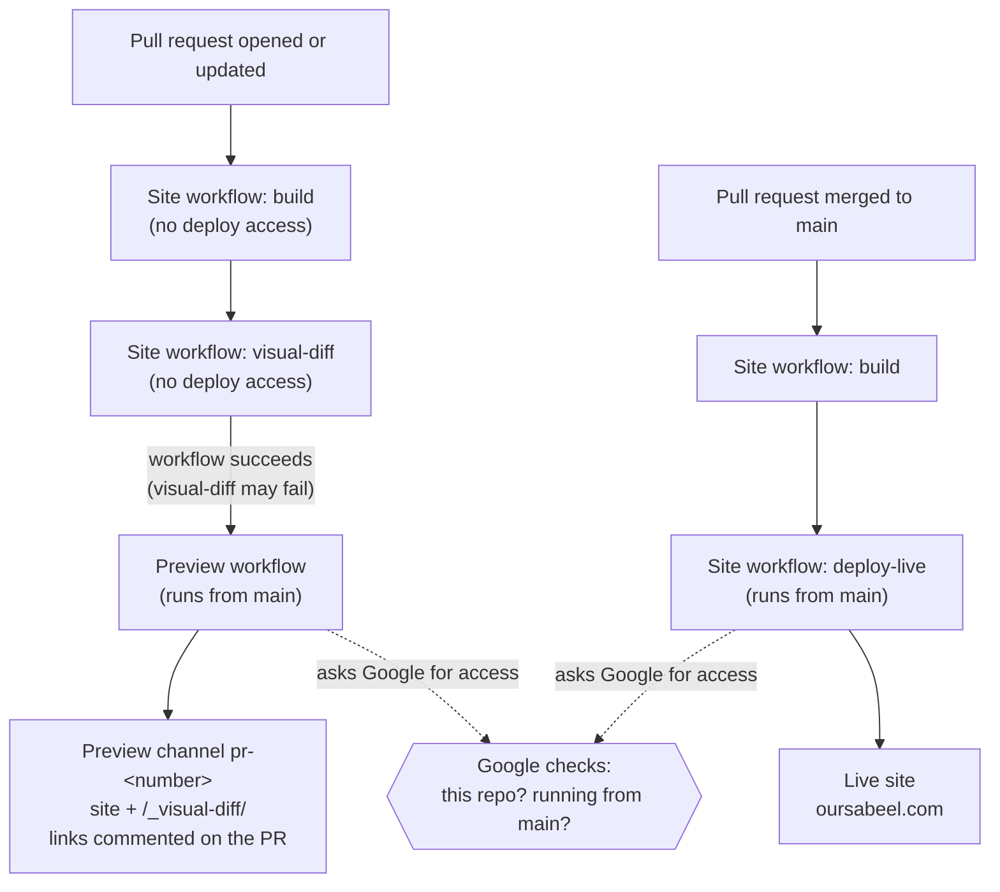
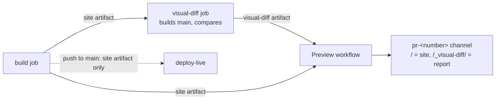

# Deployment

How the site gets from this repository to Firebase Hosting, every setting
involved, and what to change when something moves.

## How it works

The site is static: `npm run build` produces `dist/`, and Firebase Hosting
serves it. GitHub Actions builds and deploys it. There are no passwords or
keys: GitHub proves to Google who is asking (Workload Identity Federation),
and Google only gives deploy access to workflows running from `main`.



- `.github/workflows/site.yml` builds every pull request and every push to
  `main`. Only pushes to `main` run its `deploy-live` job. For pull requests,
  its `visual-diff` job compares screenshots of the changed pages with `main`
  (see [Visual comparison](#visual-comparison)).
- `.github/workflows/preview.yml` runs after a pull request's Site workflow
  succeeds. GitHub runs it from `main` (a `workflow_run` trigger), so a pull
  request cannot change what it does. It never runs pull-request code: it
  downloads the built `dist/` and the visual comparison, keeps only
  `cleanUrls`, `trailingSlash`, `redirects`, and `headers` from the pull
  request's `firebase.json` (the site name comes from `main`'s copy), deploys
  to the `pr-<number>` channel (expires after 7 days), comments the links,
  and adds a `preview` status and a `visual changes` status to the pull
  request. The channel keeps only its latest version. When the pull request
  closes, merged or not, the same workflow deletes the channel: its
  `pull_request_target` trigger runs `main`'s copy, which checks out only
  `main`'s `.firebaserc` and `firebase.json`. A pull request that has closed
  by the time its build finishes gets no preview.
- `.github/workflows/scope.yml` (Change scope) runs on every pull request
  into `main`, from `main` (`pull_request_target`). `.github/CODEOWNERS`
  makes the admin the owner of every file except routine content (listed in
  AGENTS.md, "Routine and structural changes"). A pull request that changes
  an owned file gets the `structural` label, a comment naming those files,
  and a failing `change scope` status, which the ruleset requires, so only
  the admin can merge it; GitHub also asks the admin for a review. A routine
  one gets a passing status. The workflow reads only the list of changed
  files and `.github/CODEOWNERS`, through the API, and never checks out or
  runs pull-request code.
- `preview.yml`, `scope.yml`, and the `deploy-live` job run from `main`, so
  changes to them take effect once merged. The `build` and `visual-diff` jobs run from the
  pull request's merge commit, so a pull request's own changes to them (or to
  `scripts/visual-diff/`) apply to its own runs, and other open pull requests
  pick up merged changes only when GitHub next merges them with `main` (see
  [Changing the workflows](#changing-the-workflows)).

## Where everything lives

| What | Value | Set in |
|---|---|---|
| Google account that owns the project | faisal.shah@oursabeel.com (Google Workspace org `oursabeel.com`, org ID 833557915874) | Google Cloud |
| Firebase / Google Cloud project | `oursabeel-website` (display name “Website”), project number `215221958617` | `.firebaserc` (project ID); both workflows (project number) |
| Billing account | “My Billing Account”, in the `oursabeel.com` organization | Google Cloud → Billing |
| Hosting site | `oursabeel-website` (the project's default site, also at https://oursabeel-website.web.app) | `firebase.json` (`hosting.site`); previews read it from `main`'s copy |
| Live URL | https://oursabeel.com; https://www.oursabeel.com redirects to it | `astro.config.mjs` (`site`, used for canonical and link-preview URLs, the sitemap, and robots.txt); GitHub repo "Website" field; the site's custom domains in Firebase Hosting |
| Domain and DNS | `oursabeel.com`, registered at NameSilo, which also hosts its DNS (name servers `NS1.DNSOWL.COM`, `NS2.DNSOWL.COM`, `NS3.DNSOWL.COM`) | NameSilo → Domain Manager → `oursabeel.com` → its DNS records (see [Custom domain](#custom-domain)) |
| GitHub repository | `Sabeel-Institute/website`, repo ID `1388459667`, owner ID `334027596` | Google identity pool condition and service-account binding |
| Identity pool | `github` ("GitHub Actions") | Google Cloud |
| Identity provider | `github-oidc`, issuer `https://token.actions.githubusercontent.com` | Google Cloud; resource path in both workflows |
| Deploy service account | `github-action-1388459667@oursabeel-website.iam.gserviceaccount.com` | Google Cloud; both workflows |
| Deploy branch | `main` | Provider condition; `site.yml` (`push: branches`) |
| Build workflow name | `Site` | `site.yml` (`name:`) and `preview.yml` (`workflows: [Site]`) must match |

The repository's hosting configuration:

- `.firebaserc`: the default Firebase project.
- `firebase.json`: `hosting.site` (the site to deploy to), `public: "dist"`,
  `cleanUrls` and `trailingSlash` (pages are served at `/path/`),
  `redirects` (other addresses for pages, so existing links keep working:
  moved pages, and every page address of the WordPress site oursabeel.com
  served before this one), and long-lived cache headers for `/_astro/**`
  (fingerprinted build assets). There are no rewrites; unknown paths get the
  built `404.html`. Firebase applies redirects before serving files, so a
  redirect's source must never be the address of a page here.
- `astro.config.mjs`: `site`, and the sitemap integration
  (`@astrojs/sitemap`), which writes `sitemap-index.xml` and `sitemap-0.xml`
  listing every page. `src/pages/robots.txt.ts` names the sitemap for search
  engines.

The project is on Firebase's Blaze plan, billed to the organization's “My
Billing Account”. Hosting is free up to 10 GB of storage and 360 MB of data
transfer a day (about 10 GB a month), counted across the live site and every
preview channel together, and usage beyond that is billed. Each deploy stores
a whole copy of the site (about 100 MB), so the live channel keeps only its 10
latest releases (step 1), each preview channel keeps only its latest, and a
preview is deleted when its pull request closes.

The provider maps these claims from GitHub's token:
`google.subject=assertion.sub`, `attribute.repository=assertion.repository`,
`attribute.repository_id=assertion.repository_id`,
`attribute.repository_owner_id=assertion.repository_owner_id`.

Its attribute condition, which decides who gets access:

```
assertion.repository_id == '1388459667' && assertion.repository_owner_id == '334027596' && assertion.ref == 'refs/heads/main' && assertion.job_workflow_ref.endsWith('@refs/heads/main')
```

The service account can be used by the pool through one binding:
`roles/iam.workloadIdentityUser` for
`principalSet://iam.googleapis.com/projects/215221958617/locations/global/workloadIdentityPools/github/attribute.repository_id/1388459667`.

Its roles on the project:

| Role | Needed for |
|---|---|
| Firebase Hosting Admin (`roles/firebasehosting.admin`) | Deploying live and preview channels |
| Service Usage Consumer (`roles/serviceusage.serviceUsageConsumer`) | Calling Firebase APIs from the project |
| Firebase Authentication Admin (`roles/firebaseauth.admin`) | Adding preview domains to Firebase Auth; unused while the site has no sign-in |
| API Keys Viewer (`roles/serviceusage.apiKeysViewer`) | Firebase Auth setup; unused |
| Cloud Functions Developer (`roles/cloudfunctions.developer`) | Rewrites to Cloud Functions; unused |
| Cloud Run Viewer (`roles/run.viewer`) | Rewrites to Cloud Run; unused |

Enabled APIs used by deploys: `firebasehosting`, `firebase`,
`iamcredentials`, `sts`, `serviceusage`, and `cloudresourcemanager`
(all `.googleapis.com`).

The `oursabeel.com` Google organization blocks service-account keys, which is
why deploys use the identity pool. Never create or use a key.

## Custom domain

The site's custom domains, in Firebase console → Hosting → the site's
**Custom domains**, are `oursabeel.com` and `www.oursabeel.com`, which
redirects to it. The domain is registered at NameSilo, which also hosts its
DNS: the domain's name servers are NameSilo's own, `NS1.DNSOWL.COM`,
`NS2.DNSOWL.COM`, and `NS3.DNSOWL.COM`, and its records are in NameSilo →
Domain Manager → `oursabeel.com` → its DNS records. There, a host is written
without the domain (`www`, `_dmarc`), and left empty for `oursabeel.com`
itself, written `@` below:

| Type | Host | Value | For |
|---|---|---|---|
| A | `@` | `199.36.158.100` | The website (Firebase Hosting) |
| CNAME | `www` | `oursabeel-website.web.app` | The website; Firebase redirects it to `oursabeel.com` |
| TXT | `@` | `hosting-site=oursabeel-website` | Proves the domain belongs to the site. Firebase checks it to renew the certificate: never remove it |
| TXT | `_acme-challenge`, `_acme-challenge.www` | Shown under each domain in the Firebase console | Let Firebase issue a certificate before traffic reaches it |
| MX | `@` | `aspmx.l.google.com` (1), `alt1.aspmx.l.google.com` (5), `alt2.aspmx.l.google.com` (5), `alt3.aspmx.l.google.com` (10), `alt4.aspmx.l.google.com` (10) | Google Workspace email |
| TXT | `@` | `v=spf1 include:_spf.google.com ~all` | Email: which servers may send as oursabeel.com |
| TXT | `_dmarc` | `v=DMARC1; p=none` | Email: reports on mail that fails those checks |
| TXT | `_gh-sabeel-institute-o` | `0ce90c06b6` | GitHub's proof that the `Sabeel-Institute` organization owns the domain (its Verified badge) |
| TXT | `@` | `google-site-verification=f-r5fNolVX0Tjy6KSmAojFJ_GiEnA8cadkK-NMFpFQA` and `google-site-verification=f3O53ieKMwLax241hlLj9de0gOQj2XB8ffhoZm4gwvE` (two records) | Google services' proof of ownership, such as Search Console |

No other A, AAAA, or CNAME records may exist for `@` or `www`: browsers would
reach the other server some of the time.

## GitHub settings that protect deploys

These are set in GitHub's web settings (they are not stored in the
repository). Organization settings are under github.com/Sabeel-Institute →
Settings; repository settings under the repository → Settings.

| Setting | Where | Value |
|---|---|---|
| Base permission | Organization → Member privileges → Base permissions | **Write**, so members can push branches, open pull requests, and merge routine ones |
| Member roles | Organization → People | Invite people as **Member**. Owners are admins on every repository, so they can change its settings and merge any pull request |
| Security defaults for new repositories | Organization → Code security | Dependabot alerts, secret scanning, and push protection on |
| Ruleset "Protect main" | Repository → Rules → Rulesets → New branch ruleset | Enforcement **Active**; target **Default branch**; rules **Restrict deletions**; **Require a pull request before merging**, with required approvals **0**, **Dismiss stale pull request approvals when new commits are pushed**, and **Require review from Code Owners**; **Require status checks to pass**, with the checks `build` and `change scope`, each from the source **GitHub Actions**; **Block force pushes**; bypass list **Repository admin**, set to **For pull requests only** |
| Who can open pull requests | Repository → General → Features → Pull requests | **Collaborators only** |
| Who can open issues | Repository → General → Features → Issues → Creation allowed by | **Collaborators only** |
| Wiki, Projects | Repository → General → Features | Off |
| Workflow token | Repository → Actions → General → Workflow permissions | **Read repository contents and packages permissions**; "Allow GitHub Actions to create and approve pull requests" off |
| Security scanning | Repository → Code security | Secret scanning, push protection, and Dependabot alerts on |
| About | Repository → General (or the gear beside "About" on the code page) | Description, and Website set to the live URL |
| Label `structural` | Repository → Issues → Labels | Exists, so the Change scope workflow can add it to structural pull requests |

With these, `main` changes only through pull requests whose `build` and
`change scope` checks passed. Members merge routine pull requests
themselves; one that changes any other file fails `change scope`, so only
you can merge it, bypassing the rules. `.github/CODEOWNERS` names you as the
owner of those files, so GitHub asks you to review them (change that line if
the admin's GitHub account changes). Nobody outside the organization can
open pull requests or issues on the public repository.

## Visual comparison

Each pull request's preview includes a report at `<preview URL>/_visual-diff/`,
linked from the **Visual changes** line of the preview comment and from the
`visual changes` status. It lists the pages that look different from `main`,
new pages, removed pages, and pages that could not be captured, with
screenshots on a phone (390 × 844) and a desktop (1440 × 900) screen that
reviewers can compare with a slider, side by side, or with the changed pixels
marked in pink.



- The `visual-diff` job in `site.yml` runs for pull requests, after `build`.
  GitHub checks out the merge of the pull request into `main` that it made
  for the run; the job builds that merge's first parent (`main` as of that
  merge) and downloads the pull request's `site` artifact, so it compares
  exactly the files the preview serves.
- `scripts/visual-diff/run.mjs` serves both builds on local ports and skips
  every page whose HTML is identical in both. Astro names the files it
  generates under `_astro/` after a hash, so a page that loads a changed
  stylesheet, script, font, or image has changed HTML. If any other file
  differs (a file from `public/`, or a generated file that kept its name),
  it compares every page.
- [BackstopJS](https://github.com/garris/BackstopJS) screenshots the
  remaining pages in both builds with Playwright's Chromium (the version
  pinned in `scripts/visual-diff/package-lock.json`): whole pages, after the
  page, its images, and its fonts have loaded (each wait gives up after 10
  seconds), with reduced motion, a fixed clock, a repeatable `Math.random`,
  and every animation brought to a fixed state, so that two captures of an
  unchanged page are identical. [pixelmatch](https://github.com/mapbox/pixelmatch)
  then compares each pair exactly. Screenshots of different sizes are
  compared on the larger size, with the extra area counted as changed, so a
  page that starts to scroll sideways on a phone shows up. Pages that look
  different, or whose screenshot failed, are captured a second time and the
  second result stands (when 40 or fewer pages differ), which clears a rare
  one-off difference caused by timing on a busy machine. A page whose
  screenshot still fails is listed as not captured, and the rest of the
  report is unaffected. Animations the browser draws itself (animated GIFs, an
  indeterminate progress bar, a marquee) cannot be held still and would show
  as changes.
- The report is uploaded as the `visual-diff` artifact (kept 7 days).
  `preview.yml` adds it to the preview under `/_visual-diff/` if it is under
  50 MB and its `summary.json` is a single object of five whole-number
  counts, and writes those counts in the comment and the `visual changes`
  status. The live deploy uses only the `site` artifact, so the report never
  reaches the live site.
- The preview waits for the job (one to four minutes, depending on how many
  pages changed) but does not depend on it. The job is marked
  `continue-on-error` and each of its steps has a time limit; when its report
  is missing or rejected, the comment says the comparison is unavailable,
  with a link to the run, and the `visual changes` status shows an error.

The report is served from the same Hosting quota as the live site (see
[Where everything lives](#where-everything-lives)), so it stays small. It
shows screenshots for at most 20 pages: new and removed pages first (no more
than 10 of them when more changed pages are waiting), then the pages that
changed most; other changed pages are listed with links. Only the screens on
which a page changed get screenshots, as WebP images (JPEG for pages taller
than 16,383 pixels) that load as the reviewer scrolls. A report for a change
to one page is under 1 MB; one for a change to every page is about 20 MB.

To run it locally (Node 22.12 or later; CI uses Node 24), from the branch to
compare:

```bash
npm ci
(cd scripts/visual-diff && npm ci && npx playwright install chromium-headless-shell)
git fetch origin
git worktree add --detach /tmp/sabeel-main "$(git merge-base HEAD origin/main)"
(cd /tmp/sabeel-main && npm ci && npx astro build)
npm run build
node scripts/visual-diff/run.mjs --before /tmp/sabeel-main/dist --after dist --out /tmp/visual-diff
```

Open `/tmp/visual-diff/index.html` in a browser; its links to the pages
themselves work only on the preview. `--out` must be a folder that is empty
or does not exist yet. Remove the worktree afterwards with
`git worktree remove /tmp/sabeel-main`.

## When something changes

Everything below is a checklist. After any change, merge a small pull request
and confirm both a preview and the live deploy succeed.

### Moving to a different Firebase project (same or different Google account)

A Firebase project cannot be moved between Google accounts in place; create a
new one and point everything at it.

1. Set up the new project with [Setting up from scratch](#setting-up-from-scratch),
   steps 1–5.
2. `.firebaserc`: change `"default"` to the new project ID, and
   `firebase.json`: change `hosting.site` to the new site name (the default
   site is named after the project ID).
3. `.github/workflows/site.yml` and `.github/workflows/preview.yml`: change
   `workload_identity_provider` (new project number) and `service_account`
   (new service-account email). Both files, both lines.
4. `astro.config.mjs`: change `site` to the new live URL
   (`https://<new-project-id>.web.app`), unless a custom domain is used.
5. GitHub repo Settings → General → "Website": the new URL.
6. If a custom domain is connected, add it to the new project and update its
   DNS records ([Connecting a custom domain](#connecting-a-custom-domain)).
7. Update this file's [Where everything lives](#where-everything-lives) table.
8. Merge the changes. Deploys then go to the new project; confirm the site
   there, then delete the previous project or its identity pool.

### Transferring the repository to another GitHub organization

The repo ID stays the same; the owner ID changes.

1. In Google Cloud, update the provider's attribute condition with the new
   owner ID (`gh api repos/<org>/<repo> -q .owner.id`).
2. Re-create the organization-level settings in the new organization: base
   permission, Member vs Owner roles, security defaults for new repositories.
   Repository settings (ruleset, pull-request and issue policies) move with
   the repository.
3. Update the IDs in this file.

Renaming the repository needs no deploy changes; access is tied to IDs, not
names.

### Moving the code to a new repository

A new repository has a new repo ID. Update the attribute condition
(repository ID and owner ID) and the service account's
`workloadIdentityUser` binding (the `attribute.repository_id/<id>` part), and
re-create the GitHub settings above.

### Renaming the default branch

Update `refs/heads/main` (twice) in the attribute condition and
`branches: [main]` in `site.yml`. The ruleset targets the default branch
whatever its name.

### Renaming the build workflow

`site.yml`'s `name: Site` and `preview.yml`'s `workflows: [Site]` must match,
or previews stop.

### Changing the workflows

A merged change to `preview.yml` applies to every pull request's next
preview. A merged change to `site.yml` or `scripts/visual-diff/` reaches an
open pull request only when GitHub merges that pull request with the new
`main`, which happens when the branch gets a new commit. Re-running a
workflow never helps: it reuses the merge the run started with.

To bring an open pull request up to date without pushing to its branch:

```bash
n=<number>
repo=Sabeel-Institute/website
git fetch -q origin && main=$(git rev-parse origin/main)
gh pr close $n && gh pr reopen $n
until [ "$(gh api "repos/$repo/commits/$(gh api "repos/$repo/pulls/$n" -q .merge_commit_sha)" -q '.parents[0].sha')" = "$main" ]; do sleep 10; done
gh pr close $n && gh pr reopen $n
```

The first reopen makes GitHub redo the merge, but its run still uses the old
merge. The loop waits until the new merge, based on the new `main`, exists,
and the second reopen runs with it. Closing and reopening notifies people
watching the pull request.

### Connecting a custom domain

To connect `oursabeel.com` (or another domain) to a site, without downtime:

1. Firebase console → **Build → Hosting → Add custom domain** →
   `oursabeel.com` → **Advanced setup**, then `www.oursabeel.com`, set to
   redirect to `oursabeel.com`. With the API:

   ```bash
   B="https://firebasehosting.googleapis.com/v1beta1/projects/$PROJECT_ID/sites/$PROJECT_ID/customDomains"
   H=(-H "Authorization: Bearer $(gcloud auth print-access-token --account=$ACCOUNT)" -H "x-goog-user-project: $PROJECT_ID" -H "Content-Type: application/json")
   curl -X POST "${H[@]}" "$B?customDomainId=oursabeel.com" -d '{}'
   curl -X POST "${H[@]}" "$B?customDomainId=www.oursabeel.com" -d '{"redirectTarget": "oursabeel.com"}'
   curl "${H[@]}" "$B/oursabeel.com"   # requiredDnsUpdates and cert.verification list the records
   ```

2. Add the `hosting-site` and `_acme-challenge` TXT records Firebase lists to
   the domain's DNS (see [Custom domain](#custom-domain)). Firebase then
   proves ownership and issues the certificate while the domain still points
   elsewhere; this takes from minutes to a few hours. The domain shows as
   ready (`ownershipState` `OWNERSHIP_ACTIVE`, `cert.state` `CERT_ACTIVE`)
   when it is done.
3. Replace the `@` A record and the `www` CNAME with the ones Firebase lists.
   Visitors arrive as their DNS caches expire, within the records' TTL.
4. `astro.config.mjs`: set `site` to the custom domain, and GitHub repo
   Settings → General → "Website" to it.

## Setting up from scratch

Everything needed to stand hosting and deploys up on a new Firebase project,
in order. Each step shows the web-console route and, where one exists, the
equivalent command.

You need:

- A Google account that can create projects in the `oursabeel.com` Google
  organization, and a GitHub account that owns the `Sabeel-Institute`
  organization.
- On your computer: Node.js 24 with npm, the Google Cloud CLI (`gcloud`), and
  the GitHub CLI (`gh`). The Firebase CLI runs through `npx firebase-tools@15`
  and needs no install.
- A billing account in the `oursabeel.com` organization for the Blaze plan.
  The site's use stays within Hosting's no-cost amounts (see
  [Where everything lives](#where-everything-lives)).

### Checklist

| # | Step | Where | Manual only? |
|---|---|---|---|
| 1 | Create the project, put it on the Blaze plan, and add Firebase and Hosting | Firebase console or `gcloud` | No |
| 2 | Enable the Google APIs | Google Cloud console or `gcloud` | No |
| 3 | Create the deploy service account and grant its roles | Google Cloud console or `gcloud` | No |
| 4 | Create the identity pool and GitHub provider | Google Cloud console or `gcloud` | No |
| 5 | Let the pool use the service account | Google Cloud console or `gcloud` | No |
| 6 | Point the repository at the project | Code: `.firebaserc`, both workflows, `astro.config.mjs` | No |
| 7 | Apply the GitHub settings | GitHub web settings | Mostly (issue policy is web-only) |
| 8 | First deploy and a test preview | Merge a pull request | No |
| 9 | Custom domain | Firebase console or API, and the DNS host | DNS records only |

Use a Google account that owns the project (faisal.shah@oursabeel.com)
and a GitHub account that is an organization owner. For the commands, sign in
first with `gcloud auth login <account>` and `gh auth login`, then set:

```bash
PROJECT_ID=oursabeel-website
REPO=Sabeel-Institute/website
ACCOUNT=faisal.shah@oursabeel.com
```

### 1. Create the project, put it on the Blaze plan, and add Firebase and Hosting

Console:

1. Go to https://console.firebase.google.com → **Create a project** (or
   **Add Firebase to a Google Cloud project** if the project already exists).
   Choose the project ID carefully; it becomes the free web address
   `https://<project-id>.web.app`. Google Analytics is not needed.
2. Make sure the project sits under the `oursabeel.com` organization (the
   project picker in the Google Cloud console shows its parent).
3. ⚙ → **Usage and billing → Details & settings** → modify the plan to
   **Blaze**, with the organization's billing account.
4. **Build → Hosting → Get started**, clicking through the steps once. This
   creates the default site named after the project. The CLI steps it shows
   can be skipped; the repository already contains the configuration.
5. Still in **Hosting**, open the live channel's **Release history** → ⋮ →
   **Release storage settings**, and keep **10** releases. Firebase otherwise
   keeps every release, and storage passes the no-cost 10 GB within weeks.
6. Look up the project number: ⚙ **Project settings** → General →
   **Project number**.

The same with commands. Adding Firebase creates the default Hosting site;
`gcloud billing accounts list` shows the billing account's ID. Right after
the project is created, a step can fail with "permission denied" for a minute
while Google applies your access; repeat it.

```bash
gcloud projects create "$PROJECT_ID" --name Website --organization 833557915874 --account "$ACCOUNT"
gcloud billing projects link "$PROJECT_ID" --billing-account <billing account ID> --account "$ACCOUNT"
gcloud services enable firebase.googleapis.com --project "$PROJECT_ID" --account "$ACCOUNT"
curl -X POST -H "Authorization: Bearer $(gcloud auth print-access-token --account=$ACCOUNT)" \
  -H "x-goog-user-project: $PROJECT_ID" -H "Content-Type: application/json" \
  "https://firebase.googleapis.com/v1beta1/projects/$PROJECT_ID:addFirebase" -d '{}'
curl -X PATCH -H "Authorization: Bearer $(gcloud auth print-access-token --account=$ACCOUNT)" \
  -H "x-goog-user-project: $PROJECT_ID" -H "Content-Type: application/json" \
  "https://firebasehosting.googleapis.com/v1beta1/sites/$PROJECT_ID/channels/live?updateMask=retainedReleaseCount" \
  -d '{"retainedReleaseCount": 10}'
PROJECT_NUMBER=$(gcloud projects describe "$PROJECT_ID" --account "$ACCOUNT" --format='value(projectNumber)')
```

Also look up the repository's IDs (GitHub shows them only through the API):

```bash
REPO_ID=$(gh api "repos/$REPO" -q .id)
OWNER_ID=$(gh api "repos/$REPO" -q .owner.id)
SA="github-action-$REPO_ID@$PROJECT_ID.iam.gserviceaccount.com"
```

### 2. Enable the Google APIs

Console: https://console.cloud.google.com → select the project → **APIs &
Services → Library**, and enable Firebase Hosting API, Firebase Management
API, IAM Service Account Credentials API, Security Token Service API, Service
Usage API, and Cloud Resource Manager API.

```bash
gcloud services enable firebasehosting.googleapis.com firebase.googleapis.com \
  iamcredentials.googleapis.com sts.googleapis.com serviceusage.googleapis.com \
  cloudresourcemanager.googleapis.com --project "$PROJECT_ID" --account "$ACCOUNT"
```

### 3. Create the deploy service account and grant its roles

Console:
1. **IAM & Admin → Service Accounts → Create service account.** ID:
   `github-action-<repo ID>`; name: `GitHub Actions (Sabeel-Institute/website)`.
2. **IAM & Admin → IAM → Grant access.** Principal: the new service-account
   email. Add the six roles in the table under
   [Where everything lives](#where-everything-lives).

Do not create a key for it; the organization blocks keys, and none is needed.

```bash
gcloud iam service-accounts create "github-action-$REPO_ID" --project "$PROJECT_ID" \
  --account "$ACCOUNT" --display-name "GitHub Actions ($REPO)"

for role in firebasehosting.admin serviceusage.serviceUsageConsumer firebaseauth.admin \
            serviceusage.apiKeysViewer cloudfunctions.developer run.viewer; do
  gcloud projects add-iam-policy-binding "$PROJECT_ID" --account "$ACCOUNT" \
    --member "serviceAccount:$SA" --role "roles/$role" --condition None
done
```

### 4. Create the identity pool and GitHub provider

Console: **IAM & Admin → Workload Identity Federation → Create pool.**
1. Pool name `GitHub Actions`, pool ID `github`.
2. Add a provider: type **OpenID Connect (OIDC)**, name `GitHub OIDC`,
   provider ID `github-oidc`, issuer URL
   `https://token.actions.githubusercontent.com`, audiences left at the default.
3. Attribute mapping (add each row):

   | Google | OIDC |
   |---|---|
   | `google.subject` | `assertion.sub` |
   | `attribute.repository` | `assertion.repository` |
   | `attribute.repository_id` | `assertion.repository_id` |
   | `attribute.repository_owner_id` | `assertion.repository_owner_id` |

4. Attribute conditions: add the condition from
   [Where everything lives](#where-everything-lives), with this repository's
   IDs.

To edit an existing provider later: Workload Identity Federation → pool
`github` → provider `github-oidc` → **Edit**; the condition is under the
attribute settings. The console layout changes over time; the command below
does the same thing and is easier to check.

```bash
gcloud iam workload-identity-pools create github --location global \
  --project "$PROJECT_ID" --account "$ACCOUNT" --display-name "GitHub Actions"

gcloud iam workload-identity-pools providers create-oidc github-oidc --location global \
  --workload-identity-pool github --project "$PROJECT_ID" --account "$ACCOUNT" \
  --display-name "GitHub OIDC" \
  --issuer-uri https://token.actions.githubusercontent.com \
  --attribute-mapping "google.subject=assertion.sub,attribute.repository=assertion.repository,attribute.repository_id=assertion.repository_id,attribute.repository_owner_id=assertion.repository_owner_id" \
  --attribute-condition "assertion.repository_id == '$REPO_ID' && assertion.repository_owner_id == '$OWNER_ID' && assertion.ref == 'refs/heads/main' && assertion.job_workflow_ref.endsWith('@refs/heads/main')"
```

To change only the condition on an existing provider:

```bash
gcloud iam workload-identity-pools providers update-oidc github-oidc --location global \
  --workload-identity-pool github --project "$PROJECT_ID" --account "$ACCOUNT" \
  --attribute-condition "<new condition>"
```

### 5. Let the pool use the service account

Console: Workload Identity Federation → pool `github` → **Grant access** →
**Grant access using service account impersonation** → choose the service
account → principals: attribute `repository_id` equal to the repo ID.

```bash
gcloud iam service-accounts add-iam-policy-binding "$SA" --project "$PROJECT_ID" \
  --account "$ACCOUNT" --role roles/iam.workloadIdentityUser \
  --member "principalSet://iam.googleapis.com/projects/$PROJECT_NUMBER/locations/global/workloadIdentityPools/github/attribute.repository_id/$REPO_ID"
```

### 6. Point the repository at the project

In a pull request, update `.firebaserc`, `hosting.site` in `firebase.json`,
`workload_identity_provider` and `service_account` in both workflows, and
`site` in `astro.config.mjs`, as in
[Moving to a different Firebase project](#moving-to-a-different-firebase-project-same-or-different-google-account).

### 7. Apply the GitHub settings

Work through the table in
[GitHub settings that protect deploys](#github-settings-that-protect-deploys).

### 8. First deploy and a test preview

1. Merge the pull request from step 6. Actions → **Site** shows `build` then
   `deploy-live`; the live URL serves the site.
2. Open a small test pull request. After **Site** finishes, **Preview** runs,
   and a comment with the preview link and a **Visual changes** line appears
   on the pull request. Close it afterwards.
3. Optional: confirm a branch cannot deploy by pushing a branch whose workflow
   runs `google-github-actions/auth` with `token_format: access_token`; it must
   fail with "rejected by the attribute condition". Delete the branch after.

### 9. Custom domain

See [Connecting a custom domain](#connecting-a-custom-domain).

### Checking the Google side

```bash
gcloud iam workload-identity-pools providers describe github-oidc --location global \
  --workload-identity-pool github --project oursabeel-website \
  --account faisal.shah@oursabeel.com --format 'yaml(attributeCondition,attributeMapping)'
gcloud iam service-accounts get-iam-policy github-action-1388459667@oursabeel-website.iam.gserviceaccount.com \
  --project oursabeel-website --account faisal.shah@oursabeel.com
```

If `gcloud` says "Reauthentication required", run
`gcloud auth login faisal.shah@oursabeel.com` and try again.

## Deploying by hand

Only if GitHub Actions is unavailable. This skips the pull-request checks, so
deploy only what is on `main`.

```bash
git switch main && git pull
npm ci && npm run build
npx firebase-tools@15 login          # as faisal.shah@oursabeel.com
npx firebase-tools@15 deploy --only hosting --project oursabeel-website
```

The deploy goes to the site named in `firebase.json`. The Firebase command
line remembers the signed-in account per folder; if it picks the wrong one,
run `npx firebase-tools@15 login:use faisal.shah@oursabeel.com`.

## Troubleshooting

| Symptom | Cause and fix |
|---|---|
| Deploy fails partway with a Firebase error that a re-run might clear (timeouts, "Assertion failed", HTTP 5xx) | Re-run the failed job: Actions → the run → "Re-run failed jobs" (or `gh run rerun <run-id> --failed`). |
| Deploy fails with a "site not found" or "does not exist" error | `hosting.site` in `firebase.json` names a site that is not in the project `.firebaserc` points to. |
| "The given credential is rejected by the attribute condition" | The workflow is not running from `main` (expected for branch workflows), or the repository, owner, or branch in the condition do not match this repository. Compare with the condition above. |
| "Permission 'iam.serviceAccounts.getAccessToken' denied" | The service account's `workloadIdentityUser` binding is missing or names a different repo ID. |
| Firebase returns 403 during deploy | The service account lacks a project role from the table above. |
| A pull request has no preview comment | The pull request's Site build failed; the Preview run failed (Actions → Preview); the pull request comes from a fork; or a change to `preview.yml` is not yet on `main`. |
| A preview ignores a `firebase.json` change | Previews use only `cleanUrls`, `trailingSlash`, `redirects`, and `headers` from the pull request; other settings apply after merging. |
| The comment says "Visual changes: comparison unavailable" | Either the `visual-diff` job failed (Actions → the Site run → visual-diff shows why; re-run the Site workflow to try again), or its report was too large or invalid (the Preview run shows a warning), or the Site run had no `visual-diff` job because GitHub merged the pull request with a `main` from before the job existed (push to the branch, or see [Changing the workflows](#changing-the-workflows)). The preview itself is unaffected. |
| The comment says pages "could not be captured" | Their screenshots failed, usually because the page never finished loading, kept its browser busy for more than 30 seconds, or navigated away. The visual-diff job's log in the Site run names the error. Open the page on the preview to see what it does. |
| The visual comparison shows a difference nobody made | Screenshots differ only if the rendering differs, so look for a shared change (a stylesheet, the header or footer, a component used on many pages). If pages differ when comparing a build with itself, the screenshots are not repeatable; see the visual comparison notes in `CLAUDE.md`. |
| Previews stop after renaming the build workflow | `preview.yml`'s `workflows: [Site]` does not match `site.yml`'s `name:`. |
