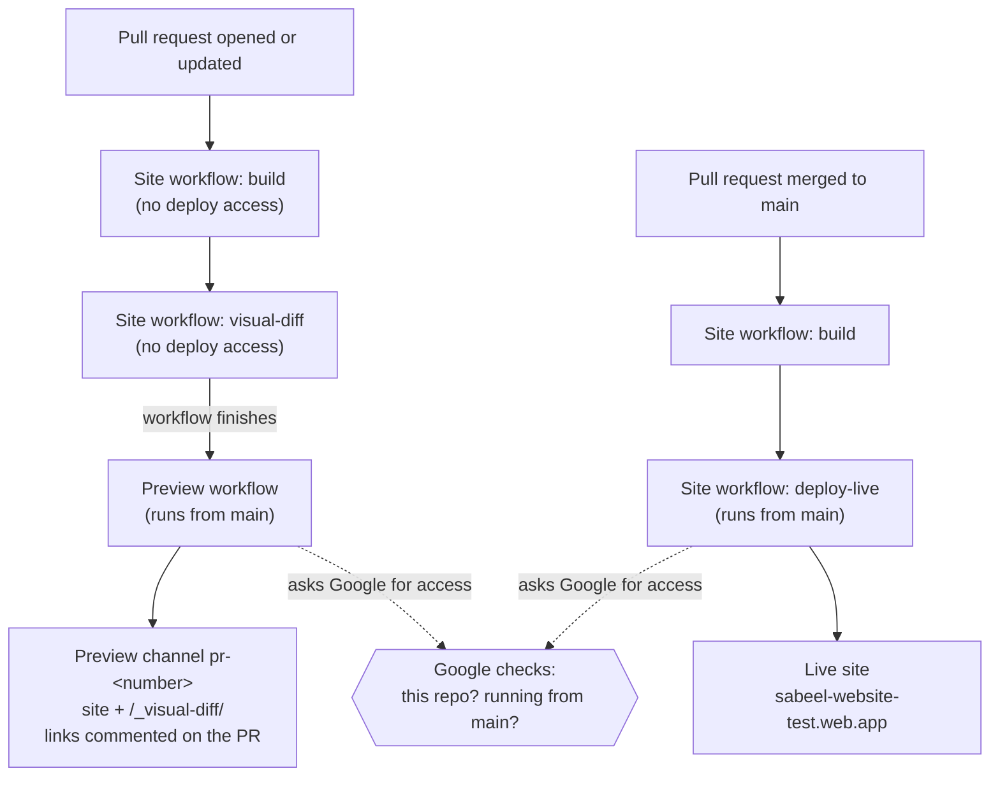
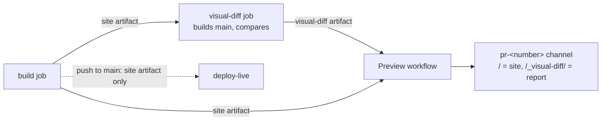

# Deployment

How the site gets from this repository to Firebase Hosting, every setting
involved, and what to change when something moves.

## How it works

The site is static: `npm run build` produces `dist/`, and Firebase Hosting
serves it. GitHub Actions builds and deploys it. There are no passwords or
keys: GitHub proves to Google who is asking (Workload Identity Federation),
and Google only gives deploy access to workflows running from `main`.



- `.github/workflows/site.yml` builds every pull request and every push to
  `main`. Only pushes to `main` run its `deploy-live` job. For pull requests,
  its `visual-diff` job compares screenshots of the changed pages with `main`
  (see [Visual comparison](#visual-comparison)).
- `.github/workflows/preview.yml` runs after a pull request's Site workflow
  succeeds. GitHub runs it from `main` (a `workflow_run` trigger), so a pull
  request cannot change what it does. It never runs pull-request code: it
  downloads the built `dist/` and the visual comparison, keeps only
  `cleanUrls`, `trailingSlash`, `redirects`, and `headers` from the pull
  request's `firebase.json` (the site name comes from `main`'s copy), deploys
  to the `pr-<number>` channel (expires after 7 days), comments the links,
  and adds `preview` and `visual-diff` checks to the pull request.
- Because deploy access depends on running from `main`, changes to either
  workflow take effect only after they are merged.

## Where everything lives

| What | Value | Set in |
|---|---|---|
| Google account that owns the project | faisal.shah@oursabeel.com (Google Workspace org `oursabeel.com`, org ID 833557915874) | Google Cloud |
| Firebase / Google Cloud project | `sabeel-website-test`, project number `176680257141` | `.firebaserc` (project ID); both workflows (project number) |
| Hosting site | `sabeel-website-test` (the project's default site) | `firebase.json` (`hosting.site`); previews read it from `main`'s copy |
| Live URL | https://sabeel-website-test.web.app | `astro.config.mjs` (`site`, used for canonical and link-preview URLs); GitHub repo "Website" field |
| GitHub repository | `Sabeel-Institute/sabeel-website-test`, repo ID `1388459667`, owner ID `334027596` | Google identity pool condition and service-account binding |
| Identity pool | `github` ("GitHub Actions") | Google Cloud |
| Identity provider | `github-oidc`, issuer `https://token.actions.githubusercontent.com` | Google Cloud; resource path in both workflows |
| Deploy service account | `github-action-1388459667@sabeel-website-test.iam.gserviceaccount.com` | Google Cloud; both workflows |
| Deploy branch | `main` | Provider condition; `site.yml` (`push: branches`) |
| Build workflow name | `Site` | `site.yml` (`name:`) and `preview.yml` (`workflows: [Site]`) must match |

The repository's hosting configuration:

- `.firebaserc`: the default Firebase project.
- `firebase.json`: `hosting.site` (the site to deploy to), `public: "dist"`,
  `cleanUrls` and `trailingSlash` (pages are served at `/path/`),
  `redirects` (other addresses for pages, so existing links keep working),
  and long-lived cache headers for `/_astro/**` (fingerprinted build assets).
  There are no rewrites; unknown paths get the built `404.html`.

The project is on Firebase's no-cost Spark plan (no billing account). Hosting
on Spark allows 10 GB of storage and 10 GB of data transfer a month (about
360 MB a day), counted across the live site and every preview channel
together. Past the transfer limit, Firebase disables the sites until the next
month; past the storage limit, deploys fail. Before the site serves the
organization's real traffic, switch the project to the Blaze plan
(Firebase console → the project → Usage and billing → Details and settings →
Modify plan), which keeps the same no-cost amounts and bills usage beyond
them.

The provider maps these claims from GitHub's token:
`google.subject=assertion.sub`, `attribute.repository=assertion.repository`,
`attribute.repository_id=assertion.repository_id`,
`attribute.repository_owner_id=assertion.repository_owner_id`.

Its attribute condition, which decides who gets access:

```
assertion.repository_id == '1388459667' && assertion.repository_owner_id == '334027596' && assertion.ref == 'refs/heads/main' && assertion.job_workflow_ref.endsWith('@refs/heads/main')
```

The service account can be used by the pool through one binding:
`roles/iam.workloadIdentityUser` for
`principalSet://iam.googleapis.com/projects/176680257141/locations/global/workloadIdentityPools/github/attribute.repository_id/1388459667`.

Its roles on the project:

| Role | Needed for |
|---|---|
| Firebase Hosting Admin (`roles/firebasehosting.admin`) | Deploying live and preview channels |
| Service Usage Consumer (`roles/serviceusage.serviceUsageConsumer`) | Calling Firebase APIs from the project |
| Firebase Authentication Admin (`roles/firebaseauth.admin`) | Adding preview domains to Firebase Auth; unused while the site has no sign-in |
| API Keys Viewer (`roles/serviceusage.apiKeysViewer`) | Firebase Auth setup; unused |
| Cloud Functions Developer (`roles/cloudfunctions.developer`) | Rewrites to Cloud Functions; unused |
| Cloud Run Viewer (`roles/run.viewer`) | Rewrites to Cloud Run; unused |

Enabled APIs used by deploys: `firebasehosting`, `firebase`,
`iamcredentials`, `sts`, `serviceusage`, and `cloudresourcemanager`
(all `.googleapis.com`).

The `oursabeel.com` Google organization blocks service-account keys, which is
why deploys use the identity pool. Never create or use a key.

## GitHub settings that protect deploys

These are set in GitHub's web settings (they are not stored in the
repository). Organization settings are under github.com/Sabeel-Institute →
Settings; repository settings under the repository → Settings.

| Setting | Where | Value |
|---|---|---|
| Base permission | Organization → Member privileges → Base permissions | **Write**, so members can push branches and open pull requests |
| Member roles | Organization → People | Invite people as **Member**. Owners are admins on every repository and can merge |
| Security defaults for new repositories | Organization → Code security | Dependabot alerts, secret scanning, and push protection on |
| Ruleset "Protect main" | Repository → Rules → Rulesets → New branch ruleset | Enforcement **Active**; target **Default branch**; rules **Restrict updates**, **Restrict deletions**, **Block force pushes**; bypass list **Repository admin**, set to **For pull requests only** |
| Who can open pull requests | Repository → General → Features → Pull requests | **Collaborators only** |
| Who can open issues | Repository → General → Features → Issues → Creation allowed by | **Collaborators only** |
| Wiki, Projects | Repository → General → Features | Off |
| Workflow token | Repository → Actions → General → Workflow permissions | **Read repository contents and packages permissions**; "Allow GitHub Actions to create and approve pull requests" off |
| Security scanning | Repository → Code security | Secret scanning, push protection, and Dependabot alerts on |
| About | Repository → General (or the gear beside "About" on the code page) | Description, and Website set to the live URL |

With these, only you can change `main`, and only by merging a pull request;
members can open pull requests; nobody outside the organization can open pull
requests or issues on the public repository.

## Visual comparison

Each pull request's preview includes a report at `<preview URL>/_visual-diff/`,
linked from the preview comment (**Visual changes**) and from the
`visual-diff` check. It lists the pages that look different from `main`, new
pages, and removed pages, with screenshots on a phone (390 × 844) and a
desktop (1440 × 900) screen that reviewers can compare with a slider, side by
side, or with the changed pixels marked in pink.



- The `visual-diff` job in `site.yml` runs for pull requests, after `build`.
  GitHub checks the pull request out merged into `main`; the job builds that
  merge's first parent (`main`) and downloads the pull request's `site`
  artifact, so it compares exactly the files the preview serves.
- `scripts/visual-diff/run.mjs` serves both builds on local ports and skips
  every page whose HTML is identical in both: Astro names each stylesheet,
  script, font, and image under `_astro/` by a hash of its contents, so
  identical HTML renders identically. If any file outside `_astro/` (from
  `public/`) differs, it compares every page.
- It screenshots the remaining pages from both builds with
  [BackstopJS](https://github.com/garris/BackstopJS) and Playwright's
  Chromium (the version pinned in `scripts/visual-diff/package-lock.json`):
  whole pages, with reduced motion, lazy images loaded, and fonts ready. It
  then compares them pixel by pixel.
- The report is uploaded as the `visual-diff` artifact (kept 7 days).
  `preview.yml` adds it to the preview under `/_visual-diff/`, accepts
  `summary.json` only if it holds four whole-number counts, and writes those
  counts in the comment and the check. The live deploy uses only the `site`
  artifact, so the report never reaches the live site.
- The job never holds up the preview: it is marked `continue-on-error`, and
  when its artifact is missing the comment says the comparison is
  unavailable, with a link to the run.

The report is served from the same Hosting quota as the live site (see
[Where everything lives](#where-everything-lives)), so it stays small: it
shows screenshots for at most 20 pages (new and removed pages first, then
the largest changes; other changed pages are listed with links), only for
the screens on which a page changed, as WebP images (JPEG for pages taller
than 16,383 pixels) that load as the reviewer scrolls. A report for a change
to every page is about 15 MB.

To run it locally (it needs Node 24):

```bash
(cd scripts/visual-diff && npm ci && npx playwright install chromium-headless-shell)
git worktree add /tmp/sabeel-main main
(cd /tmp/sabeel-main && npm ci && npx astro build)
npm run build
node scripts/visual-diff/run.mjs --before /tmp/sabeel-main/dist --after dist --out /tmp/visual-diff
```

Open `/tmp/visual-diff/index.html` in a browser. `--out` must be a folder
that is empty or does not exist yet. Remove the worktree afterwards with
`git worktree remove /tmp/sabeel-main`.

## When something changes

Everything below is a checklist. After any change, merge a small pull request
and confirm both a preview and the live deploy succeed.

### Moving to a different Firebase project (same or different Google account)

A Firebase project cannot be moved between Google accounts in place; create a
new one and point everything at it.

1. Set up the new project with [Setting up from scratch](#setting-up-from-scratch),
   steps 1–5.
2. `.firebaserc`: change `"default"` to the new project ID, and
   `firebase.json`: change `hosting.site` to the new site name (the default
   site is named after the project ID).
3. `.github/workflows/site.yml` and `.github/workflows/preview.yml`: change
   `workload_identity_provider` (new project number) and `service_account`
   (new service-account email). Both files, both lines.
4. `astro.config.mjs`: change `site` to the new live URL
   (`https://<new-project-id>.web.app`), unless a custom domain is used.
5. GitHub repo Settings → General → "Website": the new URL.
6. If a custom domain is connected, add it to the new project and update its
   DNS records ([Connecting a custom domain](#connecting-a-custom-domain)).
7. Update this file's [Where everything lives](#where-everything-lives) table.
8. Merge the changes. Deploys then go to the new project; confirm the site
   there, then delete the previous project or its identity pool.

### Transferring the repository to another GitHub organization

The repo ID stays the same; the owner ID changes.

1. In Google Cloud, update the provider's attribute condition with the new
   owner ID (`gh api repos/<org>/<repo> -q .owner.id`).
2. Re-create the organization-level settings in the new organization: base
   permission, Member vs Owner roles, security defaults for new repositories.
   Repository settings (ruleset, pull-request and issue policies) move with
   the repository.
3. Update the IDs in this file.

Renaming the repository needs no deploy changes; access is tied to IDs, not
names.

### Moving the code to a new repository

A new repository has a new repo ID. Update the attribute condition
(repository ID and owner ID) and the service account's
`workloadIdentityUser` binding (the `attribute.repository_id/<id>` part), and
re-create the GitHub settings above.

### Renaming the default branch

Update `refs/heads/main` (twice) in the attribute condition and
`branches: [main]` in `site.yml`. The ruleset targets the default branch
whatever its name.

### Renaming the build workflow

`site.yml`'s `name: Site` and `preview.yml`'s `workflows: [Site]` must match,
or previews stop.

### Connecting a custom domain

1. Firebase console → **Build → Hosting → Add custom domain** (for example
   `oursabeel.com`, then `www.oursabeel.com` set to redirect to it). Firebase
   shows the DNS records to add: a TXT record to prove ownership, then A
   records. Add them at the domain registrar where `oursabeel.com` is managed,
   and remove any other A, AAAA, or CNAME records for those names.
   Verification and the HTTPS certificate can take up to a day.
2. `astro.config.mjs`: set `site` to the custom domain.
3. GitHub repo Settings → General → "Website": the custom domain.
4. `firebase.json` redirects the paths used by the WordPress site at
   `oursabeel.com` (`/our-mission/`, `/my-courses/`, `/donate/`, and more) to
   their pages here, so existing links keep working.
5. The giving links in `src/site.config.ts` (`giving`) point at the donation
   form on that WordPress site. Replace them before the domain moves.

## Setting up from scratch

Everything needed to stand hosting and deploys up on a new Firebase project,
in order. Each step shows the web-console route and, where one exists, the
equivalent command.

You need:

- A Google account that can create projects in the `oursabeel.com` Google
  organization, and a GitHub account that owns the `Sabeel-Institute`
  organization.
- On your computer: Node.js 24 with npm, the Google Cloud CLI (`gcloud`), and
  the GitHub CLI (`gh`). The Firebase CLI runs through `npx firebase-tools@15`
  and needs no install.
- Nothing paid: the free Firebase Spark plan covers Hosting, preview channels,
  and custom domains.

### Checklist

| # | Step | Where | Manual only? |
|---|---|---|---|
| 1 | Create the Firebase project and start Hosting | Firebase console | Yes |
| 2 | Enable the Google APIs | Google Cloud console or `gcloud` | No |
| 3 | Create the deploy service account and grant its roles | Google Cloud console or `gcloud` | No |
| 4 | Create the identity pool and GitHub provider | Google Cloud console or `gcloud` | No |
| 5 | Let the pool use the service account | Google Cloud console or `gcloud` | No |
| 6 | Point the repository at the project | Code: `.firebaserc`, both workflows, `astro.config.mjs` | No |
| 7 | Apply the GitHub settings | GitHub web settings | Mostly (issue policy is web-only) |
| 8 | First deploy and a test preview | Merge a pull request | No |
| 9 | Custom domain (when ready) | Firebase console and domain registrar | Yes |

Use a Google account that owns the project (faisal.shah@oursabeel.com)
and a GitHub account that is an organization owner. For the commands, sign in
first with `gcloud auth login <account>` and `gh auth login`, then set:

```bash
PROJECT_ID=sabeel-website-test
REPO=Sabeel-Institute/sabeel-website-test
ACCOUNT=faisal.shah@oursabeel.com
```

### 1. Create the Firebase project and start Hosting (manual)

1. Go to https://console.firebase.google.com → **Create a project** (or
   **Add Firebase to a Google Cloud project** if the project already exists).
   Choose the project ID carefully; it becomes the free web address
   `https://<project-id>.web.app`. Google Analytics is not needed.
2. Make sure the project sits under the `oursabeel.com` organization (the
   project picker in the Google Cloud console shows its parent).
3. In the project, open **Build → Hosting → Get started** and click through
   the steps once. This creates the default site named after the project. The
   CLI steps it shows can be skipped; the repository already contains the
   configuration.
4. Look up the project number: Firebase console → ⚙ **Project settings** →
   General → **Project number**, or:

   ```bash
   PROJECT_NUMBER=$(gcloud projects describe "$PROJECT_ID" --account "$ACCOUNT" --format='value(projectNumber)')
   ```

Also look up the repository's IDs (GitHub shows them only through the API):

```bash
REPO_ID=$(gh api "repos/$REPO" -q .id)
OWNER_ID=$(gh api "repos/$REPO" -q .owner.id)
SA="github-action-$REPO_ID@$PROJECT_ID.iam.gserviceaccount.com"
```

### 2. Enable the Google APIs

Console: https://console.cloud.google.com → select the project → **APIs &
Services → Library**, and enable Firebase Hosting API, Firebase Management
API, IAM Service Account Credentials API, Security Token Service API, Service
Usage API, and Cloud Resource Manager API.

```bash
gcloud services enable firebasehosting.googleapis.com firebase.googleapis.com \
  iamcredentials.googleapis.com sts.googleapis.com serviceusage.googleapis.com \
  cloudresourcemanager.googleapis.com --project "$PROJECT_ID" --account "$ACCOUNT"
```

### 3. Create the deploy service account and grant its roles

Console:
1. **IAM & Admin → Service Accounts → Create service account.** ID:
   `github-action-<repo ID>`; name: `GitHub Actions (Sabeel-Institute/sabeel-website-test)`.
2. **IAM & Admin → IAM → Grant access.** Principal: the new service-account
   email. Add the six roles in the table under
   [Where everything lives](#where-everything-lives).

Do not create a key for it; the organization blocks keys, and none is needed.

```bash
gcloud iam service-accounts create "github-action-$REPO_ID" --project "$PROJECT_ID" \
  --account "$ACCOUNT" --display-name "GitHub Actions ($REPO)"

for role in firebasehosting.admin serviceusage.serviceUsageConsumer firebaseauth.admin \
            serviceusage.apiKeysViewer cloudfunctions.developer run.viewer; do
  gcloud projects add-iam-policy-binding "$PROJECT_ID" --account "$ACCOUNT" \
    --member "serviceAccount:$SA" --role "roles/$role" --condition None
done
```

### 4. Create the identity pool and GitHub provider

Console: **IAM & Admin → Workload Identity Federation → Create pool.**
1. Pool name `GitHub Actions`, pool ID `github`.
2. Add a provider: type **OpenID Connect (OIDC)**, name `GitHub OIDC`,
   provider ID `github-oidc`, issuer URL
   `https://token.actions.githubusercontent.com`, audiences left at the default.
3. Attribute mapping (add each row):

   | Google | OIDC |
   |---|---|
   | `google.subject` | `assertion.sub` |
   | `attribute.repository` | `assertion.repository` |
   | `attribute.repository_id` | `assertion.repository_id` |
   | `attribute.repository_owner_id` | `assertion.repository_owner_id` |

4. Attribute conditions: add the condition from
   [Where everything lives](#where-everything-lives), with this repository's
   IDs.

To edit an existing provider later: Workload Identity Federation → pool
`github` → provider `github-oidc` → **Edit**; the condition is under the
attribute settings. The console layout changes over time; the command below
does the same thing and is easier to check.

```bash
gcloud iam workload-identity-pools create github --location global \
  --project "$PROJECT_ID" --account "$ACCOUNT" --display-name "GitHub Actions"

gcloud iam workload-identity-pools providers create-oidc github-oidc --location global \
  --workload-identity-pool github --project "$PROJECT_ID" --account "$ACCOUNT" \
  --display-name "GitHub OIDC" \
  --issuer-uri https://token.actions.githubusercontent.com \
  --attribute-mapping "google.subject=assertion.sub,attribute.repository=assertion.repository,attribute.repository_id=assertion.repository_id,attribute.repository_owner_id=assertion.repository_owner_id" \
  --attribute-condition "assertion.repository_id == '$REPO_ID' && assertion.repository_owner_id == '$OWNER_ID' && assertion.ref == 'refs/heads/main' && assertion.job_workflow_ref.endsWith('@refs/heads/main')"
```

To change only the condition on an existing provider:

```bash
gcloud iam workload-identity-pools providers update-oidc github-oidc --location global \
  --workload-identity-pool github --project "$PROJECT_ID" --account "$ACCOUNT" \
  --attribute-condition "<new condition>"
```

### 5. Let the pool use the service account

Console: Workload Identity Federation → pool `github` → **Grant access** →
**Grant access using service account impersonation** → choose the service
account → principals: attribute `repository_id` equal to the repo ID.

```bash
gcloud iam service-accounts add-iam-policy-binding "$SA" --project "$PROJECT_ID" \
  --account "$ACCOUNT" --role roles/iam.workloadIdentityUser \
  --member "principalSet://iam.googleapis.com/projects/$PROJECT_NUMBER/locations/global/workloadIdentityPools/github/attribute.repository_id/$REPO_ID"
```

### 6. Point the repository at the project

In a pull request, update `.firebaserc`, `hosting.site` in `firebase.json`,
`workload_identity_provider` and `service_account` in both workflows, and
`site` in `astro.config.mjs`, as in
[Moving to a different Firebase project](#moving-to-a-different-firebase-project-same-or-different-google-account).

### 7. Apply the GitHub settings

Work through the table in
[GitHub settings that protect deploys](#github-settings-that-protect-deploys).

### 8. First deploy and a test preview

1. Merge the pull request from step 6. Actions → **Site** shows `build` then
   `deploy-live`; the live URL serves the site.
2. Open a small test pull request. After **Site** finishes, **Preview** runs,
   and a comment with the preview link and a **Visual changes** line appears
   on the pull request. Close it afterwards.
3. Optional: confirm a branch cannot deploy by pushing a branch whose workflow
   runs `google-github-actions/auth` with `token_format: access_token`; it must
   fail with "rejected by the attribute condition". Delete the branch after.

### 9. Custom domain (manual)

See [Connecting a custom domain](#connecting-a-custom-domain).

### Checking the Google side

```bash
gcloud iam workload-identity-pools providers describe github-oidc --location global \
  --workload-identity-pool github --project sabeel-website-test \
  --account faisal.shah@oursabeel.com --format 'yaml(attributeCondition,attributeMapping)'
gcloud iam service-accounts get-iam-policy github-action-1388459667@sabeel-website-test.iam.gserviceaccount.com \
  --project sabeel-website-test --account faisal.shah@oursabeel.com
```

If `gcloud` says "Reauthentication required", run
`gcloud auth login faisal.shah@oursabeel.com` and try again.

## Deploying by hand

Only if GitHub Actions is unavailable. This skips the pull-request checks, so
deploy only what is on `main`.

```bash
git switch main && git pull
npm ci && npm run build
npx firebase-tools@15 login          # as faisal.shah@oursabeel.com
npx firebase-tools@15 deploy --only hosting --project sabeel-website-test
```

The deploy goes to the site named in `firebase.json`. The Firebase command
line remembers the signed-in account per folder; if it picks the wrong one,
run `npx firebase-tools@15 login:use faisal.shah@oursabeel.com`.

## Troubleshooting

| Symptom | Cause and fix |
|---|---|
| Deploy fails partway with a Firebase error that a re-run might clear (timeouts, "Assertion failed", HTTP 5xx) | Re-run the failed job: Actions → the run → "Re-run failed jobs" (or `gh run rerun <run-id> --failed`). |
| Deploy fails with a "site not found" or "does not exist" error | `hosting.site` in `firebase.json` names a site that is not in the project `.firebaserc` points to. |
| "The given credential is rejected by the attribute condition" | The workflow is not running from `main` (expected for branch workflows), or the repository, owner, or branch in the condition do not match this repository. Compare with the condition above. |
| "Permission 'iam.serviceAccounts.getAccessToken' denied" | The service account's `workloadIdentityUser` binding is missing or names a different repo ID. |
| Firebase returns 403 during deploy | The service account lacks a project role from the table above. |
| A pull request has no preview comment | The pull request's Site build failed; the Preview run failed (Actions → Preview); the pull request comes from a fork; or a change to `preview.yml` is not yet on `main`. |
| A preview ignores a `firebase.json` change | Previews use only `cleanUrls`, `trailingSlash`, `redirects`, and `headers` from the pull request; other settings apply after merging. |
| The comment says "Visual changes: comparison unavailable" | The `visual-diff` job failed (Actions → the Site run → visual-diff shows why), or its `summary.json` was invalid (the Preview run shows a warning). The preview itself is unaffected. To try again, re-run the Site workflow (Actions → the run → Re-run jobs). |
| The visual comparison shows a difference nobody made | Screenshots differ only if the rendering differs, so look for a shared change (a stylesheet, the header or footer, a component used on many pages). If pages differ when comparing a build with itself, the screenshots are not repeatable; see the visual comparison notes in `CLAUDE.md`. |
| Previews stop after renaming the build workflow | `preview.yml`'s `workflows: [Site]` does not match `site.yml`'s `name:`. |
